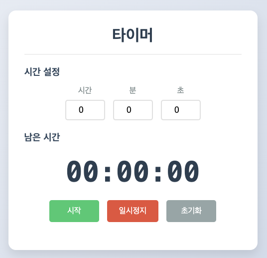

## **HTML 파트**

HTML 구조를 주요 그룹으로 나누어 설명합니다.

### **`<main>`**: 페이지의 주요 콘텐츠를 담는 영역
- 타이머의 설정, 표시, 컨트롤 버튼이 포함된 주요 콘텐츠를 감싸는 태그입니다.

```html
<main>
    <!-- 타이머 콘텐츠 포함 -->
</main>
```

---

### **시간 입력 영역**
- **역할**: 사용자가 타이머의 시작 시간을 설정합니다.
- **구성 요소**:
  - `<label>`: 사용자 입력 필드 설명
  - `<input>`: 시간을 입력받는 필드

```html
<section>
    <h2>시간 설정</h2>
    <div>
        <label>
            시간:
            <input type="number" id="hours" min="0" max="23" value="0">
        </label>
        <label>
            분:
            <input type="number" id="minutes" min="0" max="59" value="0">
        </label>
        <label>
            초:
            <input type="number" id="seconds" min="0" max="59" value="0">
        </label>
    </div>
</section>
```

---

### **타이머 표시 영역**
- **역할**: 남은 시간을 실시간으로 표시합니다.
- **구성 요소**:
  - `<p>`: 남은 시간을 표시하는 텍스트

```html
<section>
    <h2>남은 시간</h2>
    <p id="display">00:00:00</p>
</section>
```

---

### **컨트롤 버튼**
- **역할**: 타이머의 시작, 일시정지, 초기화를 제어합니다.
- **구성 요소**:
  - `<button>`: 각각의 동작(시작, 일시정지, 초기화)을 담당하는 버튼

```html
<section>
    <button onclick="startTimer()" id="startBtn">시작</button>
    <button onclick="pauseTimer()" id="pauseBtn" disabled>일시정지</button>
    <button onclick="resetTimer()" id="resetBtn">초기화</button>
</section>
```

---

## **JavaScript 파트**

JavaScript는 **함수 단위**로 설명합니다.

---

### **`setupInputValidation()`**: 입력 유효성 검사 설정

```javascript
function setupInputValidation() {
    hoursInput.addEventListener('input', () => {
        let value = parseInt(hoursInput.value) || 0;
        hoursInput.value = Math.min(23, Math.max(0, value));
    });

    [minutesInput, secondsInput].forEach(input => {
        input.addEventListener('input', () => {
            let value = parseInt(input.value) || 0;
            input.value = Math.min(59, Math.max(0, value));
        });
    });
}
```

**설명**:  
- 입력값이 올바른 범위(`0~23` 또는 `0~59`)를 벗어나지 않도록 제한합니다.  
- `addEventListener`를 사용해 사용자가 입력할 때마다 값을 검증합니다.

---

### **`startTimer()`**: 타이머 시작

```javascript
function startTimer() {
    if (!isRunning) {
        if (timeLeft === 0) {
            const hours = parseInt(hoursInput.value) || 0;
            const minutes = parseInt(minutesInput.value) || 0;
            const seconds = parseInt(secondsInput.value) || 0;

            timeLeft = (hours * 3600) + (minutes * 60) + seconds;

            if (timeLeft === 0) return;
        }

        isRunning = true;
        startBtn.disabled = true;
        pauseBtn.disabled = false;

        hoursInput.disabled = true;
        minutesInput.disabled = true;
        secondsInput.disabled = true;

        timerId = setInterval(() => {
            timeLeft--;
            updateDisplay();

            if (timeLeft === 0) {
                alert('타이머가 종료되었습니다!');
                resetTimer();
            }
        }, 1000);
    }
}
```

**설명**:  
- 타이머가 실행 중이 아니면 입력된 시간(시간, 분, 초)을 초 단위로 계산하여 `timeLeft`에 저장합니다.  
- 1초마다 `setInterval`을 통해 남은 시간을 감소시키며 화면을 업데이트합니다.  
- 남은 시간이 0이 되면 알림을 표시하고 초기화합니다.

---

### **`pauseTimer()`**: 타이머 일시정지

```javascript
function pauseTimer() {
    if (isRunning) {
        clearInterval(timerId);
        isRunning = false;
        startBtn.disabled = false;
        pauseBtn.disabled = true;
    }
}
```

**설명**:  
- `clearInterval`을 사용해 타이머를 중지합니다.  
- 버튼 상태를 변경하여 재시작이 가능하도록 만듭니다.

---

### **`resetTimer()`**: 타이머 초기화

```javascript
function resetTimer() {
    clearInterval(timerId);
    isRunning = false;
    timeLeft = 0;

    startBtn.disabled = false;
    pauseBtn.disabled = true;

    hoursInput.value = 0;
    minutesInput.value = 0;
    secondsInput.value = 0;
    hoursInput.disabled = false;
    minutesInput.disabled = false;
    secondsInput.disabled = false;

    updateDisplay();
}
```

**설명**:  
- 타이머를 중지하고 초기 상태로 되돌립니다.  
- 입력 필드와 디스플레이를 초기화합니다.

---

### **`updateDisplay()`**: 남은 시간 표시 업데이트

```javascript
function updateDisplay() {
    const hours = Math.floor(timeLeft / 3600);
    const minutes = Math.floor((timeLeft % 3600) / 60);
    const seconds = timeLeft % 60;

    const formatNumber = (number) => number.toString().padStart(2, '0');
    
    display.textContent = `${formatNumber(hours)}:${formatNumber(minutes)}:${formatNumber(seconds)}`;
}
```

**설명**:  
- `timeLeft` 값을 시, 분, 초 단위로 변환하여 디스플레이에 표시합니다.  
- 숫자는 두 자리 형식으로 표시되도록 포맷팅합니다.

---

## **전체 코드**

``` javascript
<!DOCTYPE html>
<html lang="ko">
<head>
    <meta charset="UTF-8">
    <title>간단한 타이머</title>
</head>
<body>
    <main>
        <h1>타이머</h1>
        <hr>

        <!-- 시간 입력 영역 -->
        <section>
            <h2>시간 설정</h2>
            <div>
                <label>
                    시간:
                    <input type="number" id="hours" min="0" max="23" value="0">
                </label>
                <label>
                    분:
                    <input type="number" id="minutes" min="0" max="59" value="0">
                </label>
                <label>
                    초:
                    <input type="number" id="seconds" min="0" max="59" value="0">
                </label>
            </div>
        </section>

        <!-- 타이머 표시 영역 -->
        <section>
            <h2>남은 시간</h2>
            <p id="display">00:00:00</p>
        </section>

        <!-- 컨트롤 버튼 -->
        <section>
            <button onclick="startTimer()" id="startBtn">시작</button>
            <button onclick="pauseTimer()" id="pauseBtn" disabled>일시정지</button>
            <button onclick="resetTimer()" id="resetBtn">초기화</button>
        </section>
    </main>

    <script>
        // 타이머 상태 변수들
        let timeLeft = 0;         // 남은 시간(초)
        let timerId = null;       // setInterval의 ID
        let isRunning = false;    // 타이머 실행 중 여부

        // HTML 요소들
        const hoursInput = document.getElementById('hours');
        const minutesInput = document.getElementById('minutes');
        const secondsInput = document.getElementById('seconds');
        const display = document.getElementById('display');
        const startBtn = document.getElementById('startBtn');
        const pauseBtn = document.getElementById('pauseBtn');

        // 입력값 유효성 검사 설정
        function setupInputValidation() {
            // 시간 입력 제한 (0-23)
            hoursInput.addEventListener('input', () => {
                let value = parseInt(hoursInput.value) || 0;
                hoursInput.value = Math.min(23, Math.max(0, value));
            });

            // 분, 초 입력 제한 (0-59)
            [minutesInput, secondsInput].forEach(input => {
                input.addEventListener('input', () => {
                    let value = parseInt(input.value) || 0;
                    input.value = Math.min(59, Math.max(0, value));
                });
            });
        }

        // 타이머 시작
        function startTimer() {
            if (!isRunning) {
                // 처음 시작할 때만 시간을 가져옴
                if (timeLeft === 0) {
                    const hours = parseInt(hoursInput.value) || 0;
                    const minutes = parseInt(minutesInput.value) || 0;
                    const seconds = parseInt(secondsInput.value) || 0;
                    
                    timeLeft = (hours * 3600) + (minutes * 60) + seconds;
                    
                    // 시간이 0이면 시작하지 않음
                    if (timeLeft === 0) return;
                }

                isRunning = true;
                startBtn.disabled = true;
                pauseBtn.disabled = false;
                
                // 입력 필드 비활성화
                hoursInput.disabled = true;
                minutesInput.disabled = true;
                secondsInput.disabled = true;

                // 1초마다 타이머 갱신
                timerId = setInterval(() => {
                    timeLeft--;
                    updateDisplay();

                    if (timeLeft === 0) {
                        alert('타이머가 종료되었습니다!');
                        resetTimer();
                    }
                }, 1000);
            }
        }

        // 타이머 일시정지
        function pauseTimer() {
            if (isRunning) {
                clearInterval(timerId);
                isRunning = false;
                startBtn.disabled = false;
                pauseBtn.disabled = true;
            }
        }

        // 타이머 초기화
        function resetTimer() {
            // 타이머 정지
            clearInterval(timerId);
            isRunning = false;
            timeLeft = 0;

            // 버튼 상태 초기화
            startBtn.disabled = false;
            pauseBtn.disabled = true;

            // 입력 필드 초기화 및 활성화
            hoursInput.value = 0;
            minutesInput.value = 0;
            secondsInput.value = 0;
            hoursInput.disabled = false;
            minutesInput.disabled = false;
            secondsInput.disabled = false;

            // 디스플레이 초기화
            updateDisplay();
        }

        // 남은 시간 표시 업데이트
        function updateDisplay() {
            const hours = Math.floor(timeLeft / 3600);
            const minutes = Math.floor((timeLeft % 3600) / 60);
            const seconds = timeLeft % 60;

            // 숫자를 두 자리로 표시 (예: 01, 02, ...)
            const formatNumber = (number) => number.toString().padStart(2, '0');
            
            display.textContent = `${formatNumber(hours)}:${formatNumber(minutes)}:${formatNumber(seconds)}`;
        }

        // 페이지 로드시 입력 유효성 검사 설정
        document.addEventListener('DOMContentLoaded', setupInputValidation);
    </script>
</body>
</html>
```