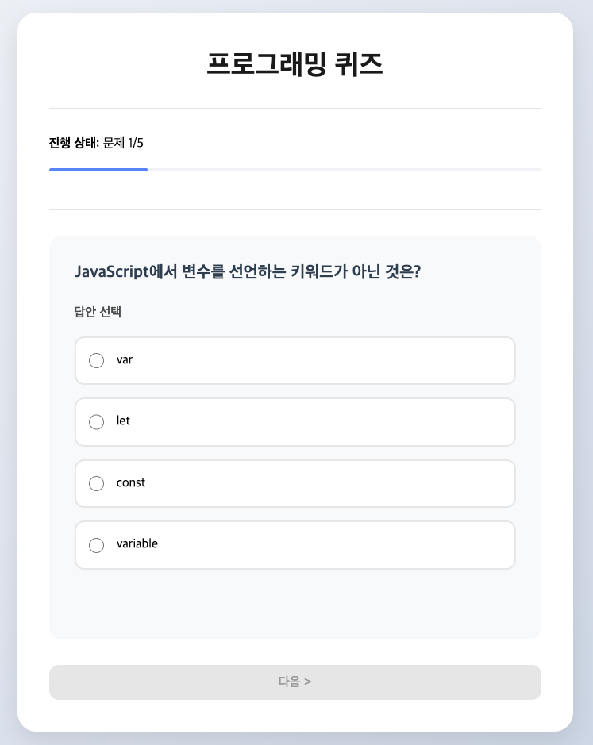

## **HTML 파트**

HTML 구조를 주요 그룹으로 나누어 설명합니다.

### **`<main>`**: 페이지의 주요 콘텐츠를 담는 영역
- 퀴즈와 결과를 표시하는 전체 콘텐츠를 감싸는 태그입니다.

```html
<main>
    <!-- 퀴즈와 결과가 포함됩니다. -->
</main>
```

### **`<header>`**: 페이지의 머리말
- 퀴즈 제목과 시각적 구분을 위한 수평선을 포함합니다.

```html
<header>
    <h1>프로그래밍 퀴즈</h1>
    <hr>
</header>
```

### **`<section id="quiz-section">`**: 퀴즈 내용
- 현재 문제, 진행 상태, 답변 입력 영역이 포함됩니다.
- 주요 구성:
  - `<div>`: 진행 상태와 진행률 표시
  - `<article>`: 현재 문제와 보기 표시
  - `<nav>`: 이전/다음 버튼

```html
<section id="quiz-section">
    <div>
        <p><strong>진행 상태:</strong> <span id="progressText">문제 1/5</span></p>
        <meter id="progress" value="0.2" min="0" max="1">20%</meter>
    </div>
    <hr>
    <article>
        <h2 id="question"></h2>
        <fieldset id="options">
            <legend>답안 선택</legend>
        </fieldset>
        <p id="feedback"></p>
    </article>
    <nav>
        <button onclick="moveToPrevQuestion()">&lt; 이전</button>
        <button onclick="moveToNextQuestion()" id="nextBtn" disabled>다음 &gt;</button>
    </nav>
</section>
```

### **`<section id="resultContainer">`**: 결과 화면
- 퀴즈 완료 후 최종 점수와 다시 시작 버튼을 표시합니다.
- 초기에는 `hidden` 속성으로 숨겨져 있다가, 퀴즈가 끝나면 표시됩니다.

```html
<section id="resultContainer" hidden>
    <h2>퀴즈 완료!</h2>
    <p><strong>최종 점수:</strong> <span id="score">0</span>/5</p>
    <button onclick="restartQuiz()">다시 시작</button>
</section>
```

---

## **JavaScript 파트**

JavaScript는 **함수 단위로** 설명합니다.

---

### **`showQuestion()`**: 현재 문제 표시

```javascript
function showQuestion() {
    document.getElementById('question').textContent = questions[currentQuestion].question;

    const optionsContainer = document.getElementById('options');
    optionsContainer.innerHTML = '<legend>답안 선택</legend>';

    questions[currentQuestion].options.forEach((option, index) => {
        const div = document.createElement('div');

        const radio = document.createElement('input');
        radio.type = 'radio';
        radio.name = 'answer';
        radio.value = index;
        radio.checked = userAnswers[currentQuestion] === index;
        radio.onchange = () => selectAnswer(index);

        const label = document.createElement('label');
        label.appendChild(radio);
        label.appendChild(document.createTextNode(' ' + option));

        div.appendChild(label);
        optionsContainer.appendChild(div);
    });

    document.getElementById('progressText').textContent = `문제 ${currentQuestion + 1}/${questions.length}`;
    document.getElementById('progress').value = (currentQuestion + 1) / questions.length;

    document.querySelector('button').hidden = currentQuestion === 0;
    document.getElementById('nextBtn').disabled = !answered[currentQuestion];
}
```

**설명**:  
- 현재 문제 텍스트를 설정하고, 보기를 동적으로 생성합니다.
- 진행 상태를 업데이트하며, 이전/다음 버튼의 상태를 관리합니다.

---

### **`selectAnswer(selected)`**: 사용자가 답안을 선택했을 때 실행

```javascript
function selectAnswer(selected) {
    userAnswers[currentQuestion] = selected;
    answered[currentQuestion] = true;

    document.getElementById('nextBtn').disabled = false;

    const isCorrect = selected === questions[currentQuestion].answer;
    const feedback = document.getElementById('feedback');

    if (isCorrect) {
        feedback.textContent = "✅ 정답입니다!";
    } else {
        feedback.textContent = `❌ 오답입니다. 정답은 "${questions[currentQuestion].options[questions[currentQuestion].answer]}" 입니다.`;
    }
}
```

**설명**:  
- 선택된 답안을 저장하고, 정답 여부를 확인하여 사용자에게 피드백을 제공합니다.
- 다음 버튼을 활성화합니다.

---

### **`moveToPrevQuestion()`**: 이전 문제로 이동

```javascript
function moveToPrevQuestion() {
    if (currentQuestion > 0) {
        currentQuestion--;
        showQuestion();
        document.getElementById('feedback').textContent = '';
    }
}
```

**설명**:  
- 현재 문제 번호를 감소시키고, 이전 문제를 표시합니다.
- 피드백 메시지를 초기화합니다.

---

### **`moveToNextQuestion()`**: 다음 문제로 이동

```javascript
function moveToNextQuestion() {
    if (currentQuestion < questions.length - 1) {
        currentQuestion++;
        showQuestion();
        document.getElementById('feedback').textContent = '';
    } else {
        showResult();
    }
}
```

**설명**:  
- 현재 문제 번호를 증가시키고, 다음 문제를 표시합니다.
- 마지막 문제 이후에는 결과 화면으로 이동합니다.

---

### **`showResult()`**: 결과 표시

```javascript
function showResult() {
    score = userAnswers.reduce((total, answer, index) => {
        return total + (answer === questions[index].answer ? 1 : 0);
    }, 0);

    document.getElementById('quiz-section').hidden = true;
    document.getElementById('resultContainer').hidden = false;
    document.getElementById('score').textContent = score;
}
```

**설명**:  
- 사용자가 정답을 맞힌 개수를 계산하여 점수를 표시합니다.
- 퀴즈 영역을 숨기고, 결과 화면을 표시합니다.

---

### **`restartQuiz()`**: 퀴즈 다시 시작

```javascript
function restartQuiz() {
    currentQuestion = 0;
    score = 0;
    answered = [false, false, false, false, false];
    userAnswers = [null, null, null, null, null];

    document.getElementById('quiz-section').hidden = false;
    document.getElementById('resultContainer').hidden = true;
    document.getElementById('feedback').textContent = '';

    showQuestion();
}
```

**설명**:  
- 퀴즈 상태를 초기화하고, 첫 번째 문제를 다시 표시합니다.
- 결과 화면을 숨기고, 퀴즈 화면을 표시합니다.

---

## **전체코드**

``` javascript
<!DOCTYPE html>
<html lang="ko">
<head>
    <meta charset="UTF-8">
    <title>간단한 퀴즈</title>
</head>
<body>
    <main>
        <header>
            <h1>프로그래밍 퀴즈</h1>
            <hr>
        </header>

        <section id="quiz-section">
            <div>
                <p><strong>진행 상태:</strong> <span id="progressText">문제 1/5</span></p>
                <meter id="progress" value="0.2" min="0" max="1">20%</meter>
            </div>
            <hr>

            <article>
                <h2 id="question"></h2>
                <fieldset id="options">
                    <legend>답안 선택</legend>
                </fieldset>
                <p id="feedback"></p>
            </article>

            <nav>
                <button onclick="moveToPrevQuestion()">&lt; 이전</button>
                <button onclick="moveToNextQuestion()" id="nextBtn" disabled>다음 &gt;</button>
            </nav>
        </section>

        <section id="resultContainer" hidden>
            <h2>퀴즈 완료!</h2>
            <p><strong>최종 점수:</strong> <span id="score">0</span>/5</p>
            <button onclick="restartQuiz()">다시 시작</button>
        </section>
    </main>

    <script>
        // 퀴즈 문제 데이터
        const questions = [
            {
                question: "JavaScript에서 변수를 선언하는 키워드가 아닌 것은?",
                options: ["var", "let", "const", "variable"],
                answer: 3
            },
            {
                question: "다음 중 배열 메소드가 아닌 것은?",
                options: ["push()", "pop()", "shift()", "array()"],
                answer: 3
            },
            {
                question: "HTML에서 JavaScript 파일을 연결하는 올바른 태그는?",
                options: ["<script>", "<javascript>", "<js>", "<scripting>"],
                answer: 0
            },
            {
                question: "다음 중 올바른 비교 연산자는?",
                options: ["=", "==", "===", "이상 모두"],
                answer: 3
            },
            {
                question: "JavaScript에서 주석을 작성하는 방법이 아닌 것은?",
                options: ["// 주석", "/* 주석 */", "# 주석", "/** 주석 */"],
                answer: 2
            }
        ];

        // 현재 퀴즈 상태
        let currentQuestion = 0;          // 현재 문제 번호
        let score = 0;                    // 점수
        let answered = [false, false, false, false, false];  // 각 문제의 답변 여부
        let userAnswers = [null, null, null, null, null];    // 사용자의 답변

        // 페이지 로드시 첫 문제 표시
        document.addEventListener('DOMContentLoaded', showQuestion);

        // 문제 보여주기
        function showQuestion() {
            // 문제 텍스트 표시
            document.getElementById('question').textContent = questions[currentQuestion].question;
            
            // 보기 만들기
            const optionsContainer = document.getElementById('options');
            optionsContainer.innerHTML = '<legend>답안 선택</legend>';
            
            questions[currentQuestion].options.forEach((option, index) => {
                const div = document.createElement('div');
                
                // 라디오 버튼 만들기
                const radio = document.createElement('input');
                radio.type = 'radio';
                radio.name = 'answer';
                radio.value = index;
                radio.checked = userAnswers[currentQuestion] === index;
                radio.onchange = () => selectAnswer(index);
                
                // 라벨 만들기
                const label = document.createElement('label');
                label.appendChild(radio);
                label.appendChild(document.createTextNode(' ' + option));
                
                div.appendChild(label);
                optionsContainer.appendChild(div);
            });

            // 진행 상태 업데이트
            document.getElementById('progressText').textContent = `문제 ${currentQuestion + 1}/${questions.length}`;
            document.getElementById('progress').value = (currentQuestion + 1) / questions.length;

            // 이전 버튼 상태 설정
            const prevButton = document.querySelector('button');
            prevButton.hidden = currentQuestion === 0;

            // 다음 버튼 상태 설정
            document.getElementById('nextBtn').disabled = !answered[currentQuestion];
        }

        // 답안 선택 처리
        function selectAnswer(selected) {
            userAnswers[currentQuestion] = selected;
            answered[currentQuestion] = true;
            
            // 다음 버튼 활성화
            document.getElementById('nextBtn').disabled = false;

            // 정답 체크
            const isCorrect = selected === questions[currentQuestion].answer;
            const feedback = document.getElementById('feedback');
            
            if (isCorrect) {
                feedback.textContent = "✅ 정답입니다!";
            } else {
                feedback.textContent = `❌ 오답입니다. 정답은 "${questions[currentQuestion].options[questions[currentQuestion].answer]}" 입니다.`;
            }
        }

        // 이전 문제로 이동
        function moveToPrevQuestion() {
            if (currentQuestion > 0) {
                currentQuestion--;
                showQuestion();
                document.getElementById('feedback').textContent = '';
            }
        }

        // 다음 문제로 이동
        function moveToNextQuestion() {
            if (currentQuestion < questions.length - 1) {
                currentQuestion++;
                showQuestion();
                document.getElementById('feedback').textContent = '';
            } else {
                showResult();
            }
        }

        // 결과 표시
        function showResult() {
            // 점수 계산
            score = userAnswers.reduce((total, answer, index) => {
                return total + (answer === questions[index].answer ? 1 : 0);
            }, 0);

            // 결과 화면 표시
            document.getElementById('quiz-section').hidden = true;
            document.getElementById('resultContainer').hidden = false;
            document.getElementById('score').textContent = score;
        }

        // 퀴즈 다시 시작
        function restartQuiz() {
            currentQuestion = 0;
            score = 0;
            answered = [false, false, false, false, false];
            userAnswers = [null, null, null, null, null];
            
            document.getElementById('quiz-section').hidden = false;
            document.getElementById('resultContainer').hidden = true;
            document.getElementById('feedback').textContent = '';
            
            showQuestion();
        }
    </script>
</body>
</html>
```