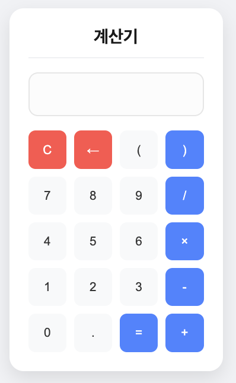

## **HTML 파트**

HTML 구조를 주요 그룹으로 나누어 설명합니다.

---

### **`<main>`**: 페이지의 주요 콘텐츠 영역
- 계산기의 전체 화면을 감싸는 태그입니다.
- 계산기 제목, 화면, 버튼들이 포함됩니다.

```html
<main>
    <h1>계산기</h1>
    <hr>
    <!-- 계산기 화면 및 버튼 포함 -->
</main>
```

---

### **계산기 화면**
- **역할**: 현재 입력된 숫자나 수식을 표시합니다.
- **구성 요소**:
  - `<input>`: 읽기 전용(`readonly`)으로 설정하여 사용자 입력을 막고, JavaScript로만 값이 수정되도록 제한합니다.

```html
<div>
    <input type="text" id="display" readonly>
</div>
```

---

### **계산기 버튼들**
- **역할**: 숫자와 연산자를 입력하거나, 특정 동작(초기화, 삭제, 계산)을 수행합니다.
- **구성 요소**:
  - `<button>`: 각각의 버튼에 JavaScript 함수가 연결되어 있습니다.

```html
<!-- 첫 번째 줄: 초기화 및 괄호 -->
<div>
    <button onclick="clearDisplay()">C</button>
    <button onclick="backspace()">←</button>
    <button onclick="addToDisplay('(')">(</button>
    <button onclick="addToDisplay(')')">)</button>
</div>

<!-- 두 번째 줄: 숫자와 나누기 연산 -->
<div>
    <button onclick="addToDisplay('7')">7</button>
    <button onclick="addToDisplay('8')">8</button>
    <button onclick="addToDisplay('9')">9</button>
    <button onclick="addToDisplay('/')">/</button>
</div>

<!-- 세 번째 줄: 숫자와 곱하기 연산 -->
<div>
    <button onclick="addToDisplay('4')">4</button>
    <button onclick="addToDisplay('5')">5</button>
    <button onclick="addToDisplay('6')">6</button>
    <button onclick="addToDisplay('*')">×</button>
</div>

<!-- 네 번째 줄: 숫자와 빼기 연산 -->
<div>
    <button onclick="addToDisplay('1')">1</button>
    <button onclick="addToDisplay('2')">2</button>
    <button onclick="addToDisplay('3')">3</button>
    <button onclick="addToDisplay('-')">-</button>
</div>

<!-- 다섯 번째 줄: 숫자와 더하기 연산 및 계산 -->
<div>
    <button onclick="addToDisplay('0')">0</button>
    <button onclick="addToDisplay('.')">.</button>
    <button onclick="calculate()">=</button>
    <button onclick="addToDisplay('+')">+</button>
</div>
```

---

## **JavaScript 파트**

JavaScript는 **함수 단위**로 설명합니다.

---

### **`addToDisplay(value)`**: 숫자 또는 연산자 추가

```javascript
function addToDisplay(value) {
    display.value += value;
}
```

**설명**:  
- 버튼 클릭 또는 키보드 입력 시, 전달된 값을 계산기 화면(`display`)에 추가합니다.

---

### **`clearDisplay()`**: 화면 초기화

```javascript
function clearDisplay() {
    display.value = '';
}
```

**설명**:  
- 계산기 화면을 비웁니다.

---

### **`backspace()`**: 마지막 문자 삭제

```javascript
function backspace() {
    display.value = display.value.slice(0, -1);
}
```

**설명**:  
- 현재 화면에 입력된 문자열에서 마지막 문자를 삭제합니다.

---

### **`calculate()`**: 계산 실행

```javascript
function calculate() {
    try {
        if (!isValidExpression(display.value)) {
            throw new Error('잘못된 수식입니다.');
        }

        const result = new Function('return ' + display.value)();

        if (isNaN(result) || !isFinite(result)) {
            throw new Error('계산할 수 없는 수식입니다.');
        }

        display.value = result;
    } catch (error) {
        alert(error.message);
        clearDisplay();
    }
}
```

**설명**:  
- 입력된 수식을 검증(`isValidExpression`)하고, 계산 결과를 화면에 표시합니다.  
- `new Function`을 사용하여 수식을 안전하게 계산합니다.  
- 유효하지 않은 입력이거나 계산할 수 없는 값이면 오류 메시지를 표시합니다.

---

### **`isValidExpression(expr)`**: 수식 유효성 검사

```javascript
function isValidExpression(expr) {
    const validChars = /^[0-9+\-*/(). ]+$/;
    if (!validChars.test(expr)) {
        return false;
    }

    let brackets = 0;
    for (let char of expr) {
        if (char === '(') brackets++;
        if (char === ')') brackets--;
        if (brackets < 0) return false;
    }
    
    return brackets === 0;
}
```

**설명**:  
- 수식에 허용되지 않은 문자가 포함되어 있는지 확인합니다.  
- 괄호 짝이 맞는지 검사하여 잘못된 수식을 걸러냅니다.

---

### **키보드 입력 처리**

```javascript
document.addEventListener('keydown', function(event) {
    const key = event.key;

    if (key >= '0' && key <= '9' || '+-*/.()'.includes(key)) {
        addToDisplay(key);
    } else if (key === 'Enter') {
        calculate();
    } else if (key === 'Backspace') {
        backspace();
    } else if (key === 'Escape') {
        clearDisplay();
    }
});
```

**설명**:  
- 키보드 입력을 처리하여 계산기 기능과 연결합니다.  
  - 숫자 및 연산자는 화면에 추가됩니다.  
  - `Enter`는 계산 실행, `Backspace`는 마지막 문자 삭제, `Escape`는 화면 초기화를 수행합니다.

---

## **전체코드**

``` javascript
<!DOCTYPE html>
<html lang="ko">
<head>
    <meta charset="UTF-8">
    <title>간단한 계산기</title>
</head>
<body>
    <main>
        <h1>계산기</h1>
        <hr>

        <!-- 계산기 화면 -->
        <div>
            <input type="text" id="display" readonly>
        </div>

        <!-- 계산기 버튼들 -->
        <div>
            <!-- 첫 번째 줄 -->
            <div>
                <button onclick="clearDisplay()">C</button>
                <button onclick="backspace()">←</button>
                <button onclick="addToDisplay('(')">(</button>
                <button onclick="addToDisplay(')')">)</button>
            </div>
            
            <!-- 두 번째 줄 -->
            <div>
                <button onclick="addToDisplay('7')">7</button>
                <button onclick="addToDisplay('8')">8</button>
                <button onclick="addToDisplay('9')">9</button>
                <button onclick="addToDisplay('/')">/</button>
            </div>
            
            <!-- 세 번째 줄 -->
            <div>
                <button onclick="addToDisplay('4')">4</button>
                <button onclick="addToDisplay('5')">5</button>
                <button onclick="addToDisplay('6')">6</button>
                <button onclick="addToDisplay('*')">×</button>
            </div>
            
            <!-- 네 번째 줄 -->
            <div>
                <button onclick="addToDisplay('1')">1</button>
                <button onclick="addToDisplay('2')">2</button>
                <button onclick="addToDisplay('3')">3</button>
                <button onclick="addToDisplay('-')">-</button>
            </div>
            
            <!-- 다섯 번째 줄 -->
            <div>
                <button onclick="addToDisplay('0')">0</button>
                <button onclick="addToDisplay('.')">.</button>
                <button onclick="calculate()">=</button>
                <button onclick="addToDisplay('+')">+</button>
            </div>
        </div>
    </main>

    <script>
        // 계산기 화면 요소
        const display = document.getElementById('display');

        // 화면에 숫자나 연산자 추가
        function addToDisplay(value) {
            display.value += value;
        }

        // 화면 초기화
        function clearDisplay() {
            display.value = '';
        }

        // 마지막 문자 삭제
        function backspace() {
            display.value = display.value.slice(0, -1);
        }

        // 계산 실행
        function calculate() {
            try {
                // 수식의 유효성 검사
                if (!isValidExpression(display.value)) {
                    throw new Error('잘못된 수식입니다.');
                }
                
                // 계산 실행 (Function 생성자를 사용하여 eval 대신 사용)
                const result = new Function('return ' + display.value)();
                
                // 결과가 숫자가 아니거나 무한대인 경우
                if (isNaN(result) || !isFinite(result)) {
                    throw new Error('계산할 수 없는 수식입니다.');
                }
                
                // 결과 표시
                display.value = result;
            } catch (error) {
                alert(error.message);
                clearDisplay();
            }
        }

        // 수식 유효성 검사
        function isValidExpression(expr) {
            // 허용된 문자만 있는지 확인
            const validChars = /^[0-9+\-*/(). ]+$/;
            if (!validChars.test(expr)) {
                return false;
            }

            // 괄호의 짝이 맞는지 확인
            let brackets = 0;
            for (let char of expr) {
                if (char === '(') brackets++;
                if (char === ')') brackets--;
                if (brackets < 0) return false;
            }
            
            return brackets === 0;
        }

        // 키보드 입력 처리
        document.addEventListener('keydown', function(event) {
            const key = event.key;
            
            // 숫자와 연산자 입력
            if (key >= '0' && key <= '9' || '+-*/.()'.includes(key)) {
                addToDisplay(key);
            } 
            // Enter 키는 계산 실행
            else if (key === 'Enter') {
                calculate();
            }
            // Backspace 키는 마지막 문자 삭제
            else if (key === 'Backspace') {
                backspace();
            }
            // Escape 키는 화면 초기화
            else if (key === 'Escape') {
                clearDisplay();
            }
        });
    </script>
</body>
</html>
```