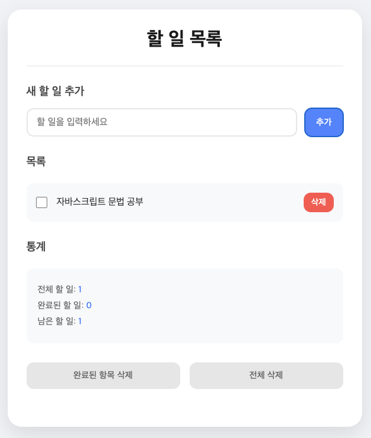

## **HTML 파트**

HTML 구조를 주요 그룹으로 나누어 설명합니다.

---

### **`<main>`**: 페이지의 주요 콘텐츠 영역
- 할 일 목록 애플리케이션의 전체 화면을 감싸는 태그입니다.
- 할 일 추가, 목록 표시, 통계, 목록 관리 버튼이 포함됩니다.

```html
<main>
    <h1>할 일 목록</h1>
    <hr>
    <!-- 할 일 애플리케이션 콘텐츠 포함 -->
</main>
```

---

### **새 할 일 추가 영역**
- **역할**: 사용자가 새로운 할 일을 입력하고 추가 버튼을 눌러 목록에 추가합니다.
- **구성 요소**:
  - `<input>`: 새로운 할 일을 입력받는 필드
  - `<button>`: 추가 버튼

```html
<section>
    <h2>새 할 일 추가</h2>
    <div>
        <input type="text" id="todoInput" placeholder="할 일을 입력하세요">
        <button onclick="addTodo()">추가</button>
    </div>
</section>
```

---

### **할 일 목록 표시 영역**
- **역할**: 사용자가 추가한 할 일 항목을 목록 형태로 표시합니다.
- **구성 요소**:
  - `<ul>`: 할 일 항목을 담는 리스트
  - `<li>`: 각각의 할 일을 나타내는 항목

```html
<section>
    <h2>목록</h2>
    <ul id="todoList">
        <!-- 할 일 항목들이 동적으로 추가됩니다 -->
    </ul>
</section>
```

---

### **통계 영역**
- **역할**: 전체 할 일 개수, 완료된 할 일 개수, 남은 할 일 개수를 표시합니다.
- **구성 요소**:
  - `<span>`: 각 통계 값을 동적으로 업데이트하여 표시

```html
<section>
    <h2>통계</h2>
    <p>전체 할 일: <span id="totalCount">0</span></p>
    <p>완료된 할 일: <span id="completedCount">0</span></p>
    <p>남은 할 일: <span id="remainingCount">0</span></p>
</section>
```

---

### **목록 관리 버튼**
- **역할**: 전체 삭제 및 완료된 항목만 삭제하는 기능을 제공합니다.
- **구성 요소**:
  - `<button>`: 각각의 버튼이 JavaScript 함수와 연결되어 있습니다.

```html
<section>
    <button onclick="deleteCompletedTodos()">완료된 항목 삭제</button>
    <button onclick="deleteAllTodos()">전체 삭제</button>
</section>
```

---

## **JavaScript 파트**

JavaScript는 **함수 단위**로 설명합니다.

---

### **`addTodo()`**: 새로운 할 일 추가

```javascript
function addTodo() {
    const text = todoInput.value.trim();
    if (text === '') {
        alert('할 일을 입력해주세요!');
        return;
    }

    const todo = {
        id: Date.now(),
        text: text,
        completed: false
    };

    todos.push(todo);
    renderTodos();
    updateStats();
    todoInput.value = '';
}
```

**설명**:  
- 입력 필드에서 할 일을 가져와 공백 여부를 확인합니다.  
- 새로운 할 일을 객체 형태로 생성하여 `todos` 배열에 추가합니다.  
- 할 일 목록을 갱신하고 통계를 업데이트합니다.

---

### **`toggleTodo(id)`**: 할 일 완료/미완료 상태 토글

```javascript
function toggleTodo(id) {
    const todo = todos.find(todo => todo.id === id);
    if (todo) {
        todo.completed = !todo.completed;
        renderTodos();
        updateStats();
    }
}
```

**설명**:  
- 선택된 할 일의 `completed` 상태를 반전시킵니다.  
- 변경된 상태를 반영하여 목록과 통계를 갱신합니다.

---

### **`deleteTodo(id)`**: 특정 할 일 삭제

```javascript
function deleteTodo(id) {
    todos = todos.filter(todo => todo.id !== id);
    renderTodos();
    updateStats();
}
```

**설명**:  
- `id`가 일치하지 않는 항목만 남겨 새로운 `todos` 배열을 만듭니다.  
- 목록과 통계를 갱신합니다.

---

### **`deleteCompletedTodos()`**: 완료된 할 일 삭제

```javascript
function deleteCompletedTodos() {
    todos = todos.filter(todo => !todo.completed);
    renderTodos();
    updateStats();
}
```

**설명**:  
- 완료 상태(`completed: true`)인 할 일을 모두 삭제합니다.  
- 목록과 통계를 갱신합니다.

---

### **`deleteAllTodos()`**: 모든 할 일 삭제

```javascript
function deleteAllTodos() {
    if (confirm('정말 모든 할 일을 삭제하시겠습니까?')) {
        todos = [];
        renderTodos();
        updateStats();
    }
}
```

**설명**:  
- 사용자가 확인을 클릭하면 모든 할 일을 삭제합니다.  
- 목록과 통계를 초기화합니다.

---

### **`renderTodos()`**: 할 일 목록 표시

```javascript
function renderTodos() {
    todoList.innerHTML = '';
    todos.forEach(todo => {
        const li = document.createElement('li');

        const checkbox = document.createElement('input');
        checkbox.type = 'checkbox';
        checkbox.checked = todo.completed;
        checkbox.onchange = () => toggleTodo(todo.id);

        const span = document.createElement('span');
        span.textContent = todo.text;
        if (todo.completed) {
            span.style.textDecoration = 'line-through';
        }

        const deleteButton = document.createElement('button');
        deleteButton.textContent = '삭제';
        deleteButton.onclick = () => deleteTodo(todo.id);

        li.appendChild(checkbox);
        li.appendChild(span);
        li.appendChild(deleteButton);
        todoList.appendChild(li);
    });
}
```

**설명**:  
- `todos` 배열의 각 항목을 `<li>`로 변환하여 표시합니다.  
- 체크박스, 텍스트, 삭제 버튼을 포함한 동적 UI를 생성합니다.

---

### **`updateStats()`**: 통계 정보 업데이트

```javascript
function updateStats() {
    const total = todos.length;
    const completed = todos.filter(todo => todo.completed).length;
    const remaining = total - completed;

    totalCount.textContent = total;
    completedCount.textContent = completed;
    remainingCount.textContent = remaining;
}
```

**설명**:  
- 전체 할 일, 완료된 할 일, 남은 할 일의 개수를 계산하여 화면에 표시합니다.

---

## **전체코드**

``` javascript
<!DOCTYPE html>
<html lang="ko">
<head>
    <meta charset="UTF-8">
    <title>할 일 목록</title>
</head>
<body>
    <main>
        <h1>할 일 목록</h1>
        <hr>

        <!-- 새 할 일 입력 영역 -->
        <section>
            <h2>새 할 일 추가</h2>
            <div>
                <input type="text" id="todoInput" placeholder="할 일을 입력하세요">
                <button onclick="addTodo()">추가</button>
            </div>
        </section>

        <!-- 할 일 목록 표시 영역 -->
        <section>
            <h2>목록</h2>
            <ul id="todoList">
                <!-- 할 일 항목들이 여기에 추가됨 -->
            </ul>
        </section>

        <!-- 통계 영역 -->
        <section>
            <h2>통계</h2>
            <p>전체 할 일: <span id="totalCount">0</span></p>
            <p>완료된 할 일: <span id="completedCount">0</span></p>
            <p>남은 할 일: <span id="remainingCount">0</span></p>
        </section>

        <!-- 목록 관리 버튼 -->
        <section>
            <button onclick="deleteCompletedTodos()">완료된 항목 삭제</button>
            <button onclick="deleteAllTodos()">전체 삭제</button>
        </section>
    </main>

    <script>
        // 필요한 HTML 요소들
        const todoInput = document.getElementById('todoInput');
        const todoList = document.getElementById('todoList');
        const totalCount = document.getElementById('totalCount');
        const completedCount = document.getElementById('completedCount');
        const remainingCount = document.getElementById('remainingCount');

        // 할 일 목록 배열
        let todos = [];

        // 새로운 할 일 추가
        function addTodo() {
            const text = todoInput.value.trim();
            
            // 빈 입력 체크
            if (text === '') {
                alert('할 일을 입력해주세요!');
                return;
            }

            // 새로운 할 일 객체 생성
            const todo = {
                id: Date.now(),  // 고유한 ID로 현재 시간 사용
                text: text,      // 할 일 내용
                completed: false  // 완료 여부
            };

            // 목록에 추가
            todos.push(todo);
            
            // 화면 갱신
            renderTodos();
            updateStats();
            
            // 입력창 초기화
            todoInput.value = '';
        }

        // 할 일 완료/미완료 토글
        function toggleTodo(id) {
            // ID로 할 일을 찾아서 완료 상태를 반전
            const todo = todos.find(todo => todo.id === id);
            if (todo) {
                todo.completed = !todo.completed;
                renderTodos();
                updateStats();
            }
        }

        // 할 일 삭제
        function deleteTodo(id) {
            // 해당 ID의 할 일을 목록에서 제거
            todos = todos.filter(todo => todo.id !== id);
            renderTodos();
            updateStats();
        }

        // 완료된 할 일 모두 삭제
        function deleteCompletedTodos() {
            todos = todos.filter(todo => !todo.completed);
            renderTodos();
            updateStats();
        }

        // 모든 할 일 삭제
        function deleteAllTodos() {
            if (confirm('정말 모든 할 일을 삭제하시겠습니까?')) {
                todos = [];
                renderTodos();
                updateStats();
            }
        }

        // 화면에 할 일 목록 표시
        function renderTodos() {
            // 목록 초기화
            todoList.innerHTML = '';
            
            // 각 할 일에 대해 HTML 요소 생성
            todos.forEach(todo => {
                const li = document.createElement('li');
                
                // 체크박스 생성
                const checkbox = document.createElement('input');
                checkbox.type = 'checkbox';
                checkbox.checked = todo.completed;
                checkbox.onchange = () => toggleTodo(todo.id);
                
                // 텍스트 표시
                const span = document.createElement('span');
                span.textContent = todo.text;
                if (todo.completed) {
                    span.style.textDecoration = 'line-through';
                }
                
                // 삭제 버튼 생성
                const deleteButton = document.createElement('button');
                deleteButton.textContent = '삭제';
                deleteButton.onclick = () => deleteTodo(todo.id);
                
                // 요소들을 li에 추가
                li.appendChild(checkbox);
                li.appendChild(span);
                li.appendChild(deleteButton);
                
                // li를 목록에 추가
                todoList.appendChild(li);
            });
        }

        // 통계 정보 업데이트
        function updateStats() {
            const total = todos.length;
            const completed = todos.filter(todo => todo.completed).length;
            const remaining = total - completed;

            totalCount.textContent = total;
            completedCount.textContent = completed;
            remainingCount.textContent = remaining;
        }

        // 엔터 키로 할 일 추가
        todoInput.addEventListener('keypress', function(event) {
            if (event.key === 'Enter') {
                addTodo();
            }
        });

        // 페이지 로드시 초기화
        document.addEventListener('DOMContentLoaded', function() {
            // localStorage에서 이전 데이터 불러오기
            const savedTodos = localStorage.getItem('todos');
            if (savedTodos) {
                todos = JSON.parse(savedTodos);
                renderTodos();
                updateStats();
            }
        });

        // 데이터 변경시 localStorage에 저장
        function saveTodos() {
            localStorage.setItem('todos', JSON.stringify(todos));
        }

        // 데이터 변경이 있는 모든 함수에 저장 로직 추가
        const originalAddTodo = addTodo;
        const originalToggleTodo = toggleTodo;
        const originalDeleteTodo = deleteTodo;
        const originalDeleteCompletedTodos = deleteCompletedTodos;
        const originalDeleteAllTodos = deleteAllTodos;

        addTodo = function() {
            originalAddTodo();
            saveTodos();
        };

        toggleTodo = function(id) {
            originalToggleTodo(id);
            saveTodos();
        };

        deleteTodo = function(id) {
            originalDeleteTodo(id);
            saveTodos();
        };

        deleteCompletedTodos = function() {
            originalDeleteCompletedTodos();
            saveTodos();
        };

        deleteAllTodos = function() {
            originalDeleteAllTodos();
            saveTodos();
        };
    </script>
</body>
</html>
```