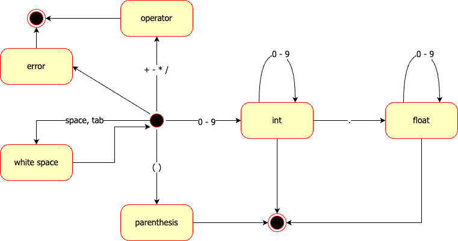

# 스캐너 직접 구현하기

<iframe width="800" height="450" src="https://www.youtube.com/embed/_rtgt4FuOk0" title="YouTube video player" frameborder="0" allow="accelerometer; autoplay; clipboard-write; encrypted-media; gyroscope; picture-in-picture" allowfullscreen></iframe>

## 상태도



::: tip
어떤 프로세스가 결론을 내리기 위해서 반복적인 조건 검사가 필요거나

현재의 상태가 과거의 상태에 의해서 영향받을 때 상태도가 유용하다.
:::


## 논리 계층

``` js
class Token {
    constructor(type, value) {
        this.type = type;
        this.value = value;
    }
}

class Scanner {
    constructor(text) {
        this._state = State.START;
        this._index = 0;
        this._text = text;
        this._preLoadedChar = null;
        this._tokenValue = "";
    }

    hasNext() {
        return this._index < this._text.length;
    }

    next() {
        while (true) {
            const ch = this._getChar();

            switch (this._state) {
                case State.START: {
                    const token = this._scanStartState(ch);
                    if (token) return token;
                    break;
                }

                case State.INTEGER: {
                    const token = this._scanIntegerState(ch);
                    if (token) return token;
                    break;
                }

                case State.FLOAT: {
                    const token = this._scanFloatState(ch);
                    if (token) return token;
                    break;
                }

                ...

                default:
                    this._index = this._text.length;
                    return new Token('ERROR', ch);
            }
        }
    }
}

let scanner = new Scanner("3 * (1 + 4) / 0.1592654");

while (scanner.hasNext()) {
  let token = scanner.next();
  console.log(token);
}
```


## 구현 계층

### _scanIntegerState

``` js
_scanIntegerState(ch) {
    switch (ch) {
        case '0': case '1': case '2': case '3': case '4':
        case '5': case '6': case '7': case '8': case '9':
            this._tokenValue = this._tokenValue + ch;
            break;

        case '.':
            this._state = State.FLOAT;
            this._tokenValue = this._tokenValue + ch;
            break;

        default:
            this._state = State.START;
            this._preLoadedChar = ch;
            const token = new Token('INTEGER', this._tokenValue);
            this._tokenValue = "";
            return token;
    }

    return null;
}
```

### _scanFloatState

``` js
_scanFloatState(ch) {
    switch (ch) {
        case '0': case '1': case '2': case '3': case '4':
        case '5': case '6': case '7': case '8': case '9':
            this._tokenValue = this._tokenValue + ch;
            break;

        default:
            this._state = State.START;
            this._preLoadedChar = ch;
            const token = new Token('FLOAT', this._tokenValue);
            this._tokenValue = "";
            return token;
    }

    return null;
}
```

### _scanStartState

``` js
_scanStartState(ch) {
    switch (ch) {
        case ' ':
        case '\t': return new Token('WHITE_SPACE', ch);

        case '+': return new Token('PLUS', ch);
        case '-': return new Token('MINUS', ch);
        case '*': return new Token('MUL', ch);
        case '/': return new Token('DIV', ch);
        case '(': return new Token('LEFT_PAREN', ch);
        case ')': return new Token('RIGHT_PAREN', ch);

        case '0': case '1': case '2': case '3': case '4':
        case '5': case '6': case '7': case '8': case '9':
            this._state = State.INTEGER;
            this._tokenValue = this._tokenValue + ch;
            break;

        default:
            this._index = this._text.length;
            return new Token('ERROR', ch);
    }

    return null;
}
```


## 전체 코드

### 실행 결과


### 코드

``` js
const State = {
    START:          0,
    ERROR:          1,
    WHITE_SPACE:    2,
    OPERATOR:       3,
    INTEGER:        4,
    FLOAT:          5,
    PAREN:          6,
}

class Token {
    constructor(type, value) {
        this.type = type;
        this.value = value;
    }
}

class Scanner {
    constructor(text) {
        this._state = State.START;
        this._index = 0;
        this._text = text;
        this._preLoadedChar = null;
        this._tokenValue = "";
    }

    hasNext() {
        return this._index < this._text.length;
    }

    next() {
        while (true) {
            const ch = this._getChar();

            switch (this._state) {
                case State.START: {
                    const token = this._scanStartState(ch);
                    if (token) return token;
                    break;
                }

                case State.INTEGER: {
                    const token = this._scanIntegerState(ch);
                    if (token) return token;
                    break;
                }

                case State.FLOAT: {
                    const token = this._scanFloatState(ch);
                    if (token) return token;
                    break;
                }

                default:
                    this._index = this._text.length;
                    return new Token('ERROR', ch);
            }
        }
    }

    _getChar() {
        if (this._preLoadedChar) {
            const ch = this._preLoadedChar;
            this._preLoadedChar = null;
            return ch;
        }

        if (this.hasNext() == false) {
            return null;
        }

        const ch = this._text[this._index];
        this._index++;
        return ch;
    }

    _scanStartState(ch) {
        switch (ch) {
            case ' ':
            case '\t': return new Token('WHITE_SPACE', ch);

            case '+': return new Token('PLUS', ch);
            case '-': return new Token('MINUS', ch);
            case '*': return new Token('MUL', ch);
            case '/': return new Token('DIV', ch);
            case '(': return new Token('LEFT_PAREN', ch);
            case ')': return new Token('RIGHT_PAREN', ch);

            case '0': case '1': case '2': case '3': case '4':
            case '5': case '6': case '7': case '8': case '9':
                this._state = State.INTEGER;
                this._tokenValue = this._tokenValue + ch;
                break;

            default:
                this._index = this._text.length;
                return new Token('ERROR', ch);
        }

        return null;
    }

    _scanIntegerState(ch) {
        switch (ch) {
            case '0': case '1': case '2': case '3': case '4':
            case '5': case '6': case '7': case '8': case '9':
                this._tokenValue = this._tokenValue + ch;
                break;

            case '.':
                this._state = State.FLOAT;
                this._tokenValue = this._tokenValue + ch;
                break;

            default:
                this._state = State.START;
                this._preLoadedChar = ch;
                const token = new Token('INTEGER', this._tokenValue);
                this._tokenValue = "";
                return token;
        }

        return null;
    }

    _scanFloatState(ch) {
        switch (ch) {
            case '0': case '1': case '2': case '3': case '4':
            case '5': case '6': case '7': case '8': case '9':
                this._tokenValue = this._tokenValue + ch;
                break;

            default:
                this._state = State.START;
                this._preLoadedChar = ch;
                const token = new Token('FLOAT', this._tokenValue);
                this._tokenValue = "";
                return token;
        }

        return null;
    }
}

let scanner = new Scanner("3 * (1 + 4) / 0.1592654");

while (scanner.hasNext()) {
  let token = scanner.next();
  console.log(token);
}
```
