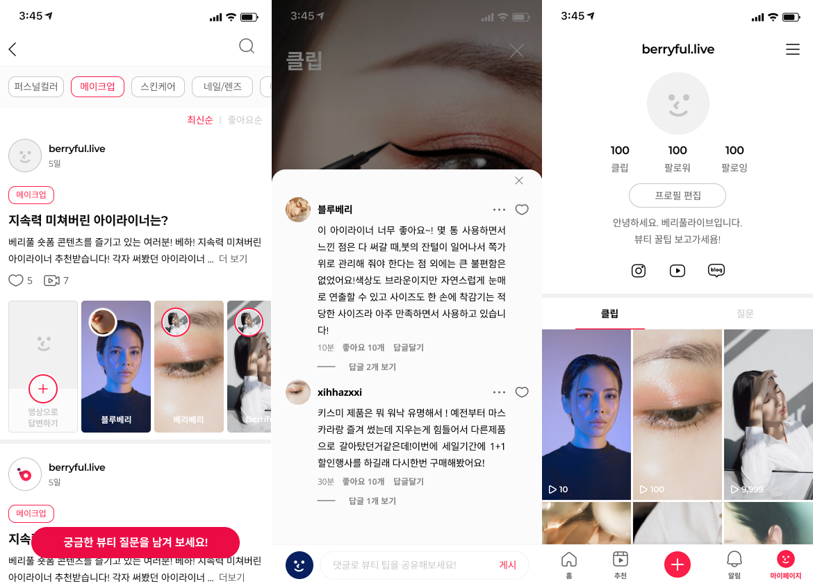

# Berryful 프로젝트 회고

## 프로젝트 개요

* 숏폼 기반의 뷰티 Q&A 플랫폼
* 라이브 방송 및 상품 판매
* A.I. 콘텐트 추천

## 사용된 기술

* Spring boot, Vue.js, Flutter, C++, Delhpi
* MySql, DynamoDB, Lambda 등
* Elastic Beanstalk, MediaConvert, IVS, S3, CloudWatch 등

## 시스템 구성

## 주요 개발 이슈

* 인공지능 콘텐츠 추천 시스템 개발
  * [TTA 인공지능 모델 분석](/docs/TensorFlow-Recommand-Contents-02.pdf)
  * [TensorFlow를 활용한 콘텐츠 분석](/docs/TensorFlow-Recommand-Contents-01.pdf)
* Agora
  * [실시간 채팅](/docs/Agora-Real-Time-Messaging-with-Flutter.pdf)
  * [실시간 비디오](/docs/Agora-Video-Streaming-with-Flutter.pdf)
* [Flutter Game Engine](https://ryujt.github.io/flutter-game-engine/)
* Bitbucket pipeline
  * [S3 정적 웹 배포](/docs/Bitbucket-Pipelines-AWS-S3.pdf)
  * [Elastic Beanstalk 배포](/docs/Bitbucket-Pipelines-AWS-EB.pdf)
* 인공지능 더빙 시스템 개발
  * [텍스트로 오디오 편집하기](/docs/Dubbing-Editor.pdf)
  * 오디오 텍스트에 맞춰서 영상 더빙하기
* [AWS MediaConvert를 이용한 비디오 스트리밍 시스템 개발](https://ryujt.github.io/video-streamming/)
* [하이브리드 형식의 프로젝트 샘플 코드](https://ryujt.github.io/hybrid-app-sample-code/)
* AWS IVS 실시간 스트리밍

## Screenshots

