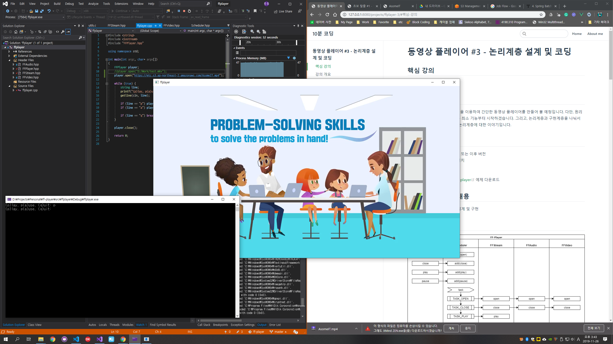

# 구현계층 코딩 및 기본동작 확인

## 핵심 강의

<iframe width="800" height="450" src="https://www.youtube.com/embed/L7Zsw9u9QEs" frameborder="0" allow="accelerometer; autoplay; encrypted-media; gyroscope; picture-in-picture" allowfullscreen></iframe>

<iframe width="800" height="450" src="https://www.youtube.com/embed/vxq2aYyRA6M" frameborder="0" allow="accelerometer; autoplay; encrypted-media; gyroscope; picture-in-picture" allowfullscreen></iframe>

<iframe width="800" height="450" src="https://www.youtube.com/embed/ipQbM9d9YGI" frameborder="0" allow="accelerometer; autoplay; encrypted-media; gyroscope; picture-in-picture" allowfullscreen></iframe>

<iframe width="800" height="450" src="https://www.youtube.com/embed/OI_0Gnw6_gU" frameborder="0" allow="accelerometer; autoplay; encrypted-media; gyroscope; picture-in-picture" allowfullscreen></iframe>

<iframe width="800" height="450" src="https://www.youtube.com/embed/5UCYwdeKuCo" frameborder="0" allow="accelerometer; autoplay; encrypted-media; gyroscope; picture-in-picture" allowfullscreen></iframe>

<iframe width="800" height="450" src="https://www.youtube.com/embed/JujjnTO5GJs" frameborder="0" allow="accelerometer; autoplay; encrypted-media; gyroscope; picture-in-picture" allowfullscreen></iframe>


## 강의 개요

이번 강의에서는 본격적으로 ffmpeg을 이용하여 만드는 간단한 동영상 플레이어의 기본 동작을 구현하겠습니다.

	동영상 파일 닫기, 에러 및 종료 처리 등은 다음 강의에서 다루도록 하겠습니다.


## 강의 전 준비 사항

* Visual Studio 2015 Update 3 또는 이후 버전
* vcpkg 설치 및 라이브러리 설치
  * ["vcpkg 설치" 참고](/install/vcpkg/)
  * vcpkg install sdl2 ffmpeg
* [https://github.com/ryujt/ff-player](https://github.com/ryujt/ff-player) 예제 다운로드
  * test/test_ffplayer 폴더의 예제를 참고하세요.


## 이 강의에서 다룰 내용

* 논리계층에서 작성된 FFStream, FFAudio, FFVideo의 인터페이스를 토대로 코드 구현
* ffmpeg을 이용하여 동영상 파일을 열고 패킷을 가져오는 방법
* ffmpeg을 이용하여 오디오 및 비디오 디코딩 후 출력하는 방법


## 실행결과



* 프로그램을 실행하고 "p"를 입력 후 엔터를 치면 동영상이 재생되고, "a"를 입력 후 엔터를 치면 재생이 잠시 멈추게 됩니다.


## 구현계층 소스


### FFStream

``` cpp
#pragma once

extern "C" {
#include <libavformat/avformat.h>
}

using namespace std;

class FFStream {
public:
	bool open(string filename)
	{
		if (avformat_open_input(&context_, filename.c_str(), NULL, NULL) != 0) return false;
		if (avformat_find_stream_info(context_, NULL) < 0) return false;
		return true;
	}

	void close()
	{
	}

	void play()
	{
		is_playing_ = true;
	}

	void pause()
	{
		is_playing_ = false;
	}

	bool isPlaying() { return is_playing_; }

	AVPacket* read()
	{
		AVPacket* packet = av_packet_alloc();
		if (av_read_frame(context_, packet) < 0) {
			av_packet_free(&packet);
			return nullptr;
		}
		return packet;
	}

	AVFormatContext* getContext()
	{
		return context_;
	}

private:
	AVFormatContext* context_ = nullptr;
	bool is_playing_ = false;
};
```
* 3: ffmpeg은 C로 작성된 라이브러리입니다. 따라서 extern "C"로 감싸줍니다. 이는 C++과 C가 컴파일 시 사용하는 함수이름의 규칙이 다르기 때문입니다.
* 13: 동영상 파일을 열어서 context_ 변수에 정보를 넣습니다. 열 수 없는 파일이면 false를 리턴합니다.
* 14: 동영상 안에 스트림(오디오나 영상 데이터)가 없으면 false를 리턴합니다.
* 36: 동영상 파일에서 패킷을 읽어오기 위하여 AVPacket을 메모리에 할당합니다.
* 37: 패킷을 하나 읽어옵니다. 없으면 nullptr을 리턴합니다.
* 41: 읽어 온 패킷을 리턴합니다.

### FFAudio

``` cpp
#pragma once

#include <ryulib/Worker.hpp>
#include <ryulib/sdl_audio.hpp>

extern "C" {
#include <libavcodec/avcodec.h>
#include <libavformat/avformat.h>
#include <libswresample/swresample.h>
}

class FFAudio {
public:
	FFAudio()
	{
		frame = av_frame_alloc();
		reframe = av_frame_alloc();

		worker_.setOnTask([&](int task, const string text, const void* data, int size, int tag){
			decode_and_play((AVPacket*) data);
		});
	}

	bool open(AVFormatContext* context)
	{
		for (int i = 0; i < context->nb_streams; i++)
			if (context->streams[i]->codecpar->codec_type == AVMEDIA_TYPE_AUDIO) {
				stream_index_ = i;
				break;
			}
		if (stream_index_ == -1) {
			printf("FFAudio.open - stream_ == -1 \n");
			return false;
		}

		parameters_ = context->streams[stream_index_]->codecpar;
		codec_ = avcodec_find_decoder(parameters_->codec_id);
		if (codec_ == NULL) {
			printf("FFAudio.open - codec == NULL \n");
			return false;
		}

		context_ = avcodec_alloc_context3(codec_);
		if (avcodec_parameters_to_context(context_, parameters_) != 0)
		{
			printf("FFAudio.open - avcodec_parameters_to_context \n");
			return false;
		}

		if (avcodec_open2(context_, codec_, NULL) < 0) {
			printf("FFAudio.open - avcodec_open2 \n");
			return false;
		}

		swr_ = swr_alloc_set_opts(
			NULL,
			context_->channel_layout,
			AV_SAMPLE_FMT_FLT,
			context_->sample_rate,
			context_->channel_layout,
			(AVSampleFormat) parameters_->format,
			context_->sample_rate,
			0,
			NULL
		);
		swr_init(swr_);

		return audio_.open(context_->channels, context_->sample_rate, 1024);
	}

	void close()
	{
	}

	void write(AVPacket* packet)
	{
		worker_.add(0, packet);
	}

	int getStreamIndex() { return stream_index_; }

	bool isEmpty() { return audio_.getDelayCount() < 2; }

private:
	int stream_index_ = -1;
	AVCodecParameters* parameters_ = nullptr;
	AVCodecContext* context_ = nullptr;
	AVCodec* codec_ = nullptr;
	Worker worker_;
	AudioSDL audio_;
	SwrContext* swr_;
	AVFrame* frame = nullptr;
	AVFrame* reframe = nullptr;

	void decode_and_play(AVPacket* packet)
	{
		int ret = avcodec_send_packet(context_, packet) < 0;
		if (ret < 0) {
			printf("FFAudio - Error sending a packet for decoding \n");
			return;
		}

		while (ret >= 0) {
			ret = avcodec_receive_frame(context_, frame);
			if (ret == AVERROR(EAGAIN) || ret == AVERROR_EOF) {
				break;
			} else if (ret < 0) {
				printf("Error sending a packet for decoding \n");
				return;
			}

			// 포멧 변환
			reframe->channel_layout = frame->channel_layout;
			reframe->sample_rate = frame->sample_rate;
			reframe->format = AV_SAMPLE_FMT_FLT;
			int ret = swr_convert_frame(swr_, reframe, frame);

			int data_size = av_samples_get_buffer_size(NULL, context_->channels, frame->nb_samples, (AVSampleFormat) reframe->format, 0);
			audio_.play(reframe->data[0], data_size);
		}

		av_packet_free(&packet);
	}
};
```
* 14-22: 생성자에서 초기화를 진행합니다.
  * 16: 디코딩 된 데이터를 저장할 구조체에 메모리를 할당합니다.
  * 17: 오디오 포멧을 출력 장치에 맞춰서 리샘플링 하기 위하여 reframe에도 메모리를 할당합니다.
  * 19-21: Worker 클래스를 이용하여 패킷이 들어오면 별도의 스레드를 이용해서 디코딩을 진행합니다. 자세한 내용은 [http://10bun.tv/beginner/episode-2/#worker](http://10bun.tv/beginner/episode-2/#worker)을 참고하세요.
* 26-34: 동영상 정보 안에서 오디오 관련 스트림을 찾아냅니다. 오디오가 여러 개 있는 동영상의 경우에는 첫 번 째 스트림만 사용하고 나머지는 무시됩니다.
* 36-41: 오디오 코덱 정보를 가져옵니다.
* 43-53: 오디오 코덱을 준비합니다.
* 55-66: 동영상의 오디오를 출력장치에 맞게 리샘플링 할 수 있도록 준비합니다.
* 68: SDL을 이용하여 오디오를 출력할 수 있는 장치를 준비합니다. 1024는 한 번에 처리 할 수 있는 프레임 개수입니다.
* 75-78: 외부에서 패킷을 전달받으면 Worker에게 처리해달라고 요청합니다. 19-21: 라인의 코드가 별도의 스레드로 동작하면서 디코딩을 시작합니다.
* 95-123: 디코딩을 하는 메소드입니다.
  * 97-101: 디코더에게 패킷을 전달합니다.
  * 104-110: 디코딩 된 프레임을 가져옵니다.
  * 112-116: 출력 장치에 맞도록 오디오를 리샘플링합니다.
  * 118-119: 리샘플링 된 데이터의 크기를 구하고 해당 크기만큼의 오디오 데이터를 출력장치(audio_)에게 재생하도록 요청합니다.


### FFVideo

``` cpp
#pragma once

#include <ryulib/Worker.hpp>
#include <ryulib/sdl_window.hpp>

extern "C" {
#include <libavcodec/avcodec.h>
#include <libavformat/avformat.h>
#include <libavutil/imgutils.h>
}

class FFVideo {
public:
	FFVideo()
	{
		frame = av_frame_alloc();

		worker_.setOnTask([&](int task, const string text, const void* data, int size, int tag){
			decode_and_play((AVPacket*) data);
		});
	}

	bool open(AVFormatContext* context)
	{
		for (int i = 0; i < context->nb_streams; i++)
			if (context->streams[i]->codecpar->codec_type == AVMEDIA_TYPE_VIDEO) {
				stream_index_ = i;
				break;
			}
		if (stream_index_ == -1) {
			printf("FFVideo.open - stream_ == -1 \n");
			return false;
		}

		parameters_ = context->streams[stream_index_]->codecpar;
		codec_ = avcodec_find_decoder(parameters_->codec_id);
		if (codec_ == NULL) {
			printf("FFVideo.open - codec == NULL \n");
			return false;
		}

		context_ = avcodec_alloc_context3(codec_);
		if (avcodec_parameters_to_context(context_, parameters_) != 0)
		{
			printf("FFVideo.open - avcodec_parameters_to_context \n");
			return false;
		}

		if (avcodec_open2(context_, codec_, NULL) < 0) {
			printf("FFVideo.open - avcodec_open2 \n");
			return false;
		}

		video_.open("ffplayer", context_->width, context_->height);

		return true;
	}

	void close()
	{
	}

	void write(AVPacket* packet)
	{
		worker_.add(0, packet);
	}

	int getStreamIndex() { return stream_index_; }

	bool isEmpty()
	{
		return true;
	}

private:
	int stream_index_ = -1;
	AVCodecParameters* parameters_ = nullptr;
	AVCodecContext* context_ = nullptr;
	AVCodec* codec_ = nullptr;
	Worker worker_;
	WindowSDL video_;
	AVFrame* frame = nullptr;

	void decode_and_play(AVPacket* packet)
	{
		int ret = avcodec_send_packet(context_, packet) < 0;
		if (ret < 0) {
			printf("FFVideo - Error sending a packet for decoding \n");
			return;
		}

		while (ret >= 0) {
			ret = avcodec_receive_frame(context_, frame);
			if (ret == AVERROR(EAGAIN) || ret == AVERROR_EOF) {
				break;
			} else if (ret < 0) {
				printf("Error sending a packet for decoding \n");
				return;
			}

			video_.showYUV(frame->data[0], frame->linesize[0], frame->data[1], frame->linesize[1], frame->data[2], frame->linesize[2]);
		}

		av_packet_free(&packet);
	}

};
```
* 14-21: 생성자에서 초기화를 진행합니다.
  * 16: 디코딩 된 데이터를 저장할 구조체에 메모리를 할당합니다.
  * 18-20: Worker 클래스를 이용하여 패킷이 들어오면 별도의 스레드를 이용해서 디코딩을 진행합니다. 자세한 내용은 [http://10bun.tv/beginner/episode-2/#worker](http://10bun.tv/beginner/episode-2/#worker)을 참고하세요.
* 25-33: 동영상 정보 안에서 비디오 관련 스트림을 찾아냅니다. 비디오가 여러 개 있는 동영상의 경우에는 첫 번 째 스트림만 사용하고 나머지는 무시됩니다.
* 35-40: 비디오 코덱 정보를 가져옵니다.
* 42-52: 비디오 코덱을 준비합니다.
* 54: SDL을 이용하여 비디오를 출력할 수 있는 장치를 준비합니다.
* 63-66: 외부에서 패킷을 전달받으면 Worker에게 처리해달라고 요청합니다. 10-20: 라인의 코드가 별도의 스레드로 동작하면서 디코딩을 시작합니다.
* 84-105: 디코딩을 하는 메소드입니다.
  * 86-90: 디코더에게 패킷을 전달합니다.
  * 93-99: 디코딩 된 프레임을 가져옵니다.
  * 101: 비디오 데이터를 출력장치(video_)에게 재생하도록 요청합니다.