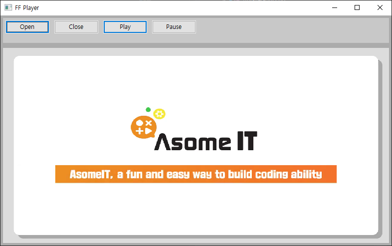

# 마무리

## 핵심 강의

<iframe width="800" height="450" src="https://www.youtube.com/embed/WRSM243rKPk" frameborder="0" allow="accelerometer; autoplay; encrypted-media; gyroscope; picture-in-picture" allowfullscreen></iframe>


## 강의 개요

ffmpeg 4.x 버전과 wxWidgets을 이용하여 동영상 플레이어를 만들어 봅니다.
지난 강의에서 만들었던 FFPlayer 클래스를 이용하여 최대한 간단한 예제를 작성하였습니다.


## 강의 전 준비 사항

* Visual Studio 2015 Update 3 또는 이후 버전
* vcpkg 설치 및 라이브러리 설치
  * ["vcpkg 설치" 참고](/install/vcpkg/)
  * vcpkg install sdl2 ffmpeg wxWidgets
    * 이전 시리즈에서 wxWidgets를 추가 설치해야 하는 점을 유의하세요.
* [https://github.com/ryujt/ff-player](https://github.com/ryujt/ff-player) 예제 다운로드
  * src/ffplayer-gui 폴더의 예제를 참고하세요.


## 이 강의에서 다룰 내용

* wxWidgets를 이용해서 GUI 어플리케이션으로 전환
* git에서 소스 내려받고 설치하는 과정부터 프로그램 완성까지 전체적인 설명

::: warning
폼의 크기를 변경하면 비디오 출력이 깨집니다. 제가 SDL 사용도 익숙하지 않고, wxWidgets 사용이 처음이라 다음에 좀 더 문서를 살펴보고 수정해서 올리도록 하겠습니다.
:::


## 실행결과




## wxFormBuilder를 이용하여 메인폼 생성

* 동영상 핵심강의와 [wxWidgets 설치](http://10bun.tv/install/wxWidgets/) 문서 참고

아래 소스는 자동으로 생성된 메인폼 소스를 헤더와 C 소스 문서를 하나로 합치고 FFPlayer 관련 코드를 추가한 것입니다. 간략하게 보이도록 중요 부분을 제외하고 생략하였습니다.

``` cpp
#pragma once
...
#include <wx/filename.h>
#include <wx/msgdlg.h>
#include <ffmpeg/FFPlayer.hpp>

class FormMain : public wxFrame {
public:
	FormMain( wxWindow* parent, wxWindowID id, const wxString& title, const wxPoint& pos, const wxSize& size, long style ) : wxFrame( parent, id, title, pos, size, style )
	{
		...
		player_.setTargetHandle( plClient->GetHandle() );
		player_.setOnError([](const void* obj, int code, const string msg){
			wxMessageBox(msg, wxT("Error"), wxICON_INFORMATION);
		});
		player_.setOnEOF([](const void* obj){
			wxMessageBox(wxT("끝까지 재생하였습니다."), wxT("Error"), wxICON_INFORMATION);
		});
	}

	~FormMain()
	{
		...
		player_.terminateNow();
	}
```
* 12: 동영상이 재생될 윈도우 핸들을 넘겨줍니다. 이제부터 해당 윈도우 화면에 동영상이 표시됩니다.
* 13-15: 에러가 났을 때 발생하는 이벤트를 처리하는 코드입니다. 메시지 박스로 에러 내용을 표시해줍니다.
* 16-18: 파일 끝까지 재생을 마치면 발생하는 이벤트를 처리하는 코드입니다.
* 24: 프로그램이 종료되기 전에 FFPlayer에서 사용되는 스레드 및 자원을 완전히 종료합니다.

::: tip
동영상 가로:세로 비율대로 영상을 출력하는 윈도우의 비율을 정하는 부분은 생략되었습니다. 비율이 다른 동영상을 재생하면 비율을 무시한 채 화면에 채워지는 효과가 나타납니다.
:::


``` cpp
private:
	FFPlayer player_;

	void on_btOpen_Click( wxMouseEvent& event )
	{
		wxFileDialog* openFileDialog =
			new wxFileDialog(this, _("Open file"), "", "", wxFileSelectorDefaultWildcardStr, wxFD_OPEN, wxDefaultPosition);
		if ( openFileDialog->ShowModal() == wxID_OK ) {
			player_.open( openFileDialog->GetPath() );
		}
	}

	void on_btClose_Click( wxMouseEvent& event )
	{
		player_.close();
	}

	void on_btPlay_Click( wxMouseEvent& event )
	{
		player_.play();
	}

	void on_btPause_Click( wxMouseEvent& event )
	{
		player_.pause();
	}
protected:
	...
};
```
* 4-11: Open 버튼이 클릭되면 파일 다이얼로그를 띄워서 선택된 파일을 오픈합니다.
* 13-16: Close 버튼 클릭 처리
* 18-21: Play 버튼 클릭 처리
* 23-26: Payse 버튼 클릭 처리


## main 소스

``` cpp
#include <wx/wxprec.h>
#ifndef WX_PRECOMP
#include <wx/wx.h>
#endif

#include "FormMain.hpp"

class MyApp : public wxApp
{
public:
	virtual bool OnInit();
};

wxIMPLEMENT_APP(MyApp);

bool MyApp::OnInit()
{
	FormMain* frame = new FormMain(NULL, 0, "FF Player", wxPoint(50, 50), wxSize(800, 500), wxDEFAULT_FRAME_STYLE | wxTAB_TRAVERSAL);
	frame->Show(true);
	return true;
}
```
* 16-21: 프로그램이 실행되면 바로 시작하는 함수입니다. 초기화에 필요한 코드를 작성합니다.
  * 18: 메인폼을 생성합니다.
  * 19: 메인폼을 나타나도록 합니다.


## FFPlayer 구조

``` cpp
class FFPlayer {
public:
	/** FFPlayer를 완전히 종료시킨다. terminateNow()를 실행하면 모든 작동이 중지되며 다시 실행할 수 없다.
	*/
	void terminateNow();

	/** 동영상 파일을 오픈하여 재생할 준비를 한다.
	@param filename 오픈 할 동영상 파일 이름
	*/
	void open(string filename);

	/** 동영상 파일을 닫는다.
	*/
	void close();

	/** 오픈된 동영상 파일을 재생한다.
	*/
	void play();

	/** 재생을 일시 멈춘다.
	*/
	void pause();

	/** 지정된 위치로 이동한다.
	@param ms 이동 할 위치 (ms 시간 단위)
	*/
	void move(int ms);

	/** 영상을 표시할 윈도우 핸들을 지정한다. 지정하지 않으면 별도의 윈도우가 생성된다.
	*/
	void setTargetHandle(void* handle);

	/** 동영상이 완전히 재생되었을 때 처리할 이벤트 핸들러를 지정한다.
	*/
	void setOnEOF(NotifyEvent event);

	/** 에러가 발생했을 때 처리할 이벤트 핸들러를 지정한다.
	*/
	void setOnError(ErrorEvent event);
```


