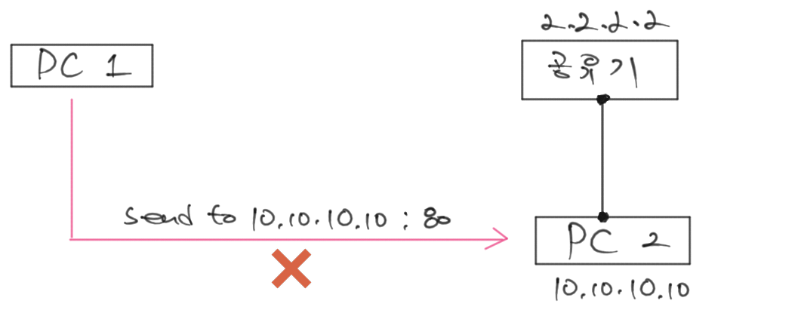

# 화상채팅 네트워크 설계

<iframe width="800" height="450" src="https://www.youtube.com/embed/HibUUfIEC0s" title="YouTube video player" frameborder="0" allow="accelerometer; autoplay; clipboard-write; encrypted-media; gyroscope; picture-in-picture" allowfullscreen></iframe>

화상채팅 프로젝트의 첫 번째 주제는 네트워크 설계로 정하였습니다.
인터넷과 서적을 검색하면서 자료를 찾아보았지만 구체적인 구현 방법에 대해서 자세하게 설명된 자료는 부족하여
제가 직접 시행착오를 거쳐서 만든 설계를 기준으로 진행하려고 합니다.

이번 강의에서는 P2P 방식과 C/S 방식의 네트워크 설계 단계에서 고려해야할 몇 가지 이슈를 다룰 것입니다.
이후 진행은 좀 더 쉽고 단순한 C/S 방식으로 프로젝트를 진행하고,
마무리 단계에서는 WebRTC를 이용할 예정입니다.


## P2P 통신의 원리

이 강의는 초보를 대상으로 기획되었습니다. 따라서, STUN이니 TURN이니 하는 무서운 용어와 구조에 대한 설명은 생략하겠습니다.
이에 대해서 좀 더 자세히 알고 싶으시면 아래의 링크의 영상을 참고하시기 바랍니다.
영어로 되어있다는 점을 빼면 문서로 된 자료들에 비해서 친절하게 설명이 되어 있어 이해하기가 수월할 거라 생각합니다.

* [https://youtu.be/FExZvpVvYxA](https://youtu.be/FExZvpVvYxA)
  * 11분 17초부터 나오는 설명부터 보시면 될 것 같습니다.

::: tip
초보분들이 쉽게 이해할 수 있도록 최대한 전문용어를 자제하고 상황을 단순하게 축약해서 설명하려고 합니다.
자세한 내용은 다른 참고자료들을 확인하시기 바랍니다.
:::


### PC-2가 인터넷에 직접 연결되어 있는 경우

이는 가장 단순한 메시지 전송 상태입니다.
PC-2가 직접 인터넷에 연결되어 있어 공용 IP를 가지고 있는 경우입니다.
이러한 경우에는 주소만 알고 있으면 메시지를 보낼 수 있게 됩니다.


* PC-2의 외부 주소(공용 IP)가 2.2.2.2이라고 가정합니다.
* PC-2에 80번 포트를 사용하고 있는 소켓이 있다고 가정합니다.
* PC-1이 PC-2의 주소를 알고 있다면 보내고 싶은 메시지를 2.2.2.2:80 주소로 보내면 PC-2에서 실행되고 있는 소켓은 이를 수신할 수 있습니다.


### PC-2가 공유기에 연결되어 있는 경우

이번에는 PC-2 대신 공유기가 인터넷에 직접 연결되어 있는 경우입니다.


* 공유기의 외부 주소(공용 IP)가 2.2.2.2이라고 가정합니다.
* PC-2는 공유기로부터 내부 아이파인 10.10.10.10을 받았다고 가정합니다. 이를 사설 IP라고 하며 외부에서는 접근할 수 없습니다. 전화기의 내선 번호와 유사합니다.
* PC-2에 80번 포트를 사용하고 있는 소켓이 있다고 가정합니다.
* PC-1이 PC-2의 사설 IP(내선번호)를 알고 있다고 해도 이는 외부에서 접근할 수 없기 때문에 10.10.10.10:80과 같은 형식으로는 메시지를 전달할 수가 없습니다.


### 중계서버를 이용해서 PC-2가 자신의 외부 주소를 PC-1에게 전달

이제 두 PC가 중계서버에 연결되어 있는 경우를 살펴보겠습니다.
중계 서버는 공용 IP 9.9.9.9를 가지고 있어서 PC-1과 PC-2가 연결할 수 있는 상태입니다.

아래 그림은 PC-2가 자신의 외부 주소를 알아내고 이를 PC-1에게 전달하는 과정을 표현한 것입니다.


* PC-2에 80번 포트를 사용하는 소켓이 9.9.9.9:80 주소로 메시지를 보낸다고 가정합니다. 이 때 자신의 주소는 10.10.10.10:80으로 메시지 안에 표시됩니다.
* 공유기를 거치면서 메시지 안의 자신의 주소 값이 2.2.2.2로 변하면서 공유기가 자신이 사용하는 포트 중에 비어 있는 포트 3333을 선택해서 지정합니다. 따라서 이제부터 메시지 안의 자신의 주소 값은 2.2.2.2:3333입니다.
* 공유기는 PC-2의 80번 포트의 소켓이 3333 포트에 연결되었다는 것을 기억해 둡니다.
* 중계서버에 PC-1이 이미 연결되어 있는 상태일 때 중계서버가 자신이 받은 메시지에서 PC-2의 주소 2.2.2.2:3333을 전달합니다.


### 외부 주소를 통해서 메시지 전달

이제 PC-2의 외부 주소를 알게 된 PC-1이 PC-2에게 직접 메시지를 전달하는 과정을 살펴보겠습니다.


* PC-2는 중계서버로부터 받은 2.2.2.2:3333 주소로 메시지를 보냅니다.
* 2.2.2.2는 공유기의 IP 주소이기 때문에 공유기까지 메시지가 전달됩니다.
* 공유기는 주소의 3333번 포트를 누가 사용하는 지 살펴봅니다. 미리 저장된 PC-2의 80번 소켓을 발견하고 메시지를 전달합니다.
* 최종적으로 메시지가 PC-2에게 전달됩니다.


## P2P 방식의 주의 사항


### 같은 LAN 안에 있는 컴퓨터인 경우 (외부 주소가 같을 경우)

메시지를 보내려는 PC가 같은 LAN 안에 있는 경우에는 외부주소로 접속이 되지 않습니다.
그래서 아래와 같이 두 가지 방법으로 연결을 시도해야 합니다.


* PC-2가 서버로 주소를 보낼 때 자신의 사설 IP를 함께 상대방에게 전달합니다.
* PC-1은 자신의 외부 IP를 알고 있어야 합니다.
* PC-1과 PC-2의 외부 IP와 자신의 외부 IP가 같을 때, PC-1은 PC-2의 사설 IP로 먼저 접속을 시도합니다. 같은 LAN 상에서는 사설 IP로 접속이 가능하기 때문입니다. 이때 포트는 PC-2의 원래 포트인 80을 사용해야 합니다.
* 사설 IP 접속이 실패하면 원래대로 외부 주소를 통해서 접속을 시도합니다.


### 외부 주소로 메시지 전달이 안되는 경우

외부 주소로 상대에게 메시지를 전달 할 수 없을 때에는 중계 서버를 이용해서 패킷을 C/S 방식으로 전달하는 수 밖에 없습니다.
네트워크 상태에 따라 P2P는 실패할 수 있기 때문입니다.


### 다수의 사용자에게 메시지를 전달해야 하는 경우

다수의 사용자에게 메시지를 전달해야 하는 상황을 가정하겠습니다. 
이런 경우 사용자가 너무 많으면 메시지를 전송하는 PC에서 감당해야 할 트래픽 양이 네트워크의 한계를 넘어서는 경우가 발생할 수 있습니다. 
이러한 경우에는 P2P로 메시지 전송이 된다고 해도 중계 방식을 병행하거나 중계 방식으로 전환해야 할 수도 있습니다.


### UDP Packet 크기 제한

UDP의 패킷 크기는 최대 65,535 바이트입니다.
하지만 [RFC 791](http://www.faqs.org/rfcs/rfc791.html)에서 IPv4의 최소 버퍼 값을 576 바이트로 정의했습니다.
여기서 헤더가 차지하는 공간이 있기 때문에 보통 프로그래머에게 익숙한 512 바이트를 단위로 메시지를 전송하는 경우가 대부분입니다.
UDP는 패킷이 반드시 전달된다는 보장이 없기 때문에 패킷이 버퍼보다 커서 조각으로 나뉘어지면 전송율이 현격하게 낮아지는 문제가 있습니다.
따라서 한 번에 보내는 데이터의 크기는 512 바이트 정도를 권장하고 있습니다.


## C/S 방식

아래 그림은 C/S 방식에서 메시지를 전달하는 일반적인 예를 보이고 있습니다.
모든 클라이언트는 서버에 미리 접속이 되어 있는 상태라고 가정했을 때,
Client A는 서버로 메시지를 보내면서 메시지를 받을 대상들을 서버에게 알려줍니다.

아래 그림에서는 나를 제외한 전체 사용자에게 전달하는 메시지라는 의미로 all-me 라고 표기했습니다.
(공식적인 표기방법이 있는 것은 아니며 이해를 돕기 위해서 한 가지 예를 들었을 뿐입니다)

P2P와 달리 메시지를 전달받은 상대의 주소를 알아낼 필요도 없고, 혹시나 직접 연결이 안되는 경우를 고려할 필요도 없기 때문에 구조와 프로세스가 상당히 단순 해집니다.


### 강의에 사용할 네트워크 설계

다음에 기회가 된다면 보다 복잡한 경우와 기능에 대해서도 다루도록 하고, 이번 강의에서는 아주 간단한 서버를 이용해서 프로젝트를 진행하도록 하겠습니다.

오디오와 비디오 데이터를 무작정 서버로 보내고 다시 서버는 클라이언트들에게 이를 전달하게 되면 생각치 못한 문제가 발생할 수 있습니다. 네트워크 속도가 느린 연결에서 데이터의 정체 현상이 발생하여 음성이나 영상이 한참 후에 도착하거나 연결 자체가 끊어질 수가 있습니다. 심각한 경우라면 서버가 죽을 수도 있고요.

아래 그림은 중계 서버로 메시지를 보내면 다른 사용자들에게 이를 전달하는 과정을 표현한 것입니다.
Client A의 마이크에서 음성 데이터가 발생하면 이를 서버로 보내고 접속된 다른 사용자에게 전달하는 것이죠.

Server는 Socket과 Buffer 객체로 구성되었다고 가정합니다.
Buffer 객체는 각 Client마다 하나씩 생성되어야 합니다.
이러한 상세한 요소들은 생략하고 전반적인 흐름을 설명하는데 집중하도록 하겠습니다.

분기를 Condition 박스를 사용하지 않고 화살표에 조건을 표시해서 단순하게 처리했습니다.


* Client A에서 **data 이벤트가 발생**하면 이를 서버로 전달합니다.
* 서버의 Socket 객체는 data 메시지를 받아서 Buffer에게 전달해달라고 요청합니다.
* 버퍼는 연결 상태가 바쁘다면 메시지를 전달하지 않고 저장(add)하고 아니라면 B에게 받은 메시지를 그대로 전달합니다.
  * 바쁘지 않은 상태라면 우선 버퍼에 미리 저장된 메시지를 먼저 보냅니다. 한 번에 보낼 수 있는 양의 한계는 정해야 합니다.
  * Client B에게 전송되는 메시지 개수만큼 idle_count를 하나씩 증가시킵니다.
  * 만약 idle_count가 제한 크기보다 크면 버퍼를 비우고 때에 따라서는 연결을 끊습니다. 네트워크 속도가 데이터 양을 감당하지 못하는 수준이라는 의미가 되며 이것이 일시적일 수 있으니 버퍼를 비워서 데이터 전송 지연을 줄이는 것이 좋습니다.
  * 버퍼를 비우는 처리는 오디오와 비디오가 서로 다르니 이는 나중에 다시 설명 드리도록 하겠습니다.
* Client B가 주기적으로 **Health Check 이벤트를 발생**시키고 이때 서버로 Health Check 메시지를 보냅니다.
  * 한 번에 보내는 메시지 개수만큼 데이터가 전달되면 서버로 Health Check 메시지를 보냅니다.
* 서버의 Socket 객체가 Health Check 메시지를 받아서 Buffer의 resetIdleCount() 메소드를 실행시킵니다.
  * "idle_count = idle_count - [한 번에 보내는 메시지 개수]"으로 초기화합니다.
  * 버퍼안에 있는 메시지를 보냅니다. 한 번에 보낼 수 있는 양의 한계는 정해야 합니다.


### C/S 방식의 주의 사항


#### TCP_NODELAY option (Nagel 알고리즘)

TCP_NODELAY을 사용하면 전송 지연을 최소화할 수가 있습니다.
메시지를 바로 보내 버리기 때문입니다.
하지만 네트워크 효율면에서는 메시지를 어느 정도 모아서 보내는 경우가 더 유리한데요.
오디오처럼 실시간이 중요한 경우에는 TCP_NODELAY 옵션을 사용하는 편이 유리하겠지만,
비디오의 경우에는 TCP_NODELAY 옵션을 사용하지 않는 것이 전체적인 서비스 품질에는 더욱 유리할 수 있습니다.


#### SO_LINGER option (TIME_WAIT)

다수의 사용자가 접속하고 다시 로그아웃 하는 등의 이벤트가 많이 발생하게 된다면,
클라이언트가 로그아웃해서 접속을 끊어도 서버에는 소켓이 남아있는 상황이 발생할 수 있습니다.
소켓의 후처리(graceful shutdown) 때문인데요.
때로는 이 때문에 소켓 자원이 모두 소비되어서 새로운 접속이 허용되지 않는 경우가 생길 수 있습니다.
클라이언트의 접속을 서버가 계속 거부하게 되는 상황이 됩니다.

이런 경우에는 SO_LINGER 옵션을 통해서 소켓 후처리를 무시하고 바로 삭제하도록 해서 해결할 수가 있습니다.
아래의 코드는 소켓 후처리를 무시하고 접속이 끊어지면 바로 소켓 리소스를 삭제하도록 하는 예제입니다.

``` cpp
struct linger ling;
ling.l_onoff = 1;
ling.l_linger = 0;
setsockopt(socket, SO_LINGER, SOL_SOCKET, SO_LINGER, &ling, sizeof(ling));
```


## 장단점 비교


### P2P 방식의 장점

* 서비스 비용이 상당히 절감된다. C/S 방식은 어디서나 접근이 가능한 곳에 서버를 둬야하기 때문에 이는 추가적이 비용이 필요하며, 사용자의 수가 증가하면 당연히 비용도 함께 증가하게 된다.
* 직접 메시지를 전송하기 때문에 지연 시간이 짧아서 대화하는데 보다 자연스럽다. C/S 방식은 P2P 방식보다는 지연이 늘어날 수밖에 없고 이는 상대방의 음성이 늦게 도착하여 함께 대화하는데 방해요소가 된다.


### C/S 방식의 장점

* 구조와 프로세스가 단순하여 구축하기가 편하다.
* 다수의 사용자를 지원하는 서비스에서 효과적이다.
  *  P2P는 개인의 네트워크 상황이 각각 다르고 사용자 수를 감당하지 못하는 경우가 발생할 수 있기 때문입니다.* 