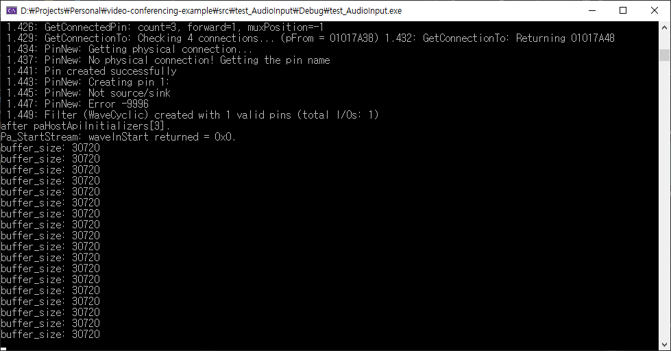
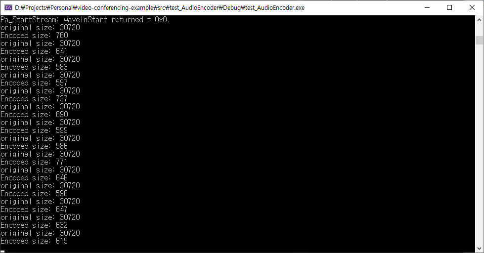
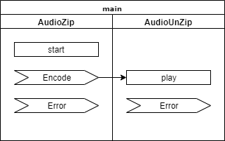

# 음성압축


## 핵심 강의

<b>동영상 준비 중</b>


## 강의 개요

화상채팅의 중요 모듈 중 하나인 음성압축 모듈에 대한 사용법을 알아봅니다. 이 강의에서는 음성압축의 구체적인 원리를 다루지 않고 이미 만들어진 라이브러리를 사용하는 방법에 집중합니다.


## 강의 전 준비 사항

* Visual Studio 2015 Update 3 또는 이후 버전
* vcpkg 설치 및 라이브러리 설치
  * ["vcpkg 설치" 참고](/install/vcpkg/)
  * vcpkg install opus portaudio
* [https://github.com/ryujt/video-conferencing-example](https://github.com/ryujt/video-conferencing-example) 예제 다운로드


## 이 강의에서 다룰 내용

* AudioInput: 음성 캡쳐 방법
* AudioOutput: 음성 출력 방법
* AudioEncoder: 음성 압축 방법
* AudioDecoder: 음성 압축 해제 방법
* AudioZip: AudioInput + AudioEncoder
* AudioUnZip: AudioOutput + AudioDecoder


## AudioInput

오디오 입력 장치로부터 오디오를 캡쳐하는 클래스입니다. "소리 설정"에서 기본 입력 장치로 선택되어 있는 장치로 부터 오디오를 가져오게 됩니다.


### Class 구조


``` cpp
class AudioInput {
public:
	/** AudioInput 생성자
	@param channels 캡쳐할 오디오의 채널 수. 1: 모노, 2: 스테레오
	@param sampe_rate 캡쳐할 오디오의 sampling rate. 초당 캡쳐할 샘플링(오디오의 데이터) 개수
	@param fpb 한 번에 처리할 프레임의 갯수
	*/
	AudioInput(int channels, int sampe_rate, int fpb)

	/** 오디오 장치를 오픈
	@return 에러 코드가 리턴된다. 정상처리되면 0이 리턴된다.
	*/
	int open() 

	/** 오디오 장치를 닫는다. 오디오 캡쳐가 중단된다. */
	void close() 

	/** 오디오가 캡쳐되는 중인지 알려준다.
	@return true: 오디오 캡쳐 중, false: 오디오 캡쳐가 중단됨
	*/
	bool isActive()

	/** OnError 이벤트 핸들러를 지정한다.
	@param event 에러가 났을 때 실행될 이벤트 핸들러
	*/
	void setOnError(IntegerEvent event) { OnError_ = event; }

	/** OnData 이벤트 핸들러를 지정한다.
	@param event 오디오가 캡쳐되었을 때 실행될 이벤트 핸들러
	*/
	void setOnData(const DataEvent &value) { on_data_ = value; }
```


### 사용방법

``` cpp
#include <ryulib/AudioIO.hpp>

int main(void) {
	Audio::init();

	AudioInput audio_input(2, 48000, 3840);
	audio_input.setOnData([](const void* obj, const void* data, int size) {
		printf("buffer_size: %d \n", size);
	});
	audio_input.open();

	while (audio_input.isActive()) {
		Pa_Sleep(1000);
	}

	audio_input.close();
}
```
* 1: AudioInput 클래스가 정의된 AudioIO.hpp 헤더를 가져옵니다.
* 4: AudioIO를 사용하기 전에는 반드시 Audio::init() 함수를 실행하여 초기화가 되어야 합니다.
* 6: 2채널(스테레오), 48000Hz(샘플 레이트)로 오디오를 캡쳐할 객체를 생성합니다.
* 7-9: 오디오가 캡쳐됐을 때 실행할 핸들러를 작성합니다.
* 8: 오디오가 캡쳐되면 오디오 데이터의 크기를 콘솔창에 출력합니다.
* 10: 오디오 캡쳐를 시작합니다.
* 12-14: 오디오 장치를 사용할 수 있을 때까지 계속 기다립니다. 반복하는 동안 CPU 사용률을 낮추기 위해서 Pa_Sleep(1000)를 반복하고 있습니다.
* 16: 오디오 캡쳐를 중단합니다.


### 실행결과

* 이미지의 앞 부분은 Audio::init() 함수에 의한 초기화과정이 표시된 것 입니다.
* "buffer_size: 30720"가 반복되는 것을 보실 수가 있습니다. 오디오 입력 창치로부터 가져온 데이터의 크기 입니다.


## AudioEncoder

OUPS 코덱을 이용해서 오디오를 압축해주는 클래스입니다.


### Class 구조

``` cpp
class AudioEncoder {
public:
	/** AudioEncoder 생성자
	@param channels 오디오의 채널 수. 1: 모노, 2: 스테레오
	@param sampe_rate 오디오의 sampling rate. 초당 캡쳐할 샘플링(오디오의 데이터) 개수
	*/
	AudioEncoder(int channels, int sampe_rate)

	/** 압축하려는 오디오 데이터를 큐에 추가합니다. 오디오 압축은 내부 스레드에서 비동기로 처리됩니다.
	@param data 오디오 데이터의 주소
	@param size 오디오 데이터의 크기
	*/
	void add(const void* data, int size) 

	/** OnError 이벤트 핸들러를 지정한다.
	@param event 에러가 났을 때 실행될 이벤트 핸들러
	*/
	void setOnError(IntegerEvent event)

	/** OnEncode 이벤트 핸들러를 지정한다.
	@param event 오디오가 압축되었을 때 실행될 이벤트 핸들러
	*/
	void setOnEncode(DataEvent event)
```


### 사용방법

``` cpp
#include <ryulib/AudioIO.hpp>
#include <ryulib/AudioEncoder.hpp>

int main(void) {
	Audio::init();

	AudioEncoder encoder(2, 48000);
	encoder.setOnEncode([&](const void* obj, const void* data, int size) {
		printf("Encoded size: %d \n", size);
	});

	AudioInput audio_input(2, 48000, 3840);
	audio_input.setOnData([&](const void* obj, const void* buffer, int buffer_size) {
		printf("original size: %d \n", buffer_size);
		encoder.add(buffer, buffer_size);
	});
	audio_input.open();

	while (audio_input.isActive()) {
		Pa_Sleep(1000);
	}

	audio_input.close();
}
```
* 1: AudioInput 클래스가 정의된 AudioIO.hpp 헤더를 가져옵니다.
* 2: AudioEncoder 클래스가 정의된 AudioEncoder.hpp 헤더를 가져옵니다.
* 5: AudioIO를 사용하기 전에는 반드시 Audio::init() 함수를 실행하여 초기화가 되어야 합니다.
* 7: 2채널(스테레오), 48000Hz(샘플 레이트) 오디오를 압축할 객체를 생성합니다.
* 8-10: 오디오 압축이 완료됐을 때 실행할 핸들러를 작성합니다.
* 9: 압축된 오디오 데이터의 크기를 콘솔 화면에 표시합니다.
* 15: 캡쳐된 오디오 데이터를 encoder 객체에게 압축해달라고 의뢰합니다.

나머지 코드는 AudioInput 사용방법과 같기 때문에 생략하였습니다.


### 실행결과


* "original size: 30720"에 이어서 "Encoded size: 760"과 같이 압축된 데이터의 크기가 콘솔 화면에 나타납니다. 압축된 데이터의 크기는 조금씩 다른 것을 볼 수가 있는데요, 캡쳐된 오디오가 압축하기에 유리한 형태이면 압축된 크기도 작아지는 것을 알 수 있습니다.


## AudioZip과 AudioUnZip

오디오 압축과 해제를 좀 더 쉽게 사용할 수 있도록 오디오 입출력, 인코딩 그리고 디코딩을 묶어서 단순하게 포장한 클래스입니다.


### AudioZip class 구조

``` cpp
class AudioZip {
public:
	/** AudioZip 생성자
	@param channels 오디오의 채널 수. 1: 모노, 2: 스테레오
	@param sampe_rate 오디오의 sampling rate. 초당 캡쳐할 샘플링(오디오의 데이터) 개수
	*/
	AudioZip(int channels, int sampe_rate)

	/** 오디오 캡쳐 및 압축을 시작한다. */
	void start() 

	/** 오디오 캡쳐 및 압축을 중단한다. */
	void stop() 

	/** OnError 이벤트 핸들러를 지정한다.
	@param event 에러가 났을 때 실행될 이벤트 핸들러
	*/
	void setOnError(IntegerEvent event)

	/** OnEncode 이벤트 핸들러를 지정한다.
	@param event 오디오가 압축되었을 때 실행될 이벤트 핸들러
	*/
	void setOnEncode(DataEvent event)
```


### AudioUnZip class 구조

``` cpp
class AudioUnZip {
public:
	/** AudioUnZip 생성자
	@param channels 오디오의 채널 수. 1: 모노, 2: 스테레오
	@param sampe_rate 오디오의 sampling rate. 초당 캡쳐할 샘플링(오디오의 데이터) 개수
	*/
	AudioUnZip(int channels, int sampe_rate)

	/** 압축된 데이터를 압축해제하고 재생을 한다.
	@param data 압축된 오디오 데이터의 주소
	@param size 압축된 오디오 데이터의 크기
	*/
	void play(const void* data, int size)

	/** OnError 이벤트 핸들러를 지정한다.
	@param event 에러가 났을 때 실행될 이벤트 핸들러
	*/
	void setOnError(IntegerEvent event)
```

### 사용방법

``` cpp
#include <ryulib/AudioZip.hpp>
#include <ryulib/AudioUnZip.hpp>

int main(void) {
	Audio::init();

	AudioUnZip unzip(1, 48000);
	unzip.setOnError([&](const void* obj, int error_code) {
		printf("AudioUnZip - error: %d", error_code);
	});

	AudioZip zip(1, 48000);
	zip.setOnError([&](const void* obj, int error_code) {
		printf("AudioZip - error: %d", error_code);
	});
	zip.setOnEncode([&](const void* obj, const void* data, int size) {
		unzip.play(data, size);
	});

	zip.start();

	while (true) {
		Pa_Sleep(1000);
	}
}
```
* 7: 오디오를 압축해제하고 재생할 객체를 만듭니다.
* 8-9: 오디오 압축해제 및 재생 과정에서 오류가 나면 처리할 이벤트 핸들러를 작성합니다.
* 12: 오디오를 캡쳐하고 압축할 객체를 만듭니다.
* 13-15: 오디오 캡쳐 및 압축 과정에서 오류가 나면 처리할 이벤트 핸들러를 작성합니다.
* 16-18: 오디오 압축이 완료될 때 실행할 이벤트 핸들러를 작성합니다.
* 17: 압축된 데이터를 바로 unzip 객체에 전달하여 압축해제 및 재생을 의뢰합니다.
* 20: 오디오 캡쳐 및 압축을 시작합니다.

위의 예제가 그다지 길지는 않지만 이벤트로 엮여 있기 때문에 초보분들에게는 코드의 흐름을 머릿속에 담기에 어려울 수도 있는데요, 아래 다이어그램으로 표현해보면 코드의 흐름이 좀 더 쉽게 이해할 수 있습니다.


* AudioZip.start() 메소드 실행이 되면 OnEncode 이벤트가 발생합니다.
* AudioZip.OnEncode 이벤트가 발생하면 압축된 데이터를 AudioUnZip.play() 메소드에 전달하여 재생을 의뢰합니다.
* 각 과정에서 에러가 발견되면 OnError 이벤트가 발생합니다. 상황에 맞는 에러처리를 추가해주시면 됩니다.


### 테스트 방법

위의 코드를 실행하면 마이크(또는 오디오 입력 장치)에서 오디오를 캡쳐하여 압축한 뒤 바로 AudioUnZip 객체에게 전달하여 압축을 해제하고 재생하게 됩니다. 따라서, 여러분들이 마이크에 소리를 입력하면 바로 스피커로 출력되는 것을 확인할 수 있습니다.

이때 압축 시간과 해제 시간 등에 의해서 소리가 조금 간격을 두고 메아리처럼 들리게 됩니다. 스피커의 소리가 너무 커서 마이크에 너무 많이 유입되면 소리가 점점 커지면서 하울링이 발생하니 조심하시기 바랍니다.

::: tip 에코 캔슬
화상회의에서 해드셋을 사용하지 않고 스피커를 사용하게 되면, 상대방의 목소리가 내 마이크로 유입되어 상대방에게 전달됩니다. 이 때문에 상대방은 자신의 목소리가 다시 자신에게 들리는 현상이 발생합니다. 이것이 반복되면 소리가 점점 커져서 소음이 심하게 발생되는데요, 이것을 제거해주는 기술을 에코 캔슬이라고 합니다.

에코 캔슬에 대해서는 이 프로젝트의 마지막 부분에서 다뤄볼 예정입니다.

참고 링크
* [https://www.speex.org/docs/manual/speex-manual/node4.html#SECTION00450000000000000000](https://www.speex.org/docs/manual/speex-manual/node4.html#SECTION00450000000000000000)
* [https://www.speex.org/docs/manual/speex-manual/node7.html#SECTION00740000000000000000](https://www.speex.org/docs/manual/speex-manual/node7.html#SECTION00740000000000000000)
:::