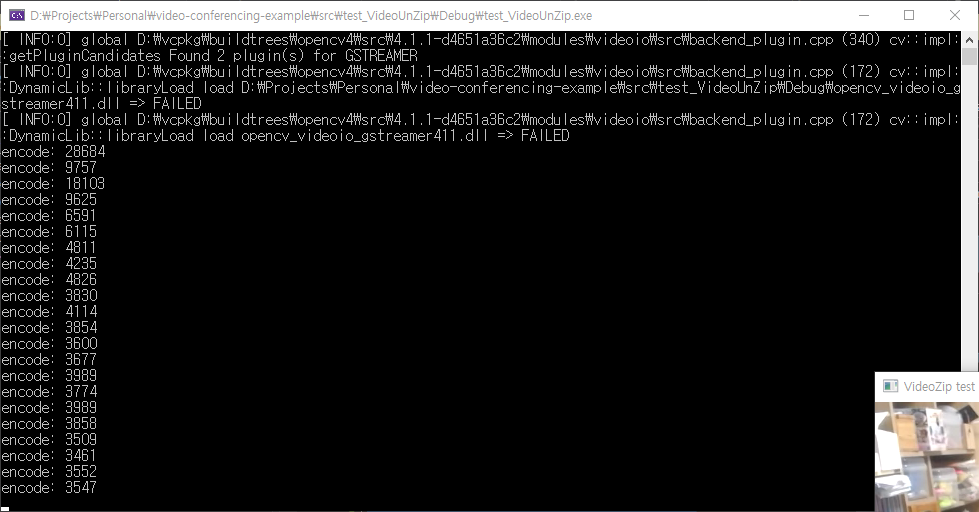

# 동영상 압축


## 핵심 강의

<b>동영상 준비 중</b>


## 강의 개요

화상채팅의 중요 모듈 중 하나인 화상 압축 모듈에 대한 사용법을 알아봅니다. 이 강의에서는 화상 압축의 구체적인 원리를 다루지 않고 이미 만들어진 라이브러리를 사용하는 방법에 집중합니다.


## 강의 전 준비 사항

* Visual Studio 2015 Update 3 또는 이후 버전
* vcpkg 설치 및 라이브러리 설치
  * ["vcpkg 설치" 참고](/install/vcpkg/)
  * vcpkg install libvpx sdl2 opencv4
* [https://github.com/ryujt/video-conferencing-example](https://github.com/ryujt/video-conferencing-example) 예제 다운로드


## 이 강의에서 다룰 내용

* CameraList: PC 카메라 목록 가져오기
* VideoCapture: PC 카메라에서 동영상 캡쳐
* VideoZip: 동영상 압축
* WindowSDL: SDL2를 이용하여 이미지를 화면에 표시
* VideoUnZip: 동영상 압축 해제


## CameraList

PC에 설치되어 있는 카메라의 목록을 가져오는 클래스입니다. 
이 강의에서는 사용하지 않지만 최종 마무리에서 사용할 클래스이기 때문에 살펴보고 넘어가도록 하겠습니다.


### Class 구조

``` cpp
class CameraList
{
public:
	/** 카메라 목록을 갱신합니다.
	*/
	void update()

	/** 찾아낸 카메라의 개수 */
	int size()

	/** 카메라의 이름을 가져옵니다.
	@param index 가져올 카메라의 순번 (순번은 0부터 시작함)
	*/
	string getName(int index)
```


### 사용방법

``` cpp
#include <iostream>
#include <ryulib/CameraList.hpp>

int main()
{
	CameraList cameralist;
	cameralist.update();
	for (int i = 0; i < cameralist.size(); i++) {
		printf("%d: %s", i, cameralist.getName(i).c_str());
	}

	return 0;
}
```
* 6: 카메라 목록을 가져올 CameraList 객체를 생성합니다.
* 7: 카메라 목록을 업데이트합니다. 만약 update() 메소드 사용 이후 카메라를 PC에 연결하거나 제거하였다면, update() 메소드를 다시 실행해야 합니다.
* 8-10: 카메라 목록의 갯수만큼 반복하면서 각 카메라의 이름을 표시해줍니다.


### 실행결과


## VideoCapture

OpenCV에서 제공하는 클래스입니다. 카메라로 부터 이미지를 캡쳐해서 가져올 수 있습니다.


### class 구조

아래 링크를 참고하시기 바랍니다.
* [https://docs.opencv.org/4.1.2/d8/dfe/classcv_1_1VideoCapture.html](https://docs.opencv.org/4.1.2/d8/dfe/classcv_1_1VideoCapture.html)


### 사용방법

``` cpp
#include <iostream>
#include <opencv2/opencv.hpp>

using namespace cv;

int main(int argc, char* args[])
{
	int width  = 640;
	int height = 480;

	VideoCapture cap;
	cap.set(CAP_PROP_CONVERT_RGB, true);
	cap.set(CAP_PROP_FRAME_WIDTH, width);
	cap.set(CAP_PROP_FRAME_HEIGHT, height);
	cap.open(0);
	if (cap.isOpened() == false) {
		printf("error! \n");
		return 0;
	}

	Mat image;
	while (true) {
		cap.read(image);
		imshow("Camera View", image);
	}

	return 0;
}
```
* 8-9: 카메라로부터 가져올 영상의 크기를 지정합니다.
* 11: 영상을 캡쳐하기 위해서 VideoCapture 객체를 생성합니다.
* 12: RGB 이미지를 사용하도록 설정합니다.
* 13-14: 영상의 크기를 설정합니다.
* 15: 기본 카메라로 설정된 카메라로부터 영상 캡처를 시작합니다.
* 16-19: 카메라를 오픈하는데 실패하였다면 에러 메시지를 표시하고 프로그램을 종료합니다.
* 21: 카메라 영상을 저장할 객체를 생성합니다. ([https://docs.opencv.org/4.1.2/d3/d63/classcv_1_1Mat.html](https://docs.opencv.org/4.1.2/d3/d63/classcv_1_1Mat.html) 참고)
* 22-25: 무한히 반복합니다.
  * 23: 카메라에서 이미지를 가져옵니다.
  * 24: 가져온 이미지를 화면에 표시해줍니다. 


### 실행결과


수염 때문에 모자이크 처리


## VideoZip

VideoZip는 VP8 코덱을 이용하여 영상을 압축하는 클래스입니다.

### Class 구조

``` cpp
class VideoZip {
public:
	/** 비디오 인코더를 준비시킵니다.
	@param width 인코딩 할 영상의 넓이 (가로 크기)
	@param height 인코딩 할 영상의 높이 (세로 크기)
	@return 인코딩 준비 중 에러가 없으면 true가 리턴됩니다.
	*/
	bool open(int width, int height)

	/** 인코더 사용을 중단합니다. */
	void close()

	/** 영상을 인코딩 합니다.
	@param bitmap 인코딩 할 BITMAP 데이터
	@param depth 인코딩 할 BITMAP의 색상수 (비트단위, 현재는 24비트만 가능)
	@return 인코딩 중 에러가 없으면 true가 리턴됩니다.
	*/
	bool encode(void* bitmap, int depth)

	/** 인코딩 결과 데이터 */
	void* getData()

	/** 인코딩 결과 데이터의 크기 */
	int getSize()
```


### 사용방법

``` cpp
#include <iostream>
#include <opencv2/opencv.hpp>
#include <ryulib/VideoZip.hpp>

using namespace cv;

int main(int argc, char* args[])
{
	int width  = 640;
	int height = 480;

	VideoCapture cap;
	cap.set(CAP_PROP_CONVERT_RGB, true);
	cap.set(CAP_PROP_FRAME_WIDTH, width);
	cap.set(CAP_PROP_FRAME_HEIGHT, height);
	cap.open(0);
	if (cap.isOpened() == false) {
		printf("error! \n");
		return 0;
	}

	width  = cap.get(CAP_PROP_FRAME_WIDTH);
	height = cap.get(CAP_PROP_FRAME_HEIGHT);

	VideoZip video_zip;
	video_zip.open(width, height);

	Mat image;
	while (true) {
		cap.read(image);
		imshow("Camera View", image);

		if (video_zip.encode(image.data, 24)) printf("encode: %d \n", video_zip.getSize());
	}

	return 0;
}
```
* 25: 영상을 압축할 VideoZip 객체를 생성합니다.
* 26: VideoZip.open() 메소드로 지정된 크기의 영상 압축을 준비합니다.
* 33: VideoZip.encoder() 메소드로 이미지를 압축합니다. 
  * 24는 24비트 컬러를 의미합니다.
  * 압축된 데이터의 크기를 콘솔화면에 표시합니다.

### 실행결과


VideoCapture 결과화면과 거의 같으나 콘솔창에 압축된 데이터의 크기가 계속 표시됩니다.


## WindowSDL

WindowSDL은 SDL2를 이용해서 화면에 영상을 표시하는 클래스입니다.
에제를 단순하게 보이기 위해서 SDL2를 다루는 구체적인 내용을 캡슐화하였습니다.

### Class 구조

``` cpp
class WindowSDL {
public:
	/** 영상을 출력하기 위한 윈도우를 생성(오픈)합니다.
	@param caption 윈도우의 제목
	@param width 윈도우의 넓이 (가로 크기)
	@param height 윈도우의 높이 (세로 크기)
	*/
	bool open(string caption, int width, int height)

	/** 윈도우를 닫습니다. */
	void close()

	/** 32비트 BITMAP을 윈도우에 표시합니다.
	@param bitmap 표시할 BITMAP 데이터
	*/
	void showBitmap32(void* bitmap)
```


## VideoUnZip

VideoUnZip는 VideoZip을 이용해서 압축된 영상 데이터를 압축 해제하는 클래스입니다.


### Class 구조

``` cpp
class VideoUnZip {
public:
	/** 비디오 디코더를 준비시킵니다.
	@param width 디코딩 할 영상의 넓이 (가로 크기)
	@param height 디코딩 할 영상의 높이 (세로 크기)
	@return 디코딩 준비 중 에러가 없으면 true가 리턴됩니다.
	*/
	bool open(int width, int height)

	/** 디코더를 초기화 시킵니다. 화상 채팅 중 상대가 접속이 끊겨서 다시 입장한 경우 등에 활용할 수 있습니다. */
	void refresh()

	/** 디코더 사용을 중단합니다. */
	void close()

	/** 영상을 디코딩 합니다.
	@param bitmap 디코딩 할 데이터
	@param size 디코딩 할 데이터의 크기
	@return 디코딩 중 에러가 없으면 true가 리턴됩니다.
	*/
	bool decode(void* data, int size)

	/** 디코딩이 완료된 BITMAP의 데이터 */
	void* getBitmap() { return bitmap_; }
```

### 사용방법

``` cpp
#include <iostream>
#include <opencv2/opencv.hpp>
#include <ryulib/VideoZip.hpp>
#include <ryulib/VideoUnZip.hpp>
#include <ryulib/sdl_window.hpp>

using namespace cv;

int main(int argc, char* args[])
{
	int width  = 640;
	int height = 480;

	VideoCapture cap;
	cap.set(CAP_PROP_CONVERT_RGB, true);
	cap.set(CAP_PROP_FRAME_WIDTH, width);
	cap.set(CAP_PROP_FRAME_HEIGHT, height);
	cap.open(0);
	if (cap.isOpened() == false) {
		printf("error! \n");
		return 0;
	}

	width  = cap.get(CAP_PROP_FRAME_WIDTH);
	height = cap.get(CAP_PROP_FRAME_HEIGHT);

	VideoZip video_zip;
	video_zip.open(width, height);

	VideoUnZip video_unzip;
	video_unzip.open(width, height);

	WindowSDL window;
	window.open("VideoZip test", width, height);

	Mat image;
	while (true) {
		cap.read(image);

		if (video_zip.encode(image.data, 24)) {
			printf("encode: %d \n", video_zip.getSize());

			if (video_unzip.decode(video_zip.getData(), video_zip.getSize())) {
				window.showBitmap32(video_unzip.getBitmap());
			}
		}
	}

	return 0;
}
```
* 30: 영상 압축 해제를 할 수 있는 VideoUnZip 객체를 생성합니다.
* 31: VideoUnZip.open() 메소드로 지정된 화면 크기의 영상 압축 해제를 준비합니다.
* 33: 압축 해제된 BITMAP 이미지를 표시하기 위해서 SDL 윈도우를 사용할 수 있는 WindowSDL 객체를 생성합니다.
* 34: WindowSDL.open() 메소드로 지정된 크기의 윈도우 화면을 표시합니다.
* 43: VideoUnZip.decode() 메소드로 압출된 데이터를 다시 압축해제하고 WindowSDL 객체를 이용해서 화면에 표시합니다. 


### 실행결과


수염을 가리고 찰칵!