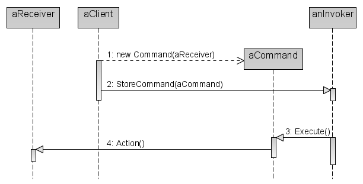
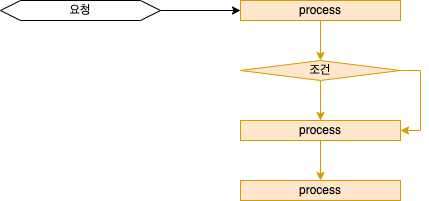
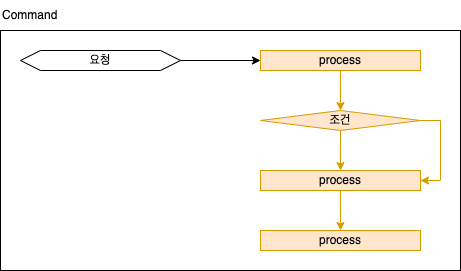

# Design pattern - Command pattern


::: tip 예제 코드
[https://github.com/ryujt/design_pattern](https://github.com/ryujt/design_pattern)
:::


## 강의 개요

이번 강의에서는 State 패턴이 무엇이고 언제 사용하는 지에 대해서 알아봅니다.

우선 위키백과의 정의를 살펴보면 다음과 같습니다.

::: tip 커맨드 패턴(command pattern)
커맨드 패턴(Command pattern)이란 요청을 객체의 형태로 캡슐화하여 사용자가 보낸 요청을 나중에 이용할 수 있도록 매서드 이름, 매개변수 등 요청에 필요한 정보를 저장 또는 로깅, 취소할 수 있게 하는 패턴이다.

커맨드 패턴에는 명령(command), 수신자(receiver), 발동자(invoker), 클라이언트(client)의 네개의 용어가 항상 따른다. 커맨드 객체는 수신자 객체를 가지고 있으며, 수신자의 메서드를 호출하고, 이에 수신자는 자신에게 정의된 메서드를 수행한다. 커맨드 객체는 별도로 발동자 객체에 전달되어 명령을 발동하게 한다. 발동자 객체는 필요에 따라 명령 발동에 대한 기록을 남길 수 있다. 한 발동자 객체에 다수의 커맨드 객체가 전달될 수 있다. 클라이언트 객체는 발동자 객체와 하나 이상의 커맨드 객체를 보유한다. 클라이언트 객체는 어느 시점에서 어떤 명령을 수행할지를 결정한다. 명령을 수행하려면, 클라이언트 객체는 발동자 객체로 커맨드 객체를 전달한다.

* 위키백과
:::

### Class diagram


### Sequence diagram



### 요약

#### 요청과 처리 프로세스 전체가 노출된 상태




#### 요청과 처리 프로세스를 한 덩어리로 캡슐화




## 미션

그림판 어플리케이션의 일부 시나리오 수행


## 공통 클래스

``` java
class Canvas {
    public void drawLine(...) { }
    public void drawCircle(...) { }
    ...
}
```

## 패턴 적용 전

``` java
public class Drawing {
    public void drawingItem(DrawItem item) {
        switch (item.code) {
            case "triangle":
                // 삼각형 그리기
                canvas.drawLine(drawItem.x, drawItem.y, ...);
                ...
                break;

            case "rectangle":
                // 사각형 그리기
                canvas.drawLine(drawItem.x, drawItem.y, ...);
                ...
                break;

            case "circle":
                // 원 그리기
                canvas.drawLine(drawItem.x, drawItem.y, ...);
                ...
                break;
        }
    }
}
```

## Command 패턴 적용 후

### Drawing

``` java
public class Drawing {
    public void drawingItem(ICommand command) {
        command.execute();
    }
}
```

### Command & Concrete Command

``` java
Interface ICommand {
    public void execute();
}

class Command {
    Command(Canvas canvas, DrawItem drawItem) {
        ...
    }
    ...
}

class DrawTriangle extends Command implements ICommand {
    public void execute() {
        // 삼각형 그리기
        canvas.drawLine(drawItem.x, drawItem.y, ...);
        ...
    }
}

class DrawRectangle extends Command implements ICommand {
    public void execute() {
        // 사각형 그리기
        canvas.drawLine(drawItem.x, drawItem.y, ...);
        ...
    }
}

class DrawCircle extends Command implements ICommand {
    public void execute() {
        // 원 그리기
        int radius = drawItem...;
        canvas.drawCircle(drawItem.x, drawItem.y, radius, ...);
        ...
    }
}
```

### 그리기 요청의 한 예

``` java
class DrawCircleButton {
    public void onClick(int x, int y, ...) {
        DrawItem drawItem = new DrawItem(x, y, ...);
        ICommand command = new DrawCircle(canvas, drawItem)
        drawing.drawingItem(command);
    }
}
```


## undo 기능 추가

### Drawing

``` java
public class Drawing {
    public void drawingItem(ICommand command) {
        command.execute();
        queue.offer(command);
    }

    public void undo() {
        if (queue.isEmpty() == false) {
            ICommand command = queue.poll();
            command.undo();
        }

    }

    private Queue<ICommand> queue = new LinkedList<>()
}
```

::: tip
Command 패턴을 사용하지 않았을 때 취소 처리를 하게 된다면 코드가 어떻게 달라졌을 지 생각해보세요.
:::

### Command & Concrete Command

``` java
Interface ICommand {
    public void execute();
    public void undo();
}

class DrawTriangle extends Command implements ICommand {
    public void execute() {
        // 이전화면 저장하기
        ...
        // 삼각형 그리기
        canvas.drawLine(drawItem.x, drawItem.y, ...);
        ...
    }

    public void undo() {
        // 이전화면 복원하기
    }
}
...
```

::: tip
undo()의 프로세스가 command마다 다르지 않고 같다면 Command 클래스에서 한 번에 처리할 수 있습니다.
:::