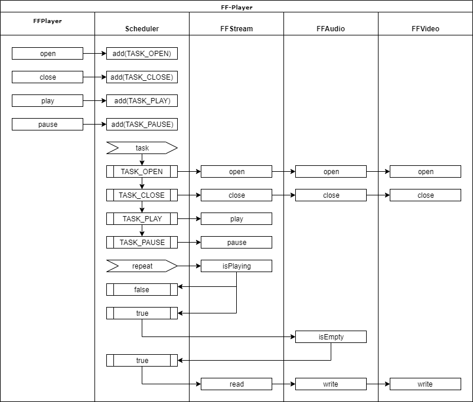
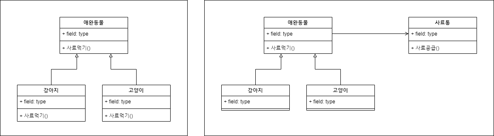
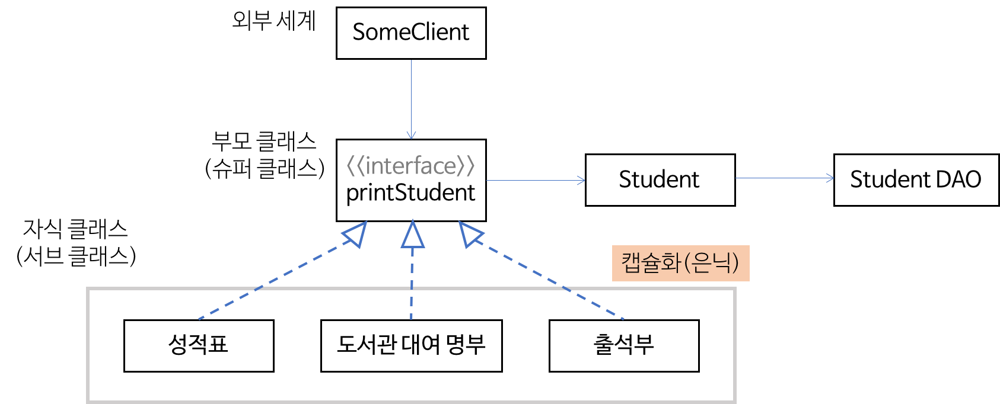
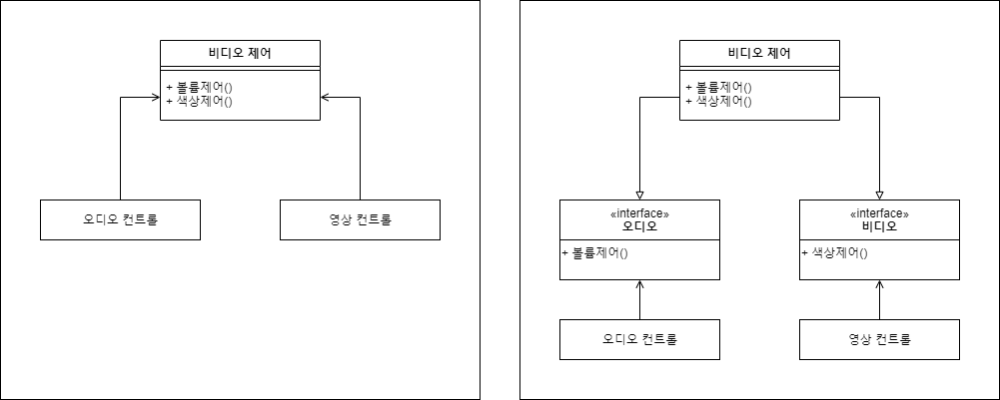

# 객체 지향 프로그래밍의 원칙


## 기본 원칙

기본 원칙은 가장 효과적이며 기본적인 원칙들만 추려낸 것입니다.


### 구현보다는 인터페이스에 맞춰서 코딩 하라

정확한 해법을 찾기 전에 전체 그림과 흐름을 파악해야 합니다.
그림을 그릴 때 스케치를 통해서 구도를 잡은 후 세밀한 부분을 나중에 채워가듯이,
복잡한 시스템을 단순한 모듈 형태로 표현하고


모듈들이 어떻게 연결되고 협력하는 지를 우선적으로 생각해야 합니다.
이렇게 각 각 모듈이 자신의 자리를 잡으면
세밀한 부분을 하나씩 구현해 가는 방식으로 프로그램을 완성합니다.




### 단일 책임 원칙

객체지향 프로그래밍 5원칙 중에서도 가장 우선이 되는 원칙입니다.
지키기도 쉬우면서도 효과적인 원칙이기도 합니다.
객체지향 프로그래밍 5원칙 파트에서 다시 설명하겠습니다.


### 중복 코드 제거

중복 코드 제거는 객체지향과 무관하게 항상 중요한 원칙입니다.
중복 코드는 시스템을 변경을 어렵게 하며 코드의 생산성을 나쁘게 하는 원인이 됩니다.

중복 코드를 제거하는 방법으로는 위임과 상속이 있으며,
상속보다는 위임을 우선으로 사용하는 것이 유지보수에 보다 유리한 경우가 많습니다.




### 변화와 복잡함 감추기 (캡슐화)

첫 번째 원칙과 겹치는 부분이 있는 원칙입니다.
복잡한 요소와 변화 요소를 전면 드러나지 않게 서랍 안에 감춰두는 것만으로도
상당한 이득을 취할 수가 있습니다.

* 복잡한 시스템을 단순한 형태로 정리할 수가 있으며
* 변화가 외부로 전파되지 못하게 방화벽 역활을 할 수 있습니다.


## 객체지향 프로그래밍 5원칙 (SOLID)


### 단일 책임 원칙 (SRP : Single Responsibility Principle)

    한 클래스는 하나의 책임만 가져야 한다.

* 이해하기 쉬운 시스템 구축
* 변경에 의한 영향 최소화


### 개방-폐쇄 원칙 (OCP : Open/Closed Principle)

    확장에는 열려(Open) 있으나, 변경에는 닫혀(Closed)있어야 한다.




### 리스코프 치환 원칙 (LSP : Liskov’s Substitution Principle)

    자식 클래스는 부모 클래스를 대체할 수 있어야 한다.

``` java
interface Service {
    void start();
    void stop();
}

class NormalService implements Service {
    void start() { ... }
    void stop() {
        ...
    }
}

class ZombieService implements Service {
    void start() { ... }
    void stop() {
        throw new Exception("좀비 서비스는 종료할 수 없습니다.");
    }
}
```


### 인터페이스 분리 원칙 (ISP : Interface Segregation Principle)

    범용 인터페이스보다 전문화된 인터페이스를 사용하라.




### 의존성 역전 원칙 (DIP : Dependency Inversion Principle)

    추상적인 코드가 구체적인 코드에 영향 받아서는 안된다.


## 기타


### 디미터의 법칙(Law of Demeter)

``` java
if (user.getAddress().getRegion().equals("Seoul")) {
    ...
}
```


