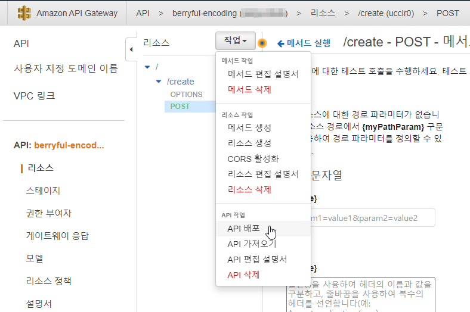

# AWS MediaConvert를 이용한 VOD 서비스 개발

## 개요

[베리풀: 화장품 뷰티 숏 비디오 커뮤니티](https://play.google.com/store/apps/details?id=co.kr.buzz.berryful&hl=ko)


## 역할 생성


## Lambda 함수 생성


### 람다 코드 작성


``` python
import glob
import json
import os
import uuid
import boto3
import datetime
import random
from urllib.parse import urlparse
import logging

from botocore.client import ClientError

logger = logging.getLogger()
logger.setLevel(logging.INFO)

S3 = boto3.resource('s3')

def lambda_handler(event, context):
    mediaConvertRole = "arn:aws:iam::...."
    application = "VOD"
    region = "ap-northeast-2"

    assetID = str(uuid.uuid4())

    statusCode = 200
    jobs = []
    job = {}

    sourceS3Bucket = event["BucketFrom"]
    sourceS3Key = event["Filename"]
    sourceS3 = 's3://'+ sourceS3Bucket + '/' + sourceS3Key
    startTimecode = event["StartTimecode"]
    endTimecode = event["EndTimecode"]

    destS3Bucket = event["BucketTo"]
    destinationS3 = 's3://' + destS3Bucket + '/encoded/' + sourceS3Key[:sourceS3Key.rfind('/')+1]

    jobMetadata = {}
    jobMetadata['assetID'] = assetID
    jobMetadata['application'] = application
    jobMetadata['input'] = sourceS3
    jobMetadata['settings'] = 'Default'

    try:
        jobInput = {}
        bucket = S3.Bucket(sourceS3Bucket)

        with open('params.json') as json_data:
            jobInput['settings'] = json.load(json_data)
            jobs.append(jobInput)

        mediaconvert_client = boto3.client('mediaconvert', region_name=region)
        endpoints = mediaconvert_client.describe_endpoints()

        client = boto3.client('mediaconvert', region_name=region, endpoint_url=endpoints['Endpoints'][0]['Url'], verify=False)

        for j in jobs:
            jobSettings = j['settings']
            jobSettings['Inputs'][0]['FileInput'] = sourceS3
            jobSettings['Inputs'][0]['InputClippings'][0]["StartTimecode"] = startTimecode
            jobSettings['Inputs'][0]['InputClippings'][0]["EndTimecode"] = endTimecode
            for outputGroup in jobSettings['OutputGroups']:
                if outputGroup['OutputGroupSettings']['Type'] == 'FILE_GROUP_SETTINGS':
                    outputGroup['OutputGroupSettings']['FileGroupSettings']['Destination'] = destinationS3
                elif outputGroup['OutputGroupSettings']['Type'] == 'HLS_GROUP_SETTINGS':
                    outputGroup['OutputGroupSettings']['HlsGroupSettings']['Destination'] = destinationS3
                elif outputGroup['OutputGroupSettings']['Type'] == 'DASH_ISO_GROUP_SETTINGS':
                    outputGroup['OutputGroupSettings']['DashIsoGroupSettings']['Destination'] = destinationS3
                elif outputGroup['OutputGroupSettings']['Type'] == 'DASH_ISO_GROUP_SETTINGS':
                    outputGroup['OutputGroupSettings']['DashIsoGroupSettings']['Destination'] = destinationS3
                elif outputGroup['OutputGroupSettings']['Type'] == 'MS_SMOOTH_GROUP_SETTINGS':
                    outputGroup['OutputGroupSettings']['MsSmoothGroupSettings']['Destination'] = destinationS3
                else:
                    logger.error("Exception: Unknown Output Group Type %s", outputGroup['OutputGroupSettings']['Type'])
                    statusCode = 500

            job = client.create_job(Role=mediaConvertRole, UserMetadata=jobMetadata, Settings=jobSettings)
    except Exception as e:
        logger.error('Exception: %s', e)
        statusCode = 500
        raise

    finally:
        return {
            'statusCode': statusCode,
            'body': json.dumps(job, indent=4, sort_keys=True, default=str),
            'headers': {'Content-Type': 'application/json', 'Access-Control-Allow-Origin': '*'}
        }
```


### 인코딩 파라메터 템플릿 작성

``` json
{
    "OutputGroups": [
        {
            "CustomName": "HLS",
            "Name": "Apple HLS",
            "Outputs": [
                {
                    "ContainerSettings": {
                        "Container": "M3U8",
                        "M3u8Settings": {}
                    },
                    "VideoDescription": {
                        "CodecSettings": {
                            "Codec": "H_264",
                            "H264Settings": {
                                "MaxBitrate": 3000000,
                                "RateControlMode": "QVBR",
                                "SceneChangeDetect": "TRANSITION_DETECTION"
                            }
                        }
                    },
                    "AudioDescriptions": [
                        {
                            "CodecSettings": {
                                "Codec": "AAC",
                                "AacSettings": {
                                    "Bitrate": 96000,
                                    "CodingMode": "CODING_MODE_2_0",
                                    "SampleRate": 48000
                                }
                            }
                        }
                    ],
                    "OutputSettings": {
                        "HlsSettings": {}
                    },
                    "NameModifier": "_high"
                },
                {
                    "ContainerSettings": {
                        "Container": "M3U8",
                        "M3u8Settings": {}
                    },
                    "VideoDescription": {
                        "CodecSettings": {
                            "Codec": "H_264",
                            "H264Settings": {
                                "MaxBitrate": 2000000,
                                "RateControlMode": "QVBR",
                                "SceneChangeDetect": "TRANSITION_DETECTION"
                            }
                        }
                    },
                    "AudioDescriptions": [
                        {
                            "CodecSettings": {
                                "Codec": "AAC",
                                "AacSettings": {
                                    "Bitrate": 96000,
                                    "CodingMode": "CODING_MODE_2_0",
                                    "SampleRate": 48000
                                }
                            }
                        }
                    ],
                    "OutputSettings": {
                        "HlsSettings": {}
                    },
                    "NameModifier": "_medium"
                },
                {
                    "ContainerSettings": {
                        "Container": "M3U8",
                        "M3u8Settings": {}
                    },
                    "VideoDescription": {
                        "CodecSettings": {
                            "Codec": "H_264",
                            "H264Settings": {
                                "MaxBitrate": 1000000,
                                "RateControlMode": "QVBR",
                                "SceneChangeDetect": "TRANSITION_DETECTION"
                            }
                        }
                    },
                    "AudioDescriptions": [
                        {
                            "CodecSettings": {
                                "Codec": "AAC",
                                "AacSettings": {
                                    "Bitrate": 96000,
                                    "CodingMode": "CODING_MODE_2_0",
                                    "SampleRate": 48000
                                }
                            }
                        }
                    ],
                    "OutputSettings": {
                        "HlsSettings": {}
                    },
                    "NameModifier": "_low"
                }
            ],
            "OutputGroupSettings": {
                "Type": "HLS_GROUP_SETTINGS",
                "HlsGroupSettings": {
                    "SegmentLength": 10,
                    "MinSegmentLength": 0
                }
            }
        }
    ],
    "Inputs": [
        {
            "InputClippings": [
                {
                    "EndTimecode": "00:00:00:00",
                    "StartTimecode": "00:00:00:00"
                }
            ],
            "AudioSelectors": {
                "Audio Selector 1": {
                    "Offset": 0,
                    "DefaultSelection": "DEFAULT",
                    "ProgramSelection": 1
                }
            },
            "VideoSelector": {
                "ColorSpace": "FOLLOW"
            },
            "FilterEnable": "AUTO",
            "PsiControl": "USE_PSI",
            "FilterStrength": 0,
            "DeblockFilter": "DISABLED",
            "DenoiseFilter": "DISABLED",
            "TimecodeSource": "ZEROBASED",
            "FileInput": ""
        }
    ]
}
```

### 테스트 이벤트
``` json
{
    "BucketFrom": "rodeolabz-us-west-2",
    "BucketTo": "인코딩 후 저장될 버킷 이름",
    "Filename": "vodconsole/TRAILER.mp4",
    "StartTimecode": "00:00:00:00",
    "EndTimecode": "00:10:00:00"
}
```

## API Gateway 연결

### API 생성


#### API 유형 선택


#### 프로토콜 선택


#### 리소스 생성


#### 메소드 생성


#### API 배포




### API 호출

