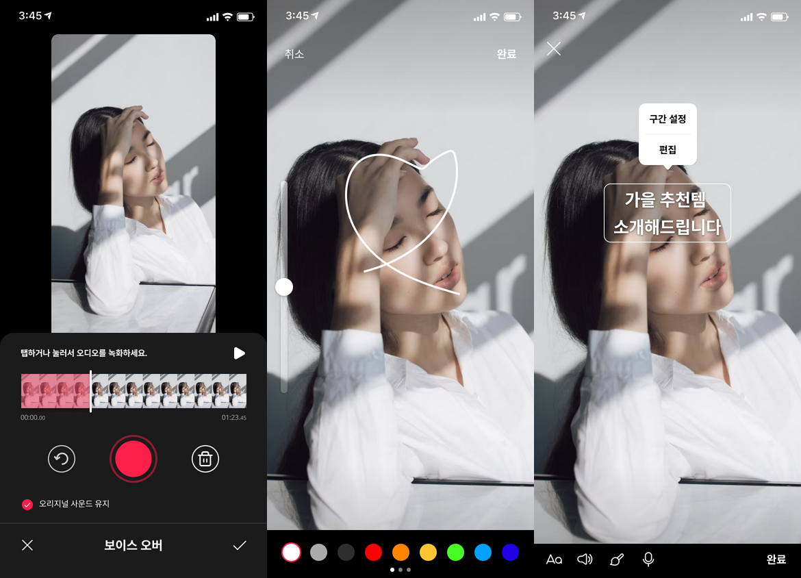
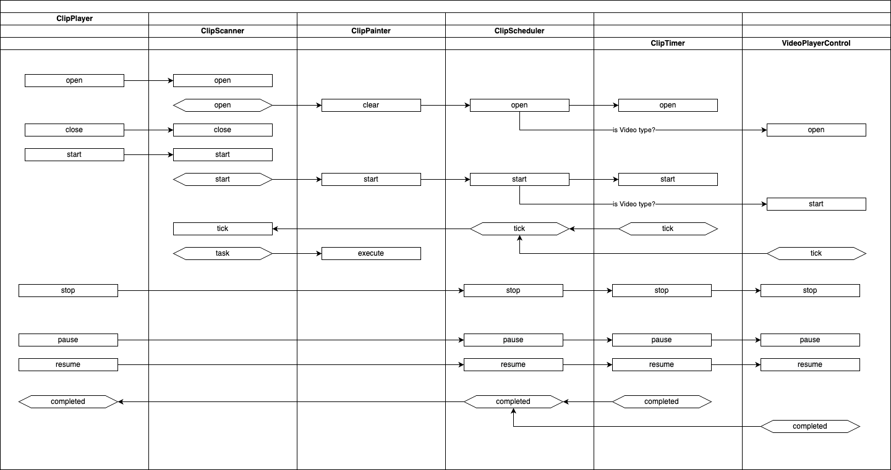

# ClipPlayer


## 개요

### 클립 재생을 위한 모듈입니다.
* 비디오, 텍스트, 사진 모드를 지원합니다.
* 클립 소스(비디오, 텍스트, 사진) 위에 텍스트나 스티거 등을 표시할 수 있도록 설계되어 있습니다.
* 타임라인을 통해서 언제 객체(텍스트 등)가 나타나고 사라져야 하는 지 등이 관리됩니다.
* 재생, 일시 멈춤을 지원하도록 설계되어 있으며, 재생 위치 이동을 추가해도 구조적인 문제는 없습니다.

### ClipPlayer 구현을 위해서 샘플로 제작해서 제공한 게임 엔진
* [https://github.com/ryujt/flutter-game-engine](https://github.com/ryujt/flutter-game-engine)

#### 완성된 앱의 스크린 샷



## 다이어그램 설명


* ClipScanner
  * 주어진 url에서 json 파일 형식의 시나리오 파일을 다운받고 해석합니다.
  * 시간을 입력하면 그 시간에 실행되어야 할 task를 task 이벤트를 발생시켜서 ClipPainer에게 전달합니다. 이때 전달할 메시지는 Command 패턴을 고려 중에 있습니다.
* ClipPainter
  * 스캐너에서 전달받은 task를 수행합니다.
  * 화면에 무엇을 그리고 삭제할 지에 대한 구체적인 코드를 수행합니다.
* ClipScheduler
  * ClipPainter의 재생 위치를 결정하는 타이머 역활을 합니다. 경우에 따라서 시간을 결정 짓는 객체가 달라지기 때문에 캡슐화하여 변화 요소가 외부로 번지지 않도록 하였습니다.
  * 비디오가 포함된 클립의 경우 VideoPlay의 재생 위치가 기준이 됩니다.
  * 비디오가 포함되지 않은 경우 타이머가 일정 간격으로 tick 이벤트를 발생합니다.
* VideoPlayerControl
  * Flutter의 VideoPlayer 클래스를 제어하는 아덥터 클래스

## 클립 timeline.json 포멧

### 전체 구조

``` json
{
    backgroud-color: 0,
    [
        { 타임라인 node },
        { ... },
    ]
}
```

### 타임라인 node 구조

#### Background color type

``` json
{
    type: "background-color",
    value: {
        color: 0
    }
}
```
* backgroud-color
  * 배경색이 변경되어야 하는 경우 화면을 덮는 객체 타입을 따로 추가하는 것으로 해결할 예정입니다.
  * 또는 start, duation이 지정된 경우와 생략된 상황을 고려하여 설계할 예정입니다.

#### Background image type

``` json
{
    type: "background-image",
    value: {
        url: "http://1234.com/test.png"
    }
}
```

#### Video type

``` json
{
    type: "video",
    value: {
        url: "http://1234.com/test.m3u8"
    }
}
```
* 클립 영상은 바로 재생이 시작되고, 전체 시나리오가 영상에 맞춰서 진행된다. 따라서 시작 시간을 사용하지 않습니다.
* 만약 클립 영상이 스케쥴링의 주체가 아닌 다른 요소가 주체가 되어야 하는 상황이 오면 다른 타입을 추가하여 해결할 예정입니다.

#### Text type

``` json
{
    start: 00:00:00:000,
    duation: 000,
    type: "text",
    value: {
        left: 0,
        top: 0,
        text: "화면에 나타나는 텍스트",
        style: {
            size: 14,
            color: #FFAAFF,
            backgroud-color: #000000,
            ...
        }
    }
}
```
* duation: 생략하면 클립 재생 끝까지 표시
* backgroud-color: #이 없이 0이면 투명 처리

#### Image type

``` json
{
    start: 00:00:00:000,
    duation: 000,
    type: "image",
    value: {
        left: 0,
        top: 0,
        width: 0,
        height: 0,
        url: "http://1234.com/test.png"
    }
}
```

#### Drawing type

``` json
{
    start: 00:00:00:000,
    duation: 000,
    type: "drawing",
    value: {
        dots: [
            [0, 0],
            [10, 10],
            ...
        ],
        style: {
            pen-width: 3,
            pen-color: 0,
            ...
        }
    }
}
```
* dots
  * (x, y) 좌표의 배열


## 기타
* [(2.0.1) 클립_업로드(녹화, 편집, 설명)_스토리보드_211015](https://docs.google.com/presentation/d/1--YLtXjFSEk6GjQNHAv9s-u6grI3uiwc3iLt8MLUdcI/edit#slide=id.g58ffa6f583_1_159)