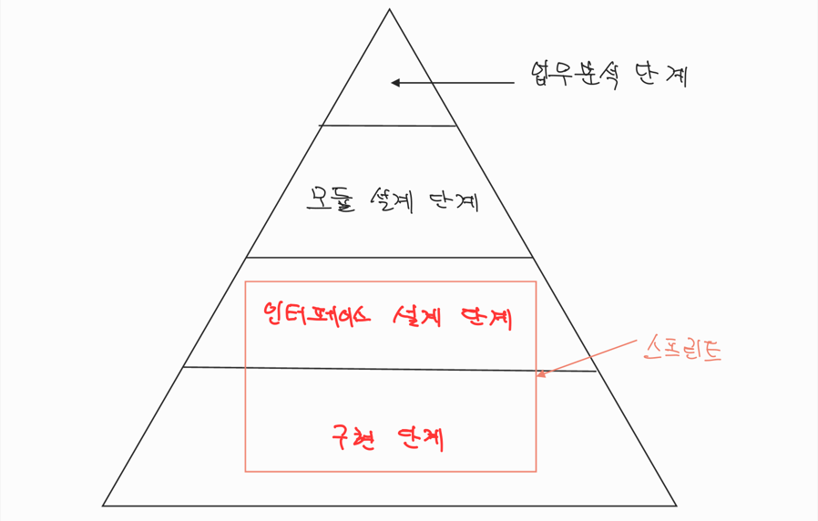

# Job Flow

## 개요

1995년 객체들 간의 메시지 흐름을 한 눈에 파악하기 위해서 고안해낸 문서입니다.

### 분석하고자 하는 핵심

* 특정 객체가 외부 객체에게 어떤 기능을 제공하는 지?
* 특정 객체가 외부 객체에게 무엇을 요구하는 지?

### Jobw Flow를 통해서 얻는 것

* 개발 이전에 논리적 검증
* 업무 효율성 검증
* 개발 시스템(또는 모듈이나 클래스)의 인터페이스 요구사항 분석

#### 2006년 외국계 대기업 분석결과의 일부 문서

#### 1998년 말레이시아 통신사 프로젝트의 일부 문서

## 단계별 활용

크게 4가지 단계로 객체들의 메시지 흐름을 분석하고 있습니다.

### 업무분석 단계
* 개발 목표 시스템과 사용자 그리고 외부 시스템들 간의 흐름을 분석합니다. (Use Case 래밸)
* 비지니스 룰을 정하고 요구사항을 찾아내는 단계입니다.

### 모듈 설계 단계
* 시스템을 구성하는 요소들 간의 메시지 흐름을 분석합니다.
* 필요한 경우 모듈은 패키지 단계까지 세분화합니다.

::: tip
여기서 모듈은 독립 실행이 가능한 콤포넌트 단위를 의미합니다.
:::

### 인터페이스 설계 단계
* 모듈을 구성하는 최상위(도메인) 계층의 객체들 간의 메시지 흐름을 분석합니다.
* 대상 클래스 내부 구성 요소들 간의 의존성 분석 및 메시지 설계 단계입니다.

### 구현 단계
* 구현하는 대상의 복잡성이 높아서 필요성이 느껴질 때만 진행합니다.
