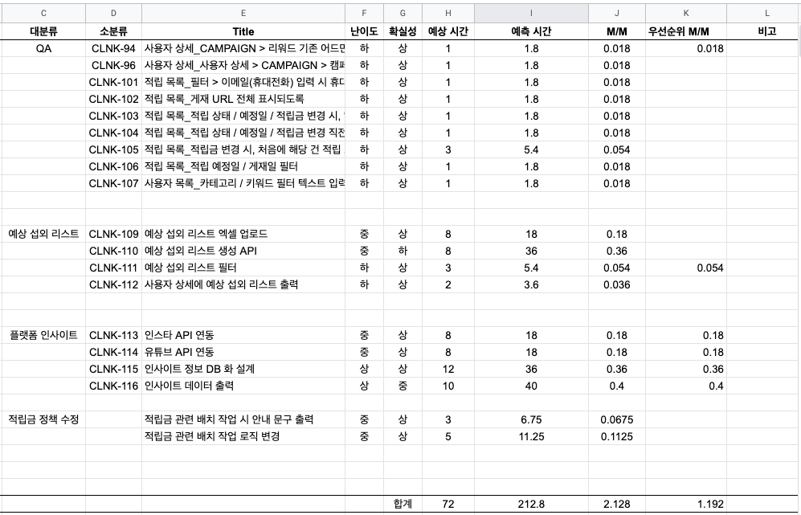

# PBS (Process Breakdown Structure)

## 개요

개발 목표의 기능 목록을 트리 형식으로 표현한 것입니다.

### 분석하고자 하는 핵심

* 시스템이 제공해야 할 기능 목록

### PBS를 통해서 얻는 것

* 개발 범위 확정
* 개발 일정 예측

## Example

### 예상 시간 측정 방법

* 난이도
  - 상: 외부 도움이 필요하거나 상당히 노력이 필요하다.
  - 중: 스스로 해결 가능하다.
  - 하: 단순 업무이다.
* 확실성
   - 상: 요구사항 및 구현 방향이 확실하다.
   - 중: 구현 방법이 아직 뚜렷하지는 않다.
   - 하: 요구사항이 추상적이거나 구현 방법이 막연하다.
   - "하"는 개발을 시작하면 안되는 Task (추가 분석 요망)
* 예상 개발 시간 (Hour)
   - 테스트 및 기타 업무 시간을 고려하지 않고 순수 개발 시간

::: tip
예측 일정은 개발 시간을 기준으로 계산된 "개발+테스트+α"의 예측 시간입니다.
(분석/설계 시간 제외)
:::