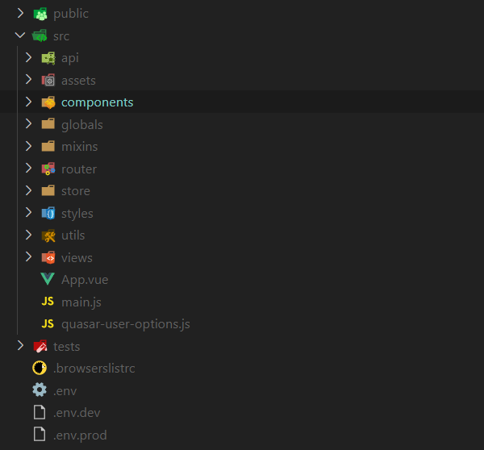

# Vue.js 시작하기


## 폴더 구조



* public
* src
  * api
  * components
  * globals
  * mixins
  * router
  * store
  * utils
  * views
* .env
* .env.dev
* .env.prod

## Vue 콤포넌트 구조

* template
* script
* style

## 핵심 요소

### 데이터 바인딩 및 상태관리

### 라우터

### Rest API 연동


## Hello world!

### Node.js 설치하기

이 강의에서는 어떻게든 안하고 넘어갈 수 있는 것은 무시하고 일단 빨리 시작해서 전반적인 스토리를 이해하는데 중점을 둘 것입니다.
그래도 피해갈 수 없는 것이 Node.js 설치하기 입니다.
다행이도 설치가 어렵지는 않으니 아래 과정을 따라서 설치를 먼저 진행하시기 바랍니다.


### vue-cli로 프로젝트 시작하기


## 핵심 문법

### property

### event

``` js
this.$emit('myEvent');
```

``` html
<my-component @my-event="doSomething"></my-component>
```

### 템플릿 문법

* @click, @event
* v-if, v-else, v-show
* v-for
* :class


## 기타

### Event bus

### Mobile app 연동

#### Vue to App

#### App to Vue

