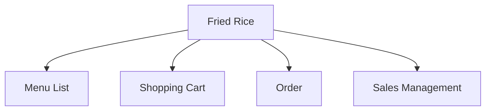
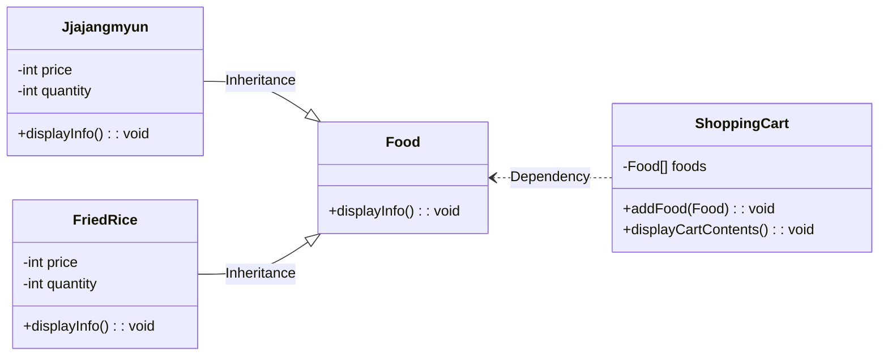

# 가장 쉽게 설명한 개방폐쇄의 원칙

## cover

개방폐쇄 원칙은 
소프트웨어 엔지니어링에서 중요한 디자인 원칙 중 하나입니다. 
이 원칙의 기본 아이디어는 소프트웨어 컴포넌트가 확장에는 열려있어야 하지만, 
수정에는 닫혀 있어야 한다는 것입니다. 

여기서 열려 있다와 닫혀있다라는 표현이
이해를 오히려 방해하는데요.
영어와 다른 한국어의 뉘앙스 차이 때문인 것 같습니다.

좀 더 쉽게 표현하자면,
새로운 기능을 계속 추가하더라도, 
그 영향이 최대한 작은 범위에서 이루지도록 해야 한다는 것입니다.

## 01

``` csharp
if (selectedMenu == "자장면")
{
    int jjajangmyunPrice = 4000; // 자장면 가격
    int totalPrice = jjajangmyunPrice * quantity; // 총 금액

    Console.WriteLine("선택한 메뉴: 자장면");
    Console.WriteLine("자장면 가격: " + jjajangmyunPrice + "원");
    Console.WriteLine("선택한 개수: " + quantity + "개");
    Console.WriteLine("총 금액: " + totalPrice + "원");
}
else if (selectedMenu == "볶음밥")
{
    int friedRicePrice = 5000; // 볶음밥 가격
    int totalPrice = friedRicePrice * quantity; // 총 금액

    Console.WriteLine("선택한 메뉴: 볶음밥");
    Console.WriteLine("볶음밥 가격: " + friedRicePrice + "원");
    Console.WriteLine("선택한 개수: " + quantity + "개");
    Console.WriteLine("총 금액: " + totalPrice + "원");
}
else
{
    Console.WriteLine("잘못된 메뉴를 선택하셨습니다.");
}
```

중국집 음식 주문 프로그램을 만들었다고 가정하겠습니다.
이집은 짜장면 전문 식당이었는데요.
볶음밥을 같이 팔기로 결정하였습니다.

그래서 메뉴에 볶음밥을 추가합니다.
장바구니에는 자장면에 관한 코드만 있었는데요.
볶음밥 처리하는 코드가 추가되었습니다.

코드를 보는 순간 바로 엉터리라고 생각하시는 분들도 계실겁니다.
하지만, 생각보다 실무에서는 유사한 패턴의 일이 벌어지기 쉽습니다.

## 02



이러한 코드의 가장 심각한 문제점은
메뉴 목록, 장바구니, 주문, 매출관리 등
수 많은 곳의 코드를 수정해야 한다는 점입니다.

더구나 예제와 달리 실무에서 사용하는 코드들은
보다 많은 모듈들이 복잡하게 연결되어 있는데요.
실수로 어느 한 곳을 다르게 처리하는 경우도 발생하게 됩니다.
이런 오류는 나중에 찾기도 상당히 어렵고요.

## 03


해결방법은 변화하는 요소와 변하지 않는 요소를 분리하는 것입니다.
그리고 변화 요소가 자유롭게 교체될 수 있도록
변화하지 않는 요소가 
항상 같은 모양의 인터페이스와 사용법을 제공하도록 하는 것입니다.

예를 들어 전기 콘센트를 보면
구멍에만 맞으면
연결되는 가전기기가 냉장고이든 세탁기이든 상관이 없는 것과 같습니다.

이후 어떤 새로운 가전제품이 발명되더라도
이 규칙만 지키면 사용하는데 문제가 없습니다.
가전제품이 새로 출시되었다고,
벽을 뜯어내고 
전선 및 배전 시스템 전체를 
수정할 필요는 없는 것과 같은 이치입니다.

## 04

``` csharp
abstract class Food
{
    ...
    public abstract void DisplayInfo();
}

class Jjajangmyun : Food
{
    ...
}

class FriedRice : Food
{
    ...
}

foreach (Food food in foodList) // 장바구니 목록 표시
{
    food.DisplayInfo();
    Console.WriteLine();
}
```

통일된 사용법을 고려해서 장바구니 코드를 수정하면 다음과 같습니다.
자장면과 볶음밥을 
같은 방법으로 다룰 수 있도록 
모두 음식이라고 처리하는 것입니다.

장바구니는 목록에 있는 모든 음식을 반복하면서 
해당 음식 객체가 
공통으로 제공하는 속성과 메소드를 사용하는 것으로 변경되었습니다.

이제 음식 종류가 새로 생기더라도 
장바구니나 기타 다른 코드들이 변경될 이유가 사라졌습니다.

## 05



지금까지 설명한 예제의 구조는 다음과 같습니다.

Food라는 규칙을 지키기만 한다면
어떠한 음식이 새로 생겨도
Food를 사용하는 ShoppingCart와 같은 다른 클래스는 
아무런 변경없이 사용할 수 있는 상태입니다.

## end

이번 영상에서는 개방페쇄의 원칙에 대해서 알아보았는데요.
원리를 이해하고 코드에 적용할 수 있다면,
시스템의 유연성과 유지보수성을 크게 향상시킬 수 있을 것입니다.

이번 영상은 여기까지 마무리하고요.
저는 다음 영상에서 다시 뵙겠습니다.
감사합니다.