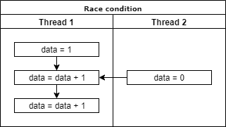
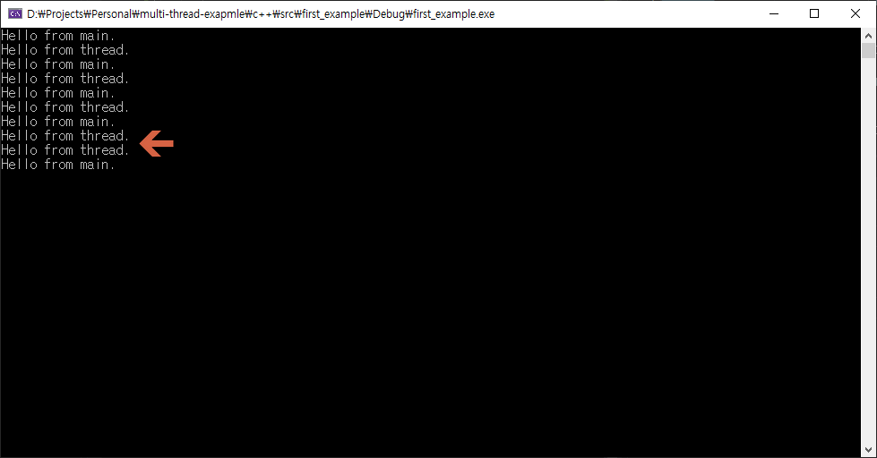
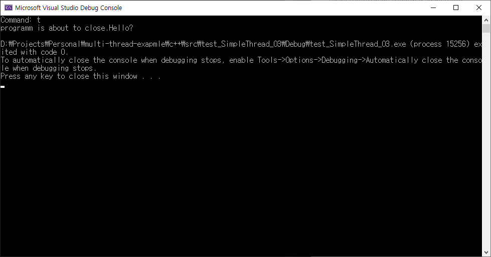
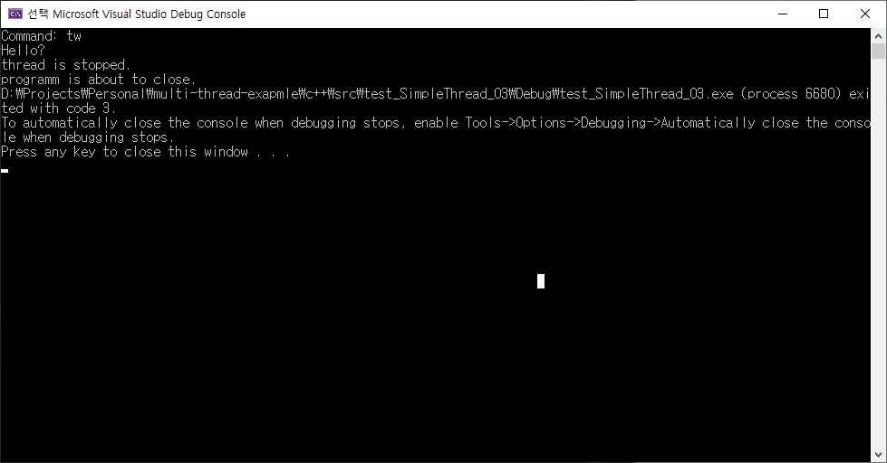
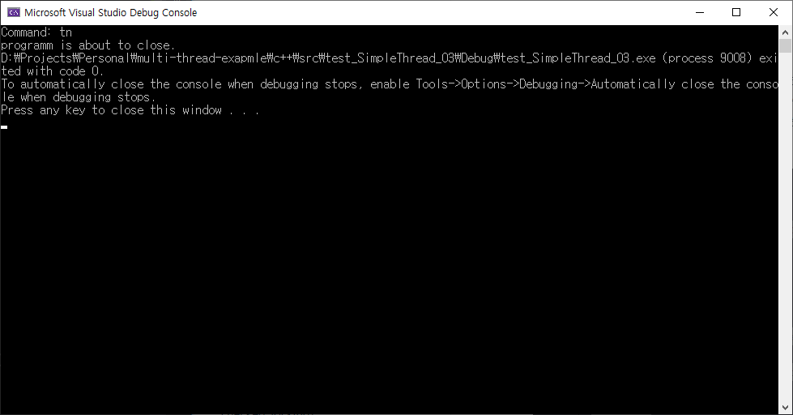
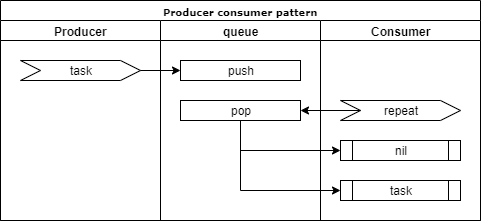
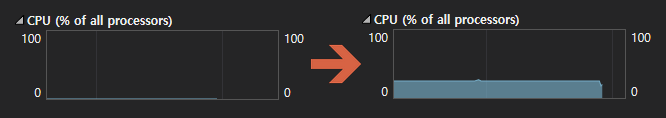
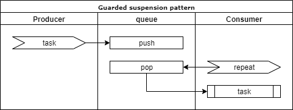
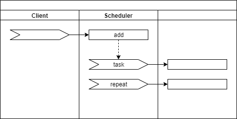
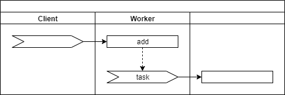

# 멀티 스레드 프로그래밍 #1


## 핵심 강의

<iframe width="800" height="450" src="https://www.youtube.com/embed/guPB2hXtaQA" frameborder="0" allow="accelerometer; autoplay; encrypted-media; gyroscope; picture-in-picture" allowfullscreen></iframe>


## 강의 개요

멀티 스레드가 필요한 가장 큰 이유는 프로그램의 실행 효율을 높이기 위해서입니다. 그러나, 스레드를 이용하면 코드가 복잡해지고 디버깅하기가 까다로워 집니다. 그리고 오히려 성능을 해치는 경우도 발생합니다. 이 강의에서는 기초적인 스레드 사용의 패턴을 통해서 효과적으로 스레드를 사용할 수 있는 방법들을 알아봅니다.

::: tip 제가 생각하는 중급으로 넘어가기 위한 장벽들입니다.
* 기초 알고리즘
* OOP
* 멀티 스레드 (비동기 프로세스)
* 포인터
* 함수 호출의 구조 (재귀 프로세스 등)
:::


## 강의 전 준비 사항

* Visual Studio 2015 Update 3 또는 이후 버전
* git
* [https://github.com/ryujt/multi-thread-exapmle](https://github.com/ryujt/multi-thread-exapmle) 예제 다운로드


## 이 강의에서 다룰 내용

이 강의에서는 이미 만들어진 라이브러리를 활용하여 구체적인 구현보다는 논리적인 개념을 파악하는데 집중하겠습니다.

* 스레드 프로그래밍의 기초
* 스레드를 사용하는 패턴들

::: tip
보편적인 방법을 사용하지 않고 제가 미리 만든 라이브러리를 이용한 이유가 있습니다.
초보자분들에게 멀티 스레드를 강의할 때마다 초기에 미리 알아야할 정보들이 너무 많아서
호기심을 잃기도 하고, 전체의 내용을 이해하는데 방해가 되는 경우가 있었습니다.
그래서 미리 만든 라이브러리를 방편(方便)으로 삼아서 단계적으로 이해를 이끌어 내려고 합니다.
:::


## 스레드 프로그래밍의 기초

스레드는 일종의 분신술입니다. 프로그램이 실행되면 OS로부터 프로세스가 생성됩니다. 이는 마치 OS가 분신을 만들어서 자신은 원래 하던 일을 계속하고, 새로 만들어진 분신이 프로그램의 내용을 읽고 그대로 임무를 수행하는 것과 같습니다.

그런데 그 분신인 프로세스마저 임무가 복잡해서 분신술이 필요할 수 있습니다. 이렇게 프로세스가 새로 만든 분신을 스레드(thread)라고 할 수 있습니다.

::: tip
위의 설명은 상당히 단순한 관점에서의 표현입니다. 프로세스와 스레드의 정확한 차이와 이해가 필요하신 분들은 추가로 검색해보시길 권합니다.
:::


### 스레드의 장점
* 동시에 처리해야 할 일이 있을 때
* CPU 성능을 최대한 활용 할 수 있음
* 프로세스보다 빠르고 적은 비용
* 대기시간 및 응답시간 최소화
* 독립 실행되는 모듈을 만들어서 시스템을 단순하게 만들 수 있다

### 스레드의 단점
* 코드의 난이도 증가
* 에러의 위험성 증가 및 디버깅이 어려워진다.

### 임계영역

멀티 스레드 프로그램을 하다보면 각기 다른 스레드 들이 동시에 특정 자원을 사용하려고 하는 순간이 발생합니다.

아래와 같은 단순한 예를 들어보겠습니다.
Thread 1은 data 값을 0부터 1씩 더해가며 작업 중입니다.
그런데 중간에 Thread 2가 data 값을 0으로 변경하였습니다.
Thread 1은 data의 값이 3이 될 것을 기대하고 작업하고 있는데,
전혀 엉뚱한 값이 들어가서 논리적으로 결함이 발생합니다.



가장 심각한 상황 중에 하나는
특정 스레드가 할당 받은 메모리 공간에서 작업하고 있는 동안, 다른 스레드가 메모리 할당을 해제하는 경우입니다. 이것은 마치 의자가 있는 것을 확인하고 앉으려는 순간 장난 꾸러기 친구가 의자를 치워버린 경우와 같습니다.

프로그래밍에서는 이런 경우를 A.V.에러(Access Violation error)라고 합니다.


이렇게 여러 개의 스레드가 같은 자원을 공유하면서 발생하는 문제들은 임계영역을 사용하여 해결할 수 있습니다. 임계영역은 일종의 신호등이며 자물쇠의 역활을 합니다. 그래서 임계영역을 락(lock)이라고도 부릅니다. 어떤 자원을 사용할 때, 사용중인 스레드가 락을 걸어서 다른 스레드는 접근할 수 없도록 하는 것입니다. 자원 사용을 마친 스레드가 락을 풀어주면 다른 스레드가 다시 락을 걸어서 사용하게 됩니다.

임계영역을 사용하면 자신이 락을 걸고 데이터를 사용하는 동안은 다른 스레드에 의해서 데이터가 오염되는 것을 방지 할 수 있습니다.

하지만, 임계영역을 사용하면 복수의 스레드가 한정된 자원으로 인해서 대기하는 시간이 길어지면서 단일 스레드보다 효율이 떨어지는 병목현상이 발생하기도 합니다. 어떤 조건에서는 서로 락을 걸고 풀어주지 않아서 시스템이 멈출 수도 있습니다. 이런 경우는 데드락(Deadlock)이라고 합니다. 그래서 락을 사용하는 경우에는 스레드를 효율적으로 사용하기 위해 다양한 해법이 필요합니다.


## SimpleThread

SimpleThread 클래스는 제가 자주 사용하는 기능들을 포함시킨 스레드 래핑(Wrapping) 클래스입니다.
소스는 [https://github.com/ryujt/multi-thread-exapmle](https://github.com/ryujt/multi-thread-exapmle)에서 다운받을 수 있습니다.


### 동시에 두 가지 일을 하기

``` cpp
#include <iostream>
#include <ryulib/SimpleThread.hpp>

int main()
{
	SimpleThread thread([&](SimpleThread* simple_thread) {
		while (true) {
			printf("Hello from thread. \n");
			simple_thread->sleep(1000);
		}
	});

	while (true) {
		printf("Hello from main. \n");
		Sleep(1000);
	}
}
```
* 2: SimpleThread를 가져와서 스레드를 쉽게 처리할 수 있도록 합니다.
* 6-11: SimpleThread 객체를 생성하고 스레드로 실행할 코드를 7-10에 구현하였습니다.
  * 7: 스레드가 중단되지 않고 계속 실행하도록 무한 반복합니다.
  * 8: 스레드가 동작 중임을 표시하기 위해서 콘솔에 메시지를 출력합니다.
  * 9: 1초(1000ms) 동안 기다립니다. 15: 라인처럼 Sleep(1000)을 사용해도 됩니다. 차이점은 simple_thread->sleep(1000)은 기다리는 도중에도 외부에서 신호를 줘서 깨울 수가 있습니다.
* 13-16: 프로그램이 종료되지 않도록 무한 반복하면서 기다립니다.
  * 프로그램이 종료되면 스레드가 돌고 있는 상황에서도 프로그램이 종료되면서 스레드도 종료됩니다.
  * 14: 메인 스레드가 동작 중임을 표시하기 위해서 콘솔에 메시지를 출력합니다.
  * 15: 1초 기다립니다.

아래는 실행결과입니다. Sleep() 함수의 오차로 인해서 순서가 뒤바뀔 수 있다는 점을 유의하세요.




### 일을 줄 때까지 기다리기

"동시에 두 가지 일을 하기"처럼 항상 동작하는 스레드가 필요한 경우도 있겠지만, 일이 없을 때는 CPU를 사용하지 않고 조용히 쉬게 하고 싶을 때가 있습니다. 이 때 사용할 수 있는 방법은 아래와 같습니다. 외부에서 메시지를 보내서 깨우기 전에는 동면을 하듯이 자고 있다가 메시지를 받았을 때만 일어나서 일을 하는 경우입니다.

``` cpp
#include <string>
#include <iostream>
#include <ryulib/SimpleThread.hpp>

using namespace std;

int main()
{
	SimpleThread thread([&](SimpleThread* simple_thread) {
		while (true) {
			simple_thread->sleepTight();
			printf("Hello? \n");
		}
	});

	while (true) {
		string line;
		printf("Command: ");
		getline(cin, line);

		if (line == "q") break;

		thread.wakeUp();
	}
}
```
* 1: 문자열을 다루기 위해서 추가하였습니다.
* 11: sleepTight() 메소드는 스레드를 완전히 멈추가 메시지를 기다립니다. 따라서 12: 라인에 있는 prinft() 함수가 실행되지 않습니다.
* 17-19: 화면에 "Command: "를 표시하고 문자열을 입력받기를 기다립니다. 엔터가 쳐지면 입력된 문자열을 line 변수에 저장합니다.
* 21: 입력된 문자가 "q"라면 반복을 중단하고 프로그램을 종료합니다.
* 23: 그 이외의 문자라면 스레드를 깨웁니다.


### SimpleThread를 종료하는 세 가지 방법

SimpleThread를 종료하기 위해서는 아래의 세 가지 방법 중에 하나를 선택하시면 됩니다.
* terminate(): isTerminated()가 true가 되도록 합니다. 스레드가 종료되는 과정까지 기다리지 않고 종료하라고 메시지만 전달한 경우입니다.
* terminateAndWait(): isTerminated()가 true가 되며, 스레드를 깨우고 종료 될 때까지 기다립니다.
* terminateNow(): isTerminated()가 true가 되며, 스레드를 바로 종료합니다. 실행하자마자 스레드가 바로 중단됩니다.

``` cpp
#include <string>
#include <iostream>
#include <ryulib/SimpleThread.hpp>

using namespace std;

int main()
{
	SimpleThread thread([&](SimpleThread* simple_thread) {
		while (simple_thread->isTerminated() == false) {
			simple_thread->sleepTight();
			printf("Hello? \n");
		}

		printf("thread is stopped. \n");
	});

	while (true) {
		string line;
		printf("Command: ");
		getline(cin, line);

		if (line == "q") break;

		if (line == "t") thread.wakeUp();

		if (line == "t") {
			thread.terminate();
			break;
		}

		if (line == "tw") {
			thread.terminateAndWait();
			break;
		}

		if (line == "tn") {
			thread.terminateNow();
			break;
		}
	}

	printf("programm is about to close. \n");
}
```
* 10: 무한 반복이 아닌 simple_thread->isTerminated()가 true 일 때까지만 반복하는 것으로 바뀌었습니다.

#### terminate()로 종료했을 때


terminate() 메소드는 블록킹을 하지 않기 때문에 바로 리턴이 되면서 ""programm is about to close."이 콘솔에 바로 찍히게 됩니다.
그리고 프로그램이 먼저 종료되면서 "thread is stopped."는 화면에 나타나지 않은 것을 확인할 수가 있습니다.

#### terminateAndWait()로 종료했을 때


스레드 내부의 코드가 모두 동작하는 것을 기다렸기 때문에 "programm is about to close." 이전에 스레드에서 출력한 모든 메시지가 콘솔에 표시된 것을 확인할 수가 있습니다.

#### terminateNow()로 종료했을 때


스레드를 바로 강제 종료하였기 때문에 스레드 쪽에서는 아무런 메시지를 찍어보지 못하고 프로그램 종료 메시지가 표시 된 것을 확인할 수가 있습니다.

terminateNow()는 프로그램이 완전히 종료될 때 주로 사용합니다. 프로그램이 종료될 때에는 스레드가 사용하던 리소스를 반환하거나 정리할 필요 없기 때문입니다.

스레드는 종료 처리가 어려울 때가 많은데요, 프로그램이 종료하면서 사용 중이던 리소스를 이미 반환했는데, 스레드가 늦게 깨어나면서 리소스에 접근하려고하다가 오류가 발생하는 경우가 가끔 일어납니다. 이럴 때는 terminateNow()로 스레드를 바로 종료시켜버리면 프로그램 종료 중에 스레드가 뒤늦게 깨어나서 충돌하는 일을 방지 할 수 있습니다.


## Producer-consumer pattern (ThreadQueue)

Producer-consumer pattern(생산자-소비자 패턴)은 스레드를 사용하는 가장 흔한 케이스 중 하나입니다.
생산자가 일거리를 만들면 소비자가 일을 가져와서 처리하는 것입니다.

식당에서 손님의 주문을 받아서 주문서 철에 하나씩 추가하는 과정을 예로 들겠습니다.
이때 주문을 받아서 철에 추가하는 사람은 생산자에 해당합니다.

주방에서 요리사가 철에 쌓여져 있는 주문서 중에서 하나를 가져가서 주문서대로 요리를 만들게 됩니다.
이때 요리사는 소비자에 해당합니다.

* 생산자: 일을 만드는 넘
* 소비자: 일을 가져가는 넘

일을 가져가서 처리하는 소비자 스레드가 아직 일을 마무리하지 않았는데, 생산자가 일을 더 주려고하면 어떻게 될까요?
일이 꼬이거나 아니면 생산자는 소비자가 일을 마칠 때까지 다른 일은 못하고 계속 기다려야 할 것입니다.
그래서 일거리를 쌓아 둘 수 있는 큐를 만들고 생산자는 큐에 일을 추가하고, 소비자는 일을 가져가서 처리합니다.

생산자-소비자 패턴은 아래의 다이어그램처럼 간단한 구조를 가지고 있습니다.


* Producer는 처리해야 할 일(task)이 발생하면 queue에 쌓아(push) 둡니다.
* Consumer는 queue에서 일을 가져와서(pop) 처리합니다.
* 처리할 일이 없을(nil) 때는 무시하고 일이 발견될 때까지 반복합니다.

만약 여러분들이 온라인 게임을 만든다고 가정하겠습니다.
전투 중에 얻은 아이템이나 경험치들을 DB에 저장해둬야 합니다.
그런데 DB에 저장하는 속도는 너무 느리기 때문에 게임 로직을 처리하는 스레드에서 직접 처리하면, 저장하는 동안 게임이 멈추는 등의 현상이 발생하게 됩니다.
이때 게임 로직을 처리하는 스레드는 DB에 저장할 정보를 queue에만 쌓아두고 제 할일을 계속 하고,
DB 저장용 스레드가 백그라운드로 처리해준다면 DB 저장 속도 때문에 게임이 멈추는 일은 없을 것 입니다.

::: tip
* 생산자도 소비자도 여러 개(스레드)일 수 있습니다.
* ThreadQueue의 메소드들은 락을 사용하여 여러 개의 스레드가 동시에 접근해도 순차적으로 진행되도록 구현되어 있습니다.
:::

``` cpp
#include <string>
#include <iostream>
#include <ryulib/ThreadQueue.hpp>
#include <ryulib/SimpleThread.hpp>

using namespace std;

int main()
{
	ThreadQueue<string> que;

	SimpleThread producer([&](SimpleThread* simple_thread) {
		while (simple_thread->isTerminated() == false) {
			que.push("task");
			printf("task has produced. \n");
			simple_thread->sleep(1000);
		}
	});

	SimpleThread consumer([&](SimpleThread* simple_thread) {
		while (simple_thread->isTerminated() == false) {
			string item = "";
			if (que.pop(item)) {
				item = item + " --> used ";
				printf("%s \n", item.c_str());
			} else {
				simple_thread->sleep(1);
			}
		}
	});

	while (true) {
		Sleep(1000);
	}
}
```
* 처리해야할 일(task)을 저장해 둘 큐(ThreadQueue) 클래스가 정의된 헤더입니다. 멀티 스레드에서 사용할 수 있도록 설계되어 있습니다.
* 12-18: 생산자 스레드를 생성하고 1초마다 "task"를 만들어서 큐에 저장합니다.
  * 14: "task" 문자열을 큐에 넣습니다. 이것을 처리해야 할 일이라고 가정하겠습니다.
  * 15: 콘솔에 작업이 추가되었음을 표시합니다.
  * 16: 다음 작업을 만들 때까지 1초 기다립니다.
* 20-30: 소비자 스레드를 생성하고 0.001초마다 일을 가져와서 처리합니다. 0.001초보다 작거나 커도 되지만, 생산자보다 더 긴 간격으로 일을하게되면 일이 점점 밀리게 됩니다. 어떤 때에는 간격없이 바로바로 처리해도 시간이 많이 걸리는 일이어서 밀릴 수도 있습니다. 이런 경우에는 소비자 스레드를 여러 개로 늘려서 처리할 수도 있습니다.
  * 23: 큐에서 일을 하나 가져옵니다. 일이 없으면 pop() 메소드의 결과가 false가 되어 24-25:는 실행되지 않습니다.
  * 24: 가져온 일을 사용(처리)합니다. 여기서는 뒤에  "--> used"를 붙이는 것으로 일이 처리 된 것으로 표현하였습니다.
  * 25: 처리된 일을 콘솔에 표시합니다.
  * 27: 없어도 상관은 없습니다. (기다리지 않고 계속 실행해도 됩니다)

27: 라인은 없어도 되지만 할 일이 없는데도 쉬지 않고 계속 일을 찾다보면 아래 그림의 오른쪽처럼 쓸 때없이 CPU를 많이 사용하게 됩니다.



## Guarded suspension pattern (SuspensionQueue)

생산자-소비자 패턴의 경우에는 일이 없을 때에는 다른 일을 처리할 수는 있겠지만,
큐 안에 쌓인 일만 하는 경우에는 일이 없어도 반복하면서 CPU 자원을 낭비하게됩니다.
그와 달리 Guarded suspension 패턴은 일이 없으면 스레드가 완전히 멈춰서 기다립니다.
다시 일이 들어와서 자신을 깨울 때까지 완전히 멈추게 됩니다.



::: tip
* 다른 일도 하면서 큐에 있 데이터가 있으면 병행해서 처리해야 한다면 ThreadQueue를 사용하고,
큐에 있는 일만 처리하면 될 경우에는 SuspensionQueue 사용하세요.
* SuspensionQueue의 메소드들은 락을 사용하여 여러 개의 스레드가 동시에 접근해도 순차적으로 진행되도록 구현되어 있습니다.
:::

``` cpp
#include <string>
#include <iostream>
#include <ryulib/SuspensionQueue.hpp>
#include <ryulib/SimpleThread.hpp>

using namespace std;

int main()
{
	SuspensionQueue<string> que;

	SimpleThread producer([&](SimpleThread* simple_thread) {
		while (simple_thread->isTerminated() == false) {
			que.push("task");
			printf("task has produced. \n");
			simple_thread->sleep(1000);
		}
	});

	SimpleThread consumer([&](SimpleThread* simple_thread) {
		while (simple_thread->isTerminated() == false) {
			string item = que.pop();
			item = item + " --> used ";
			printf("%s \n", item.c_str());
		}
	});

	while (true) {
		Sleep(1000);
	}
}
```
코드는 생산자-소비자 패턴과 거의 똑같은 것을 아실 수가 있습니다. 중요한 차이는 22: 라인에 있습니다.
SuspensionQueue의 pop() 메소드는 큐 안에 아무것도 없으면 리턴되지 않고 멈춰서게 됩니다. (blocking)
따라서, sleep() 메소드를 사용하지않아도 CPU를 계속 사용하면서 반복하는 일이 없습니다.
또한 큐에서 일을 가져왔는 지 if 문을 사용해서 처리할 필요가 없습니다.
일이 없다면 다음 코드가 실행 될 일이 없기 때문입니다.


## Scheduler

Scheduler는 생산자-소비자 패턴과 스레드를 합쳐 놓은 형태입니다. add() 메소드를 이용해서 처리해야 할 일을 추가하면 OnTask 이벤트가 발생합니다. OnTask는 Scheduler 내부 스레드에 의해서 동작하기 때문에 병렬로 처리됩니다. 그리고, 처리할 일이 없어도 OnRepeat 이벤트가 계속 발생하는데요, 주기적으로 처리해야 할이 있는 경우 사용합니다.



아래 코드는 가상으로 동작하는 소켓 프로그램을 예로 들어 본 것 입니다.

* start(): Scheduler 내부 스레드에 의해서 작업(task)과 이벤트가 처리가 시작됩니다.
* stop(): Scheduler 내부 스레드에 의해서 작업(task)과 이벤트가 중단 됩니다.
* add(): 처리해야 할 일을 추가합니다.
* OnTask: Scheduler의 add() 메소드에 의해서 작업(task)가 추가되면 동작하는 이벤트입니다. 이벤트 핸들러의 코드는 Scheduler 내부 스레드에 의해서 실행됩니다.
* OnRepeat: 계속 반복해서 주기적으로 실행됩니다.

``` cpp
#include <string>
#include <iostream>
#include <ryulib/Scheduler.hpp>

const int TASK_CONNECT = 1;
const int TASK_DISCONNECT = 2;

class Address {
public:
	Address(string ip, int port)
		: ip_(ip), port_(port)
	{
	}
	string ip_;
	int port_;
};

int main()
{
	Scheduler scheduler;
	scheduler.setOnTask([](int task, const string text, const void* data, int size, int tag) {
		switch (task) {
			case TASK_CONNECT: {
				Address* address = (Address*) data;
				printf("Connect to %s:%d \n", address->ip_.c_str(), address->port_);
				delete address;
				break;
			}

			case TASK_DISCONNECT: {
				printf("Disconnect \n");
				break;
			}
		}
	});
	scheduler.setOnRepeat([&](){
		printf("수신된 메시지 확인... \n");
		scheduler.sleep(1000);
	});
	scheduler.start();

	while (true) {
		string line;
		printf("Command: ");
		getline(cin, line);

		if (line == "c") scheduler.add(TASK_CONNECT, new Address("127.0.0.1", 1234));
		if (line == "d") scheduler.add(TASK_DISCONNECT);
	}
}
```
* 47: 소켓을 접속하라는 작업을 추가합니다. 그러면 바로 setOnTask에 정의된 이벤트 핸들러의 코드가 스레드에서 실행됩니다.
  * add(int task, void* data)
* 48: 소켓 접속을 종료하라는 작업을 추가합니다. 추가 정보가 필요없을 때에는 작업 내용만 추가하면 됩니다.
  * add(int task)
* 21-35: 작업이 추가되었을 때 실행되는 코드입니다.
  * task_type 종류에 따라서 각각의 의미에 맞는 코드를 실행하면 됩니다.
  * 24: 라인에서는 data 파라메터에 전달된 주소 객체를 타입 변환을 하여 사용하고 있습니다.
* 36-39: 무한 반복되는 코드입니다.

::: tip add() 메소드의 파라메터
``` cpp
void add(int task)
void add(int task, string text)
void add(int task, void* data)
void add(int task, string text, void* data, int size, int tag)
```
:::

## Worker

Worker 클래스는 Scheduler 클래스와 비슷합니다. 차이점은 OnRepeat 이벤트가 없다는 점입니다. Worker는 일을 주지 않을 때는 내부 스레드가 완전하게 멈춰있게 됩니다. Guarded suspension 패턴에 필요한 요소를 하나의 클래스 안에 담아둔 형태입니다.



게임 서버가 동작하는 중에 DB에 데이터를 저장해야하는 작업이 있다고 가정하겠습니다.
그때 저장해야할 데이터를 json 문자열로 Worker에 add() 해주고,
OnTask 이벤트에서 DB 저장 코드를 넣어주면 비동기로 DB를 저장하는 코드를 쉽게 작성할 수 있습니다.

``` cpp
#include <string>
#include <iostream>
#include <ryulib/Worker.hpp>

int main()
{
	Worker worker;
	worker.setOnTask([](int tast, const string text, const void* data, int size, int tag) {
		printf("OnTask: %s \n", text.c_str());
	});

	while (true) {
		string line;
		printf("Command: ");
		getline(cin, line);

		worker.add(line);
	}
}
```
스레드로 실행되는 코드에서 printf()를 함께 사용하기 때문에 이전 예제처럼 문자열은 서로 겹쳐서 표시되는 경우가 많습니다.