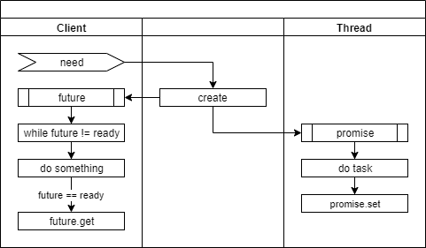

# 멀티 스레드 프로그래밍 #2


## 핵심 강의

<b>동영상 준비 중</b>


## 강의 개요

이 강의에서는 이전 강의에서 다루지 않았던 다른 패턴들을 살펴보도록 하겠습니다.


## 강의 전 준비 사항

* Visual Studio 2015 Update 3 또는 이후 버전
* git
* [https://github.com/ryujt/multi-thread-exapmle](https://github.com/ryujt/multi-thread-exapmle) 예제 다운로드


## 이 강의에서 다룰 내용

* Thread-per-message pattern
* Future pattern
* Callback pattern
* Balking pattern
* Thread pool
* Atomic operation


## Thread-per-message pattern

Thread-per-message 패턴은 처리해야 할 일에 대한 요청(message)이 발생하면 스레드를 하나 만들어서 해당 일을 처리하도록 합니다. 일이 처리되기만하면 될 뿐 결과를 알 필요가 없을 때 유용합니다.

* Client: 일을 요청하는 객체
* Host: 일을 요청받는 객체
* Helper: 일을 처리하는 객체


* need: Client 객체가 Host 객체에게 요청할 일이 발생하였습니다.
* request: Client 객체가 Host 객체에게 일을 요청합니다.
* create: 새로운 Helper 객체가 생성됩니다. 이때 내부에 스레드를 같이 생성합니다.
* handle: 요청한 일을 처리합니다.

``` cpp
#include <stdio.h>
#include <thread>

using namespace std;
```

``` cpp
class Helper {
public:
	Helper(int value)
	{
		thread worker([&](){
			printf("value: %d \n", value);
		});
		worker.join();
	}
};
```
* Helper 객체가 생성되면서 작업 할 내용을 파라메터로 받아옵니다. 즉시 스레드가 생성되며 작업을 처리하고 종료합니다.

``` cpp
class Host {
public:
	void request(int value)
	{
		auto helper = make_unique<Helper>(value);
	}
};
```
* 작업을 요청 받으면 Helper 객체를 생성해서 작업을 의뢰합니다. make_unique를 이용해서 필요 없어지면 (더이상 참조되지 않고 있다면) 스스로 메모리에서 삭제되도록 합니다.


``` cpp
int main()
{
	Host host;
	host.request(1);
	host.request(2);
	host.request(3);

	while (true);
}
```
* 3-6: Host 객체를 통해서 작업을 요청합니다.
* 8: 스레드가 동작하고 있는 상태에서 메인 프로그램이 종료하지 않도록 무한 반복하면서 기다립니다.

## Future pattern

Future 패턴은 Thread-per-message 패턴과 달리 다른 스레드에게 일을 부탁하고 나서 결과를 알아야 할 경우에 사용합니다. Client가 기다리는 대상을 스레드가 아닌 결과 자체로 국한 시키기 때문에 의존관계를 조금 더 단순하게 만들 수 있다는 것이 장점입니다. Client는 결과를 받아서 처리하는 내부 구현 계층에 스레드가 있다는 사실을 알려줄 필요가 없습니다. 결과 자체를 던져주고 다만 "언제 준비 될지는 모르지만, 준비가 되면 사용해라"라고 알려주기만 하면 됩니다.

::: tip
외부의 객체들을 몰라도 된다는 것은 독립성이 확보되었다는 의미가 됩니다.
시스템 구성원이 긴밀하게 엮여서 한 덩어리로 뭉쳐있는 것보다
독립적으로 동작하는 여러 조각으로 나누어져있는 것을 다루는 편이 휠씬 쉽습니다.
:::

### 작업을 스레드에 의뢰하고 기다리기


* need: Client에게 필요한 task가 발생하였습니다.
* create: promise, future 객체를 생성하고 promise 객체는 Thread에게 전달합니다.
* future.get: Client는 Thread가 작업을 완료 할 때까지 멈춰서서 결과를 기다리게 됩니다.
* do task: Thread가 의뢰받은 작업을 처리 합니다.
* promise.set: Thread가 의뢰받은 작업을 마치고 promise 객체의 _Is_ready() 상태를 true로 변경합니다. Client는 future.get의 결과를 얻고 기다리던 프로세스가 다시 동작하게 됩니다.

일단 의문이 들 수 있는 것이 "작업을 의뢰하고 계속 기다릴 거라면 그냥 스레드를 만들 필요 없이 스스로 해도 다를 것이 없지 않는 가"하는 것입니다.

이 방식을 활용하는 유형 중 한 가지는 다음과 같습니다.
문제를 여러 개로 조각내고 각 조각이 모두 해결되면 취합해야 할 경우입니다. 단순한 예로는 1부터 100까지 더해야하는 작업이 있다면, 두 개의 스레드에게 각각 50개씩 계산하게 하고 받아낸 Future 각체가 완료될 때까지 기다렸다가 결과를 합하는 것입니다.

``` cpp
#include <stdio.h>
#include <future>
#include <string>
#include <thread>

using namespace std;

void make_it_double(promise<int>* p, int value)
{
	p->set_value(value * 2);
}

int main()
{
	promise<int> p;
	future<int> result = p.get_future();

	thread t(make_it_double, &p, 1);

	printf("1 * 2 = %d \n", result.get());

	t.join();
}
```
* 15-6: 스레드에게 일을 줄 때 스레드에게는 promise 객체를 주고 일을 의뢰한 Client 쪽에는 future 객체를 나눠줍니다. 두 객체는 서로 연결되어 있어서 스레드가 작업을 처리하고 결과를 promise 객체에 저장하면 Client가 가지고 있는 future 객체에 바로 적용됩니다.
  * 식당에서 음식 주문하면 번호가 같은 주문 전표가 주방으로 들어가고 손님이 번호표를 가지고 있는 것과 같습니다. 주방에서 주문 전표의 음식을 완성하면 전표에 있는 번호로 손님을 호출하기 위해서입니다.
* 18: 스레드를 생성하여 make_it_double 함수를 실행하고 promise 객체와 계산에 필요한 인자를 전달합니다.
* 20: 스레드가 결과를 알려줄 때까지 기다립니다. 결과를 받으면 prinft() 함수로 콘솔창에 표시합니다.
* 22: 스레드가 멈출 때까지 기다립니다.
* 10: 스레드에 의해서 실행되며, 계산하여 결과를 promise 객체를 통해서 promise 객체에게 알립니다.


### 작업을 스레드에게 의뢰하고 주기적으로 확인하기



"작업을 스레드에 의뢰하고 기다리기"과 달리 이번에는 작업을 의뢰하고 다른 작업을 진행하면서 주기적으로 확인하여 준비가 된 경우에 결과를 가져와서 처리하는 방식입니다.

이 방식은 주로 식당에서 음식을 주문하면 음식이 나올 때까지 기다리지 않고 다른 일을 처리하고, 받아 두었던 대기표의 순서가 되면 음식을 받아가는 것과 비교됩니다.

다른 활용 방법 중 하나는 비동기로 동작하는 A, B, C 등의 과정이 순차적으로 진행되어야 할 때 입니다. 각 과정을 처리하는 객체들은 순서나 외부 객체를 신경 쓸 필요 없고 자신이 가진 future 객체가 준비되면 자신이 해야할 일만 하고 결과가 나오면 자신이 가지고 있는 promise 객체의 set_value() 메소드를 실행해서 알려주기만 합니다. 프로세스를 컨베이어 벨트 방식으로 처리하고 싶은 경우입니다.

``` cpp
#include <stdio.h>
#include <future>
#include <string>
#include <thread>

using namespace std;

void make_it_double(promise<int>* p, int value)
{
	p->set_value(value * 2);
}

int main()
{
	promise<int> p;
	future<int> result = p.get_future();

	thread t(make_it_double, &p, 1);

	while (result._Is_ready() == false) {
		// 기다리면서 다른 일을 할 수 있다.
		printf(".");
	}

	printf("1 * 2 = %d \n", result.get());

	t.join();
}
```

## Callback pattern

스레드에게 일을 시키고 결과를 받기 위해서 콜백 함수를 이용할 수도 있습니다. 이 방식은 일을 의뢰하는 Client에서 스레드의 결과를 최대한 의식하지 않아도 되는 장점이 있습니다.

단점으로는 결과를 처리하는 함수가 스레드에서 실행되기 때문에 사용하고 있는 자원 공유 문제가 발생할 수 있다는 점입니다. 자원 공유 문제가 발생하면 락을 사용해야 하는 등의 복잡성이 증가할 수 있습니다.


* next screen: 컴퓨터 원격제어의 예입니다. 원격지에서 현재 화면 상태를 요청해서 Socket 객체가 요청을 받은 상태입니다.
* execute: ScreenCapture 객체가 내부의 스레드에서 화면을 캡쳐하고 압축합니다.
* data: 화면 압축이 끝나면 data 이벤트를 발생합니다. 미리 지정된 Socket.send() 메소드가 실행됩니다. 당연히 Socket.send()를 실행하는 주체는 ScreenCapture 객체가 내부의 스레드가 됩니다.

아래의 예제는 이벤트를 활용하여 Callback 패턴을 구현한 것입니다.

``` cpp
#include <ryulib/AudioIO.hpp>

void on_data(const void* obj, const void* data, int size) {
	printf("buffer_size: %d \n", size);
}

int main(void) {
	Audio::init();

	AudioInput audio_input(1, 48000, 3840);
	audio_input.setOnData(on_data);
	audio_input.open();

	while (audio_input.isActive()) {
		Pa_Sleep(1000);
	}

	audio_input.close();
}
```
* 11: setOnData() 메소드를 이용하여 데이터가 발생하면 on_data를 실행시켜달라고 부탁합니다. AudioInput 객체 내부에는 on_data 함수의 레퍼런스(주소)가 전달되어 필요할 때마다 함수를 호출 시켜줍니다.

::: tip
Callback 패턴의 장점은 변하지 않는 부분만 내부에 남기고 변하는 부분은 외부로 옮겨서 재사용성을 높일 수 있다는 것 입니다.

더 중요한 장점은 복잡한 시스템을 조각으로 나눠서 작업할 때 연결고리를 Callback으로 처리함으로 인해서 내부 코드가 외부의 객체들의 존재를 알지 못해도 문제없도록 처리 할 수 있다는 점입니다. 이를 통해서 하나의 시스템을 최대한 독립적인 객체들의 집합으로 구성할 수 있게 됩니다. ([http://10bun.tv/beginner/episode-1/](http://10bun.tv/beginner/episode-1/) 참고)
:::


## Balking pattern

Balking 패턴은 가장 쉬우면서도 낭비되는 자원을 아낄 수 있는 팁입니다. 이미 작업이 완료되었는데 다시 요청했거나 필요 없어진 작업이라면 스레드에 진입했더라도 끝까지 작업을 진행하지 말고 중단하라는 의미입니다.

어찌보면 너무나 당연한 이야기 입니다. 하지만, 이 당연한 패턴을 언급한 이유는 자주 나타나는 유형이기 때문입니다. 특히 락이 걸리거나 작업이 오래 걸리는 일인 경우 간단한 플래그 하나만으로 효율을 높일 수 있다는 장점이 있습니다.

::: tip
생각보다 락은 스레드를 심하게 괴롭힙니다. 락을 건 이후 처리해야 할 작업이 아무리 단순하더라도, 락의 영향으로 성능이 심각하게 떨어질 수 있습니다.
:::

``` cpp
#include <stdio.h>
#include <mutex>

using namespace std;

mutex mutex_;
bool need_to_work;
int cnt = 0;

void critical_work()
{
	if (need_to_work == false) return;

	unique_lock<mutex> lock(mutex_);
	cnt = cnt + 1;
}

int main()
{
	//need_to_work = true;
	need_to_work = false;
	thread worker([](){
		for (int i=0; i<1000; i++) critical_work();
	});
	worker.join();

	printf("result: %d \n", cnt);
}
```
* 12: need_to_work 값이 false이면 스레드 실행을 무시하고 리턴합니다.
* 20-21: 주석을 한 쪽을 풀어서 테스트하시면 됩니다.


## Thread pool


스레드 풀은 미리 정해진 개수의 스레드를 생성해 두고
작업이 필요할 때 생성된 스레드 중에 하나를 선택해서 실행하도록 하여 생성과 삭제에 의한 성능 저하를 피하는 방법입니다. Producer-consumer 패턴에서 consumer가 여러 개인 경우라고 생각하시면 됩니다.

스레드 개수를 정하는 것도 중요한 요소가 되는데요,
너무 적게 만들면 나눠서 할 일의 양이 줄어서 더 끌어 올릴 수 있었던 성능을 포기하는 것과 같습니다.
또 너무 많이 만들면 메모리와 CPU 등의 자원을 낭비하게 될 수 있습니다.

일반적으로 "스레드 개수 = (CPU 개수 X 2) + 1"이 좋다고 합니다.
하지만, 실행되는 코드에 따라서 다를 수 있기 때문에 최적의 개수를 찾으려면 테스트를 통해 데이터를 분석해야 합니다.

동적으로 스레드 개수를 조절해서 상황이 달라졌을 때도 최적의 효율을 끌어 올리는 방법도 고민해볼 수 있습니다.

::: tip 스레드 성능에 나쁜 영향을 미치는 요인
* 스레드 생성 및 삭제
* 락(임계영역)의 잘못된 사용
* 너무 많은 스레드 사용
* etc
:::


### 예제

``` cpp
#include <stdio.h>
#include <Windows.h>
#include <iostream>
#include <string>
#include <ryulib/SuspensionQueue.hpp>

const int POOL_SIZE = 8;

using namespace std;

SuspensionQueue<string> que;
thread* workers[POOL_SIZE];

void do_work(int index)
{
	while (true) {
		string line = que.pop();
		Sleep(10000);
		printf("index: %d, line: %s \n", index, line.c_str());
	}
}

int main()
{
	for (int i = 0; i < POOL_SIZE; i++) {
		workers[i] = new thread(do_work, i);
	}

	while (true) {
		string line;
		printf("Command: ");
		getline(cin, line);

		que.push(line);
	}
}
```
* 25-27: POOL_SIZE 개수만큼 스레드를 생성합니다.
* 17: 모든 스레드는 que.pop()에 의해서 멈춰서 있게됩니다. 큐에 데이터가 입력되면 가장 먼저 도달했던 스레드가 깨어나서 데이터를 얻고 18-19: 라인을 처리하게 됩니다.

### 실행결과


* 입력된 문자열이 각각 다른 스레드에서 처리되고 있는 것을 확인 할 수가 있습니다. 입력하는 동안 화면에 출력되어서 문자들이 섞이지 않도록 모든 스레드는 10초 기다렸다가 메시지를 출력하도록 하였습니다.


## Atomic operation

Atomic operation은 컴퓨터가 한 번에 처리하는 작업을 의미합니다. 그래서 다른 스레드가 끼어들 여지가 없는 상태입니다.

아래 그림에서는 파스칼 언어로 "a := b + 1"을 어쎔블리로 표현한 것입니다. 프로그램 코드에서의 한 줄이 컴퓨터에 의해서 한 번에 실행되지 않고 세 단계의 동작으로 나누어져서 처리되는 것을 알 수가 있습니다.


만약 "a == 1, b == 1" 상태에서 아래 코드를 두 개의 스레드가 동시에 실행한다고 가정하겠습니다.

	a = a + b;

아래와 같이 간발의 차이로 스레드가 엇갈리는 상황이 달라져서 결과값은 예측할 수 없게 됩니다.

::: tip 시나리오 #1
* Thread 1번이 a, b 값이 1인 것을 확인하였습니다.
* Thread 2번이 a, b 값이 1인 것을 확인하였습니다.
* Thread 1번이 a에 a와 b의 값, 1을 두 번 더하여 a에 2를 저장합니다.
* Thread 2번이 a에 a와 b의 값, 1을 두 번 더하여 a에 2를 저장합니다.
:::

::: tip 시나리오 #2
* Thread 1번이 a, b 값이 1인 것을 확인하였습니다.
* Thread 1번이 a에 a와 b의 값, 1을 두 번 더하여 a에 2를 저장합니다.
* Thread 2번이 a의 값이 2, b 값이 1인 것을 확인하였습니다.
* Thread 2번이 a에 a와 b의 값을 더하여 a에 3을 저장합니다.
:::

이런 경우 락을 사용하여 한 번에 하나의 스레드만이 코드를 실행하도록 할 수도 있습니다. 하지만, 락을 사용하는 것은 스레드의 성능을 떨어트리게 됩니다.
그래서 한 번에 처리할 수 있는 명령어로 대체 할 수 있다면 성능 저하를 최소화 할 수 있습니다.

여기서는 C++에서 제공하는 Atomic operation 중 중요한 몇 가지를 살펴보도록 하겠습니다.

``` cpp
#include <stdio.h>
#include <atomic>

using namespace std;

int main()
{
	// Atomic operation이 가능한 정수형 데이터를 처리할 수 있는 객체를 생성한다.
	atomic<int> a;

	// 아래에 나오는 모든 연산들은 한 번에 처리되어 멀티 스레드 상황에서도 안전하다.

	// a 객체에 1을 저장한다.
	a.store(1);
	printf("a.store(1) --> a = %d \n", a.load());

	// a 값에 1을 더하고 변경되기 바로 전의 값을 리턴한다.
	// a++처럼 단순한 명령어도 스레드에 안전한 것이 아니다.
	int old = a.fetch_add(1);
	printf("a.fetch_add(1) --> old = %d, a = %d \n", old, a.load());

	// a 값에 1을 빼고 변경되기 바로 전의 값을 리턴한다.
	old = a.fetch_sub(1);
	printf("a.fetch_sub(1) --> old = %d, a = %d \n", old, a.load());

	// a에 3을 저장하고 변경되기 바로 전의 값을 리턴한다.
	old = a.exchange(3);
	printf("int old = a.exchange(3) --> old = %d, a = %d \n", old, a.load());

	// a의 값이 expected와 같다면 7로 변경해준다.
	// a와 expected 값이 다르기 때문에 변경되지 않고 그대로 3으로 남는다.
	int expected = 1;
	if (a.compare_exchange_strong(expected, 7)) {
		printf("compare_exchange_strong --> a = %d \n", a.load());
	} else {
		printf("compare_exchange_strong --> a != %d \n", expected);
	}

	// a의 값이 expected와 같다면 7로 변경해준다.
	// a와 expected 값이 같아서 7로 변경된다.
	expected = 3;
	if (a.compare_exchange_strong(expected, 7)) {
		printf("compare_exchange_strong --> a = %d \n", a.load());
	} else {
		printf("compare_exchange_strong --> a != %d \n", expected);
	}
}
```

::: tip
락을 걸고 a 값을 변경하는 것보다는 Atomic operation을 사용하는 것이 휠씬 성능에 유리합니다.
하지만, Atomic operation 자체도 CPU를 일반 명령어들 보다 조금 더 사용합니다.
:::

###

### 링버퍼의 객체를 복수의 스레드에게 나눠주기

고정 크기 배열로 저장 된 객체들을 여러 개의 스레드가 차례로 나눠서 사용하는 경우를 생각해보겠습니다.
단순히 요청 할 때마다 다음 객체를 사용할 수 있도록 하는 조건이라 가정하겠습니다.

``` cpp
#include <stdio.h>
#include <atomic>

const int BUFFER_SIZE = 5;

using namespace std;

class Item {
};

Item* items[BUFFER_SIZE];
atomic<int> index(0);

Item* getNextItem()
{
	// index에 1을 더하고 기존 값을 리턴 받기 때문에 리턴 값에 1을 더해야 한다.
	// 하나씩 증가하다보면 배열 크기보다 크거나 같은 순간에 다시 0부터 시작하도록 해야 한다.
	// 0부터 다시 시작하도록 % 연산자를 사용하였다.
	int i = (index.fetch_add(1) + 1) % BUFFER_SIZE;
	printf("new i = %d, index = %d \n", i, index.load());
	return items[i];
}

int main()
{
	Item* item;

	for (int i=0; i<10; i++) {
		getNextItem();
	}
}
```
* 배열의 요소를 순차적으로 하나씩 선택할 수 있도록 간단한 예제를 만들었습니다. 이 getNextItem() 함수는 멀티 스레드 상황에서도 문제없이 실행됩니다.


* 결과화면을 보면 index의 값은 계속 증가하다가 언젠가는 정수형의 한계를 넘어서게 될 것 입니다. 그러면 음수 값이 되면서 에러가 발생됩니다. 이부분을 고려해서 수정한 코드는 아래와 같습니다.

``` cpp
#include <stdio.h>
#include <atomic>

const int BUFFER_SIZE = 5;

using namespace std;

class Item {
};

Item* items[BUFFER_SIZE];
atomic<int> index(0);

Item* getNextItem()
{
	int i = index.fetch_add(1) + 1;

	// 현재 값이 BUFFER_SIZE보다 크면 BUFFER_SIZE로 나눈 나머지로 변경
	// 만약 그동안 다른 스레드가 값을 변경하였다면 변경되지 않게되어 안전하다.
	if (i >= BUFFER_SIZE) {
		index.compare_exchange_strong(i, i % BUFFER_SIZE);
	}

	printf("new i = %d, index = %d \n", i, index.load());

	return items[i % BUFFER_SIZE];
}

int main()
{
	Item* item;

	for (int i=0; i<10; i++) {
		getNextItem();
	}
}
```

::: tip
부호화 되지 않은 정수형을 index에 사용하고, BUFFER_SIZE 값이 (정수의 최대값+1)을 나눠떨어지게하는 경우에는 compare_exchange_strong를 사용하지 않아도 상관없습니다.
:::

### Lock free & Wait free

Atomic operation을 이용하면 위의 예제와 같이 명시적인 락 사용이 없이 동작하는 자료구조를 구성할 수 있습니다. 검색을 해보시면 queue와 stack과 같은 자료구조를 구현한 것들을 찾으실 수가 있습니다.

하지만, Lock free나 Wait free를 사용했다고 해서 반드시 성능이 좋아진다는 보장은 없습니다. 상황에 따라서 결과는 무척 달라집니다. 특히 Lock free 알고리즘은 임계영역의 코드가 단순해서 스레드를 멈추는 것보다 잠시 공회전 시킬 때가 더 유리한 경우에 빛을 발하게 됩니다. (정확한 표현은 아닙니다)

Wait free는 모든 스레드의 연산이 항상 진행 될 수 있는 상태를 의미하고, Lock free는 적어도 한 개의 스레드는 연산 진행이 자유로운 상태를 의미합니다. 나머지 스레드는 진행을 못하는 경우가 발생할 수 있습니다.

초보자가 Lock free & Wait free 알고리즘 자체를 이해고 구성할 능력을 갖출 필요는 없습니다.
다만, "보다 높은 성능을 내기 위해서 이런 방법이 있다" 정도는 기억해두시는 것이 좋을 듯 합니다.

명시적인 락을 사용하면 스레드가 멈추고 다시 움직이는 동안 발생하는 비용이 너무 크다는 점이 중요합니다.
이때문에 스레드를 사용해도 성능을 충분히 끌어내는 것이 어려운 경우가 많습니다.

::: tip context switching
스레드가 멈추고 다시 움직일 때 과정에서 스레드의 상태를 저장하고 복원하는 과정을 context switching이라고 부릅니다.
:::