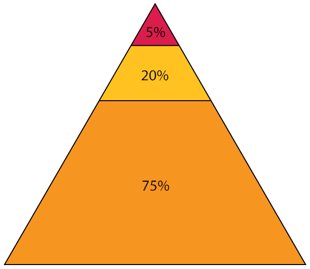

# 어떻게 공부해야 하는가?

## 쉬운길과 빠른길

- 최근에 읽은 책 중에서 기억나는 것이 무엇인가요?
- 비법과 요령을 찾는 순간 이미
- 성장은 어느 순간 찾아온다. 변화가 없다고 지치고 포기하지 마라

## 무엇보다도 재료가 우선이다

- 하고자하는 의지와 이루고 싶은 목표가 있다면 풍부한 재료를 준비해야 한다.
- 통찰, 호기심, 창의력은 재능보다 학습량에 더 크게 영향을 받는다.
- 병아리 감별사 이야기와 인공지능
- 인공지능 어느 규모 이상 기점부터 폭발적인 발현

## 세가지 부류들

- 75% - 하고자 하는 의지 자체가 빈약한 사람
- 20% - 의지만 불태우는 사람
-  5% - 열심히 실행하는 사람

5% 위에 아주 작은 칸이 하나 더 있습니다.
혹시 보이시나요?
마음을 닫고 살아서 그렇습니다.
마음을 열면 다 보이게 돼있습니다.
보이시나요?
...
음.. 이게 마음을 열면 보이긴 하는 군요.
저는 아무리 애를 써도 안보이던데.

이 작은 칸에 속한 사람들이 바로
세상을 이끌어 가는 리더들입니다.
이들의 차이점은 무엇일까요?
이들은 목표를 가지고 있는 사람들입니다.

목표는 계속 변화하고 진화해야 합니다.
우리가 서있는 것은 버티고 있는 것이 아니라
중심을 향해 끊임없이 쓰러지고 있는 것입니다.

목표를 이루기까지의 과정도 항상 고민하고 업데이트를 해야 합니다.
언제까지라는 조건은 의미없습니다.
어렸을 때 시간표 작성했을 때처럼 지켜지지 않습니다.
어느 시기까지 어느정도의 분량을 처리하고 그 바탕으로 목표를 이룰 것인지를

## 불행하게도 재능은 필수입니다

불행하게도 재능은 필수입니다.
    - 하고자 하는 의지도 있습니다.
    - 이루고자 하는 목표도 있습니다.
    - 하지만, 불행하게도 재능은 필수입니다.

불행하게도 프로그래밍에는 재능이 필요합니다.
그렇다고 높은 지능이 필요한 것은 아닙니다.
필요한 재능은 창의력, 호기심, 통찰, 비판적 사고 능력 등입니다.

새로운 것을 창조하고 본질을 탐구하는 것이
프로그래밍의 매력이라고 생각합니다.
그래서 앞서 말한 재능들이 필요한 것인데요.
이런 재능이 꽃 피울려면 많은 재료가 필요합니다.

이부분을 대부분 놓치게 되는데요.
바둑을 잘 두려면 수많은 포석과 정석 그리고 수읽기 등을 학습해야 하는 것과 같습니다.
수많은 게임을 통해서 익숙해져야하는 과정도 비슷합니다.

## 재능이 넘치는 사람들이 실패하는 경우

지속적인 프로젝트 수행을 통해 학습한 지식을 몸에 익혀야 합니다. 아는 것과 할 수 있는 것은 다르며, 지식은 학습으로 얻을 수 있지만, 실제 능력은 반복적인 훈련을 통해 완성됩니다. 연산 작업들이 직관의 영역으로 넘어갈 때, 창의력과 통찰의 능력을 발휘할 수 있습니다.

자전거를 처음 탈 때에는 멀리 바라보며 주위를 둘러볼 여유가 생기지 않는 것과 같습니다.

## 인공지능 어느 규모 이상 기점부터 폭발적인 발현

사람의 일부만 흉내낸 인공지능도 그러하듯이
인간의 뇌도 반복학습과 습득 지식 규모가 일정 규모가 넘으면 천재의 영역

타고난 천재들은 일종의 장애이다.
대부분의 장애는 불편한 쪽으로 발현되는데,
긍정적인 장애가 발생한 것
"아직도 니들은 갸들이 정상으로 보이냐?"
극단적인 예가 서번트 증후군이다.

반복만큼 중요한 것은 없고 그것이 유일한 길이다.
우리 뇌가 다른 방향으로 진화하지 않는한.
그리고 그 지겨움을 이겨내는 것이 무지하게 어렵다.
그래서 희소성 가치가 막대하다.
아무나 할 수 있다면 그다지 큰 대가가 주어지지도 않는다.

## 당신의 재능을 제대로 활용하고 있습니까?

### 재능이 충분한데 꽃을 못 피우기 전에 시들지 마라

* 싹이 텄을 뿐인데 ... (발목만 적시고 돌아서는 케이스)
* 꽃 향기에 취해 주저 앉지 마라 (작은 성공에 안주하는 케이스)
* 열심히만 하면 성장한다는 착각 (방향성의 문제)

### 싹이 텄을 뿐인데 ...

의식적 노력, 반사신경(야구), 직관(정신적)

**아는 것**과 **할 줄 아는 것**에는 커다란 차이가 있습니다.
누구나 배트를 휘둘러 공을 쳐야한다는 **지식** 자체는 쉽게 이해할 수 있지만,
실재로 멋지게 공을 쳐내기 위해서는 수없이 헛 방망이질을 해야 하는 것과 같습니다.
**실력**은 반복을 통해서 완성되는 것입니다.

하지만 대부분의 경우 무엇인가 읽고 보고 나서 이해하는 순간 **알고 있다**고 착각하게 되는 듯 합니다.
심지어는 **할 줄 아는 것**이라고 믿게 됩니다.

    "우린 우리가 길들이는 것만을 알 수 있는 거야." 여우가 말했다.
    "사람들은 이제 아무 것도 알 시간이 없어졌어.
     그들은 상점에서 이미 만들어져 있는 것들을 사거든."

    - 생텍쥐페리 "어린왕자"

### 꽃 향기에 취해 주저 앉지 마라

꽃은 피웠지만 열매를 취하지 못하는 케이스.
만족과 안주로 인해서 완성되지 못한..

## 열심히만 하면 성장한다는 착각

방향성의 문제

때로 머리가 아니고 가슴으로 이해해야 되

    어떤 이가 친구 앞에서 음악을 연주하고 난 후 물었다.
        "이 곡이 어떤가?"
    친구가 답하길,
        "그 곡의 의미를 가르켜줄 수 없나?"
    그러자 그는 다시 한 번 연주를 처음부터 되풀이 한 후,
        "이게 바로 이곡의 의미야!"

    - 채치충 "선설"

## A.I.를 대비해라

- 추상적인 가치에 투자해라 (분석/설계/비즈니스 등)
- A.I.와 함께 일하는 것에 익숙해져라
- A.I.의 결과물을 검토할 수 있는 능력을 갖추거나 테스트 시스템을 구축해야 한다

## 학습의 사계절

**봄**
시작 단계에서는 익숙해지려고 노력해야 한다.
잘하려고 하지 마라. 그 조급함이 성장을 방해한다.
이해하려고 너무 애쓰지 마라. 깨달음은 항상 뒤늦게 불연듯 찾아온다.

**여름**
익숙해지고 나면 집중력이 필요한 시기이다.
다양한 가능성을 탐색하고 실험하고 실패하고 다시 도전해라.
성장은 학습이 아닌 연습으로 이루어진다.

**가을**
어느 순간 성장 속도가 느려지면 멈춰서서 되돌아 봐야 한다.
잘한 것도 못한 것도 되새기고 정리해라.
성장이 아닌 성숙을 위한 순간이 필요하다.

**겨울**
진화를 위해서는 충분히 휴식을 취하는 단계가 필요하다.
에너지를 회복하고 마음을 재정비하라.
고된 여정 후에 자신에게 휴식을 선물해라.

## 끝으로

- 해결하고 싶은 문제를 찾고 도전하기를 반복
- 공부는 꾸준히 그리고 실습으로 마무리
- 피드백과 회고가 중요하다
- 우유를 마시는 사람보다 배달하는 사람이 건강해진다
- 한 가지를 정말 잘해야 한다
  - 동전 10개씩 천 개의 탑을 쌓는 것보다, 1000개짜리 하나의 탑이 더 가치가 있다.

