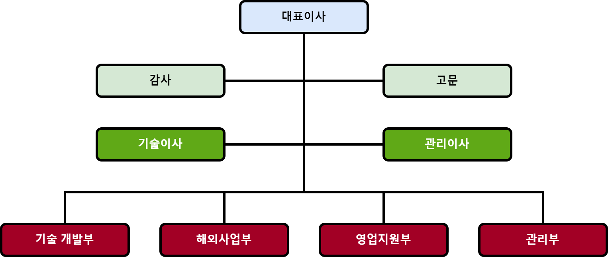
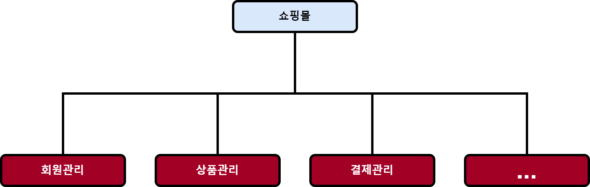
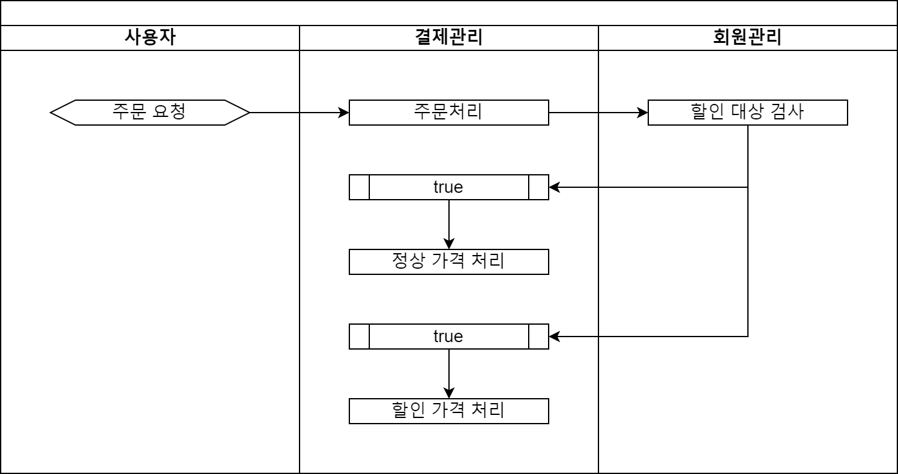

# 어렵고 복잡한 문제를 조각내서 해결하기 Part 1

<iframe width="800" height="450" src="https://www.youtube.com/embed/TePmrOa8ssM" title="YouTube video player" frameborder="0" allow="accelerometer; autoplay; clipboard-write; encrypted-media; gyroscope; picture-in-picture; web-share" allowfullscreen></iframe>

해결해야 할 문제가 너무 복잡해서 길을 잃듯 헤매 보신 적은 없나요?
이렇게 감당이 안되는 문제들은 자그마한 조각으로 나눠서 생각할 때
생각보다 쉽게 풀리는 경우가 있습니다.

이 포스트에서는 프로그래밍을 할 때 어떻게 문제를 조각 낼 것인가에 대해서 짧게 살표보도록 하겠습니다.

## 조각을 나누는 두 가지 기준

프로그래밍에서 문제를 조각내는 방법에는 크게 두 가지가 있습니다.

첫 번 째는 우리에게 익숙한 모듈화입니다.

기업을 보면 각 부서별로 할 일을 정해서 나누고 있는데요.
이처럼 기능을 중심으로 문제를 조각내는 방법입니다.

두 번째는 추상화입니다.

우리가 다뤄야 할 문제에 대한 스케치를 작성하는 과정이라고 보시면 됩니다.
전체를 쉽게 이해할 수 있는 중요한 특징과 흐름을 세부적인 구현으로부터 분리하는 작업입니다.

설계에는 **"이것이 정답이다."** 하고 단정지을 만한 절대적인 진리가 있을 수 없습니다.
개발자에 따라서 다르고 프로젝트 상황에 따라서도 달라질 수 있습니다.
다만 저는 보편적으로 적용될 수 있는 내용을 최대한 간추려 보도록 하겠습니다.

## 모듈화

우선 쉽게 생각할 수 있는 모듈화에 대해서 생각해보겠습니다.

모듈화 할 때 기준이 되는 것은 기능입니다.
각 조각들은 같은 기능들로 묶어서 분리하면 되는 데요.
단일 책임원칙도 같은 맥락에서 생각할 수 있습니다.

이렇게 서로 연관성이 강한 기능을 분리하고 함께 묶어 놓은 것을 응집도가 높다고 하는데요.
이렇게 하면 유지보수가 보다 쉬워지는 효과가 있습니다.

덤으로 기능을 기준으로 개발목표를 정리하면, 개발범위와 일정 예측을 위한 판단 근거가 될 수 있습니다.
비개발자들이 간혹 **"쇼핑몰 개발하는데 얼마나 걸려?"** 하고 물으면 대답하기가 상당히 곤란한데요.
개발하려는 쇼핑몰의 기능 목록이 있다면, 조금 더 목표가 선명해지기 때문입니다.

## 추상화

추상화를 이용해서 시스템을 인터페이스 계층과 구현계층으로 나눌 때는 모듈끼리 주고받는 메시지가 기준이 됩니다.

보시는 그림은 각 모듈이 어떻게 서로 메시지를 주고받으면서 협력하는 지를 도면으로 그려본 것입니다.
이 도면은 각 모듈들이 기능을 구체적으로 처리하는 방법에 대해서는 설명해주지 않습니다.
할인 대상을 어떻게 검사할 것인지는 이 단계에서의 관심사가 아닌 것이죠.
이 과정에서는 구체적인 세부 내용보다는 전반적인 줄거리를 찾고 설명하는데 집중해야 합니다.

이렇게 인터페이스를 어느 정도 정의하고 개발한다면,
각 모듈을 서로 다른 개발자들과 나눠서 개발할 때 더욱 더 효과적입니다.

## 재귀적인 조각내기

[출처: https://youtu.be/8cgp2WNNKmQ]

조각내기를 할 때 마지막으로 고려해야 할 특징은 조각내기가 재귀적으로 반복된다는 것입니다.

복잡한 문제를 모듈로 조각을 냈지만
그 모듈조차도 다른 작은 조각으로 나눠야 할 정도로 복잡한 경우가 있기 때문입니다.
