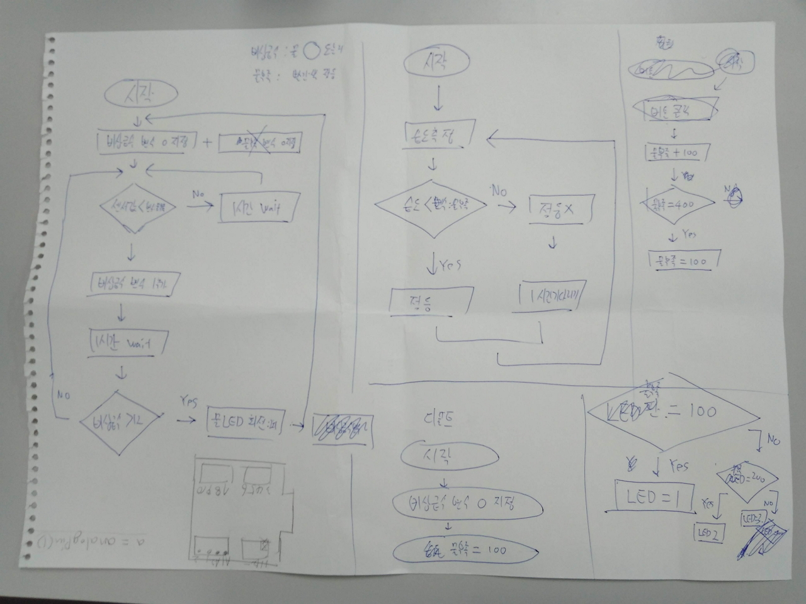
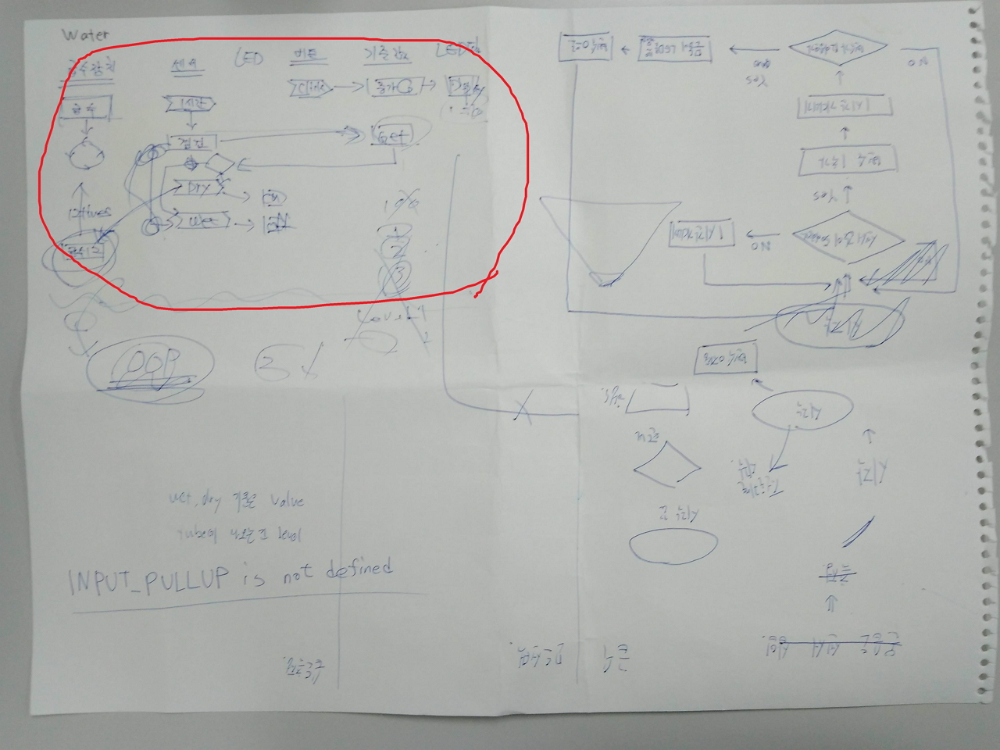
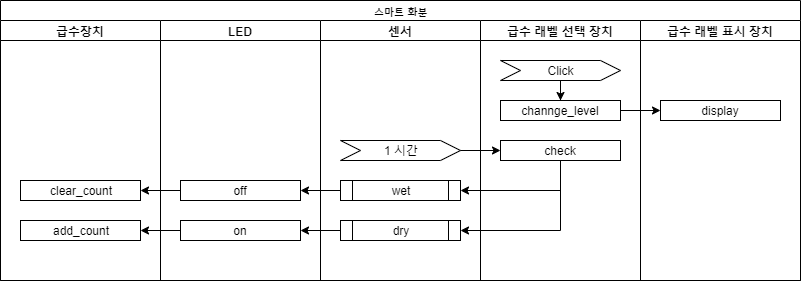
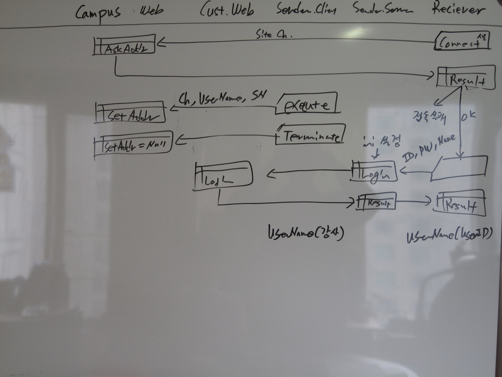
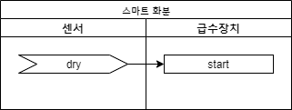
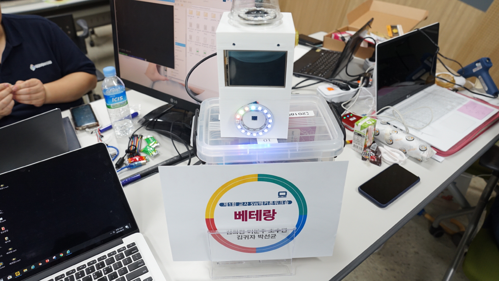
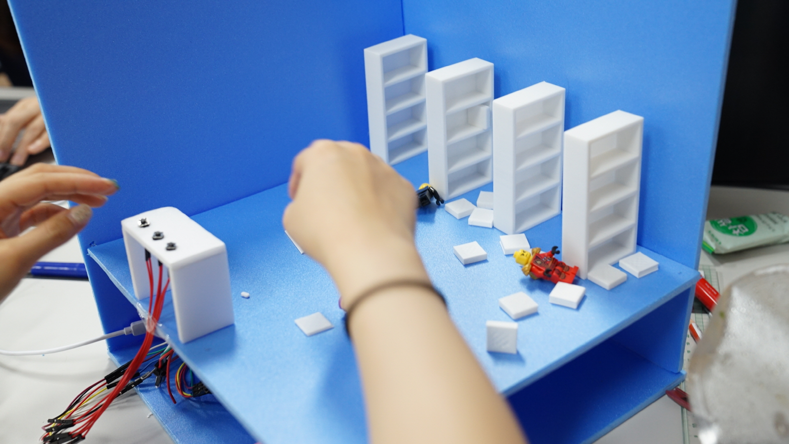
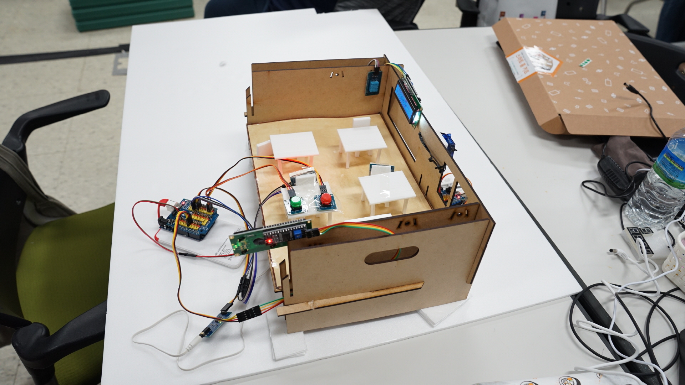
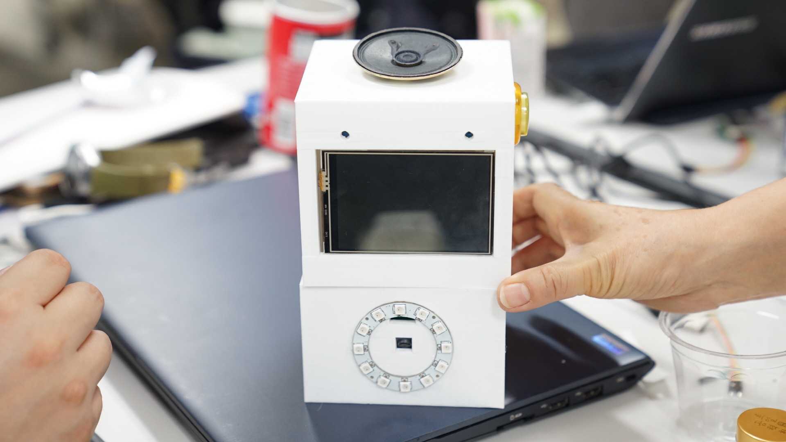
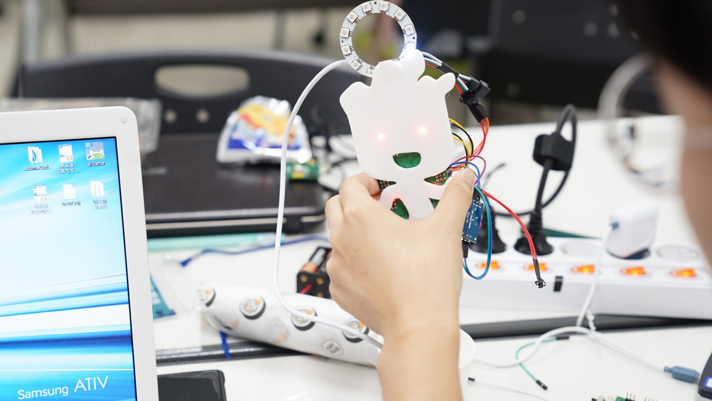

# 어렵고 복잡한 문제를 조각내서 해결하기 Part 2


## 핵심 강의

<iframe width="800" height="450" src="https://www.youtube.com/embed/bqvvmDGYOUk" frameborder="0" allow="autoplay; encrypted-media" allowfullscreen></iframe>


## 강의 개요

초.중.고 교사를 위한 피지컬 컴퓨팅 해커톤을 진행한 적이 있습니다. Micro Python을 사용할 수있는 어썸보드(AsomeBoard)라는 아두이노와 유사한 보드를 이용한 프로젝트입니다.

::: tip
어썸보드에 관해서는 [http://www.asomeit.com/](http://www.asomeit.com/) 링크를 참고하세요.
:::

저는 멘토 중 한 명으로 여러 팀을 계속 도와주고 있었는데, 한 팀이 상당히 시간이 지난 시점에서 도움을 요청해왔습니다. 그리고 아래와 같이 자신들이 설계한 플로우 차트와 진행된 코드를 보여줬는데, 도저히 그대로 진행이 어려운 상황이었습니다.

아래는 저에게 보여준 플로우 차트입니다. 빨간선 안 쪽은 제가 설명을 들으면서 정리한 부분입니다.





## 강의 전 준비 사항

* python 개발 환경


## 이 강의에서 다룰 내용

* 프로젝트를 시작할 때 요령
* OOP에 발가락 담그기


::: danger
군더더기를 피하기 위해서 현장 상황을 아주 자세하게 전달하지 않을 예정입니다. 따라서 그에 따른 오해와 혼선이 있을 수 있습니다. 의문점이나 개선점은 유튜브 영상에 댓글로 남겨주세요.
:::


## 상황 설명 및 당시 저의 고민

* 시간이 촉박한데 생각보다 구조가 복잡하다.
  * if 안에 또 if 그리고 또 if
  * 너무 길고 중첩되는 블록
  * 논리적 흐름을 이해하기 어렵고 오류로 인해서 활용할만한 부분이 별로 없다.
* 생각보다 구조가 복잡해서 모듈화를 하는 편이 설명하기도 구현하기도 편하다.
  * 프로그래밍을 접한 지 얼마 안되는 분들에게 모듈화나 OOP를 설명하는 것이 옳은가?
  * 다른 팀도 살펴봐야 하기 때문에 시간이 많지 않다.
  * 절차적인 방식으로 기본적인 코드를 만들어 주면 스스로 해결이 안될 거 같다.
      * 간단한 코드라면 절차적인 방식이 압도적으로 좋다.
      * 하지만 선생님들이 원하는 프로젝트는 자신들의 수준에 비해서 너무 복잡하다.
  * 그래도 OOP는 초보에게 아니지 않는가?

이것이 당시 짧은 시간 동안 몇 번이나 반복하면서 빠르게 제 머릿속을 휘저었던 고민이었습니다. 정말 오랫만에 엄청나게 집중할 수 있었습니다 ^^


## 프로젝트를 시작할 때 요령

    "어떻게"보다는 "무엇을" 해야 하는지 정리해야 합니다.

이 에피소드의 주인공을 포함한 초보분들 중 많은 분들이 "무엇을" 해야하는지 충분하게 고민하지 않고 "어떻게"해야 하는 가를 고민하는 경우를 있습니다. 이것은 실무에서도 자주 목격합니다. 무엇을 해야 하는지 제대로 정하지도 않은 상태에서 어떻게 해야 할 까를 고민하는 것은 시간 낭비입니다.

    규모가 큰 프로젝트라면 "왜" → "무엇을" → "어떻게" 순으로 고민합니다.

규모가 좀 크고 중요한 프로젝트라면 "왜"라는 질문에 먼저 해답을 찾아야 합니다. 프로젝트의 목적과 의미를 제대로 파악하지 못한 상태에서 프로젝트를 시작하면, 실제로는 중요하지 않은 기능에 집착하면서 시간을 허비할 수가 있습니다. 그리고 상황에 따라 변하는 가치에 대해서 고려하지 못하고 시간이 지난 뒤 쓸모없는 제품을 만들게 될 가능성이 높습니다.

::: tip "왜?"라는 질문부터 시작하지 않는다면
간단한 예로 "아침에 정원에 물을 뿌려주는 기계"의 기능에 집중하다보면 비가 오는 날에도 여전히 물을 주는 충실한 기계를 만들게 됩니다. 정원의 가치와 급수의 필요성은 고려하지 못하게 되는 것이죠.

다른 예로는 제퍼슨 기념관의 벽이 심하게 부식되어 보수작업을 시작했을 때, 곧바로 벽을 수리하지 않고, "왜?" 그러한 일이 발생했는 지 조사하게 됩니다. 결과적으로 비둘기 똥의 강한 독성이 문제임을 발견합니다. 그리고 다시 "왜?" 비둘기가 날아오는 가 조사합니다. 그 이유가 벽에 사는 거미들 때문인 것을 발견합니다. "왜?" 거미가 벽에 살게되었는지 조사하니 기념관의 야간 조명 때문에 나방이 몰려들기 때문이었습니다. 그래서 야간 조명 점등 시간을 변경하여 문제를 해결하게 됩니다. 만약 충분히 "왜"라고 묻지 않고 수리를 먼저 시도했다면, 부식과 수리를 반복하게 되었을 것입니다.
:::


## "무엇을" 해야 하는 지 정리하는 요령

프로젝트를 시작할 때 막연한 경우가 많습니다. 이때 가장 쉽고 효과적인 방법은 기능 목록을 만들어 보는 것입니다.

여기서는 에피소드의 주인공과 문제를 해결했던 과정을 살펴보도록 하겠습니다. 현장의 상황을 최대한 그대로 재현하겠습니다.

* 기능 목록
    * 물주기 레벨을 정한다.
        * 습기가 많이 필요한 식물, 보통, 조금
        * 버튼을 누를 때마다 레벨이 1 → 2 → 3 → 1 .. 처럼 반복되도록 한다.
    * 물주기 레벨을 LED 튜브에 표시한다.
    * 1시간마다 센서를 점검한다.
    * 센서의 값이 기준치를 넘어서면 LED를 켜서 학생들에게 물을 줘야하는 상황을 알린다.
        * 해커톤의 주제가 교실에서 필요한 장치 만들기였다.
        * 선생님들의 의도는 학생들이 스스로 물을 주도록 LED를 통해서 알려주는 것입니다.
        * 그러나 너무 오랫동안 방치한다면 자동으로 급수장치가 작동해야 합니다. (방학 또는 휴일 등)
    * 12시간이 지나도 센서값이 기준치를 넘어서면 펌프를 돌려서 자동으로 물을 준다.

선생님들의 설명을 듣고도 전혀 무엇을 해야 할지 감을 잡지 못하다가 어느 정도 기능을 정리하니 대략적인 윤곽을 알 수가 있었습니다.


## "어떻게" 구현할 것인가?

### 복잡한 시스템을 작은 조각으로 나눠서 효과적으로 개발하기

프로젝트의 규모가 어느 정도 크다면 모듈화나 OOP를 고려하는 것이 좋습니다. 그렇다면 어느 정도를 기준으로 규모가 크고 작음을 구별할 수 있을까요?

저는 규모가 크고 작은 기준은 개인에게 달려있다고 생각합니다. "나는 이정도는 한 덩어리로 만들어도 충분하다"라고 생각한다면 굳이 조각을 내야할 이유는 없습니다. 다만 혼자서 개발하는 프로젝트가 아니고 여럿이서 함께하는 프로젝트라면 개인의 역량보다는 공동체의 의견을 지속적으로 반영하며 기준점을 찾아가야 합니다.

    모든 조각은 자신의 일에 집중한다.

시스템을 작은 조각으로 나눌 때에는 기준이 하나 있습니다. "단일 책임 원칙"이라고도 하는데요, 모든 조각이 각자의 한 가지 목적만 가지도록 나눈다는 의미입니다. 마치 모듈 하나가 한 분야의 전문가처럼 느껴지도록 말이지요.

앞에서 작성한 기능 목록을 근거로 모듈을 나눠보면 좀 더 쉽게 나눌 수 있습니다. 유사한 기능끼리 묶어서 이것들을 해결하는 담당자를 선임하는 것처럼요. 이번 예제에서는 기능 목록이 많지 않아서 효과적이지는 않지만, 아래와 같이 나눠보도록 하겠습니다.

* 모듈 목록
    * 급수 레벨 선택 장치
    * 급수 레벨 표시 장치
    * 토양 습도 센서 장치: 화분 속 흙의 습도를 측정한다.
    * 급수 알람 LED
    * 급수 장치

::: tip
모됼화나 OOP는 복잡한 하나의 문제를 작은 단위로 쪼개서 최대한 단순한 여러 개의 문제로 나눠서 해결하는 방식입니다.
:::

### 나눠진 조각들의 관계를 정리하기

하나였던 시스템을 여러 개의 모듈로 나누면 모듈들은 서로를 필요하게 됩니다. 만약 어떤 모듈이 다른 모듈들과 상관없다면, 그 모듈은 처음부터 별개의 시스템이었던 것입니다.

이렇게 서로가 필요한 요청 관계를 정리하지 않고 바로 어떻게 동작해야하는 지를 구현하게 되면 모듈과 모듈이 서로 뒤엉켜서 이른바 스파게티 소스가 됩니다. 이렇게 작성된 코드는 이해하기도 어렵고 수정하기도 어렵게 됩니다.

저는 항상 아래와 같은 다이어그램을 통해서 모듈 간의 관계를 먼저 정리하고 구체적인 구현을 시작합니다. 각 모듈이 언제 다른 모듈이 필요하고, 다른 모듈에게 무엇을 요청하고 받아야하는 지를 정리한 다이어그램입니다. 개인적으로는 ["Job Flow"](https://www.delmadang.com/community/bbs_view.asp?bbsNo=3&bbsCat=0&st=S&indx=430697)라고 부릅니다.



* 급수 레벨 선택 장치에서 버튼이 클릭되면 내부적으로 레벨을 변경하고 변경된 레벨을 급수 레벨 표시 장치에 알려줍니다.
* 센서는 한 시간마다 급수 레벨 선택 장치에게 현재 센서 값이 레벨에서 건조한 건지 습한 건지 결과값을 알아옵니다.
    * 결과가 습하다면 급수 알림 LED를 끄고 급수 장치의 count를 0으로 바꿉니다.
    * 결과가 건조하다면 급수 알림 LED를 켜고 급수 장치의 count 값을 1씩 증가시킵니다.
        * 기능 목록 정리할 때 요구 시간대로 12가되면(12시간 지나면) 급수를 시작합니다.

다이어그램을 보시면 서로 어떻게 협력해야하는 지에 집중합니다. 각자가 무엇을 할지에 대한 것은 고려하지 않습니다. 심지어 급수 장치의 count가 증가되면 어떻게 되는지조차 다이어그램에는 표시가 없습니다.

저는 위와 같은 다이어그램을 도출하기 전 스스로 모듈이 되는 상상을 합니다. 그래서 다양한 조건과 시나리오를 고민하고 해당 시나리오에 위배되는 관계가 있는 지 또는 빠진 관계가 있는 고민합니다.

팀으로 개발할 때에는 화이트보드에 그려놓고 서로 토론을 해가면서 불필요한 관계는 없는지, 빠진 조건은 없는 지 회의를 합니다. 중간 다이어그램에는 각 모듈이 내부적으로 어떻게 동작하는 지 표시하기도 합니다. 서로의 이해를 돕는데 도움이 된다면 규칙은 얼마든지 변경합니다.



### 관계를 코드로 표현하기

``` python
import water_pump       # 급수 장치
import led              # 급수 알람 LED
import water_sensor     # 토양 습도 센서 장치
import level_select     # 급수 레벨 선택 장치
import level_display    # 급수 레벨 표시 장치

def on_click():
    level_display.display( level_select.getValue() )

def on_hour():
    value = water_sensor.getValue()
    if level_select.check( value ) == WET:
        led.off()
        water_pump.clear_counnt()
    else:
        led.on()
        water_pump.add_counnt()

level_select.setOnClick( on_click )
water_sensor.setOnHour( on_hour )
```

이렇게 모듈간의 관계가 정리되면 이제부터는 각 모듈 내부 구현에만 신경쓰면 됩니다.

웬지 그냥 개발하는 것이 더 편해보일 수도 있습니다. 만약 자신의 능력에 비해 쉬운 프로젝트라면 소위 막코딩이 더 편할 수 있습니다. 하지만, 그 코드가 앞으로 계속 수정하고 개선해야 한다면 언젠가는 한계에 부디칠 수도 있습니다.

이렇게 공들인 것의 보상은 각 모듈을 구현할 때 관계도에 나타난 자신의 책임만 신경쓰면 다른 모듈이 있다는 사실조차 몰라도 된다는 것입니다. <b>즉, 모듈이 해야하는 일에만 전념하면 됩니다.</b>


::: tip 구현이 아니라 인터페이스에 집중해라
위와 같이 모듈이나 객체(OOP 용어)로 조각을 내어 프로그래밍을 할 때에는 구체적인 동작을 구현하는 코드보다는 조각들끼리 어떤 관계를 가져야 하는 지를 먼저 고민해야 합니다.
:::

### water_pump 모듈 구현하기

``` python
# water_pump.py: 급수 장치

count = 0

def clear_counnt():
    count = 0

def add_counnt():
    count = count + 1
    if count >= 12:
        count = 0
        # 물주기 코드 구현
```
급수 장치는 다이어그램에서 두 가지 책임이 있었습니다. 다이어그램에 표기된 이름 그대로 두 함수가 정의되어 있습니다.

* 9-11: 화분이 말라 있을 때 한 시간마다 add_counnt() 함수를 호출합니다. 그런데 요구사항에서는 12시간 동안 급수가되지 않으면 물을 주기로 하였기 때문에 count가 12가 되었을 때 물주기 코드를 구현하고 count는 다시 0으로 세팅합니다.


### led 모듈 구현하기

``` python
# led.py: 급수 알람 LED

def off():
    # LED 끄기 코드 구현

def on():
    # LED 켜기 코드 구현
```
LED 따로 모듈을 구현해야 하나 싶을 정도로 간단합니다. 소스에는 표현하지 않았지만 LED를 사용하기 위한 초기화 코드를 숨기는 편이 좀 더 코드를 읽기 쉽게 만들 수 있다고 판단하여 분리하였습니다.

차후 LED가 켜지면서 소리도 함께 내야 한다든지 변경사항이 발생한다해도 led.py 모듈만 수정하면되고 전체에 영향을 주지 않기 때문에 변화를 확산을 차단하는 효과도 있습니다. (소리까지 내야한다면 모듈 이름은 변경하는 것이 좋겠네요)


### water_sensor 모듈 구현하기

``` python
# water_sensor.py: 토양 습도 센서 장치

on_hour_handler = None

def getValue():
    # 센서값 읽어서 리턴하기 코드 구현

def setOnHour(value):
    on_hour_handler = value

while True:
    if (한 시간이 지났나?) and on_hour_handler != None:
        on_hour_handler()
```
토양 습도 센서 장치에서는 좀 색다른 것이 두 가지가 있습니다.
* 첫 번 째는 이벤트처리입니다. setOnHour()는 다이어그램에는 표현되지 않았지만, 이 모듈이 이벤트를 발생하여 다른 객체(모듈)들에게 알려야할 의무가 있습니다. 이벤트를 알린다는 자체가 내부의 상황을 외부에 알려줘야 합니다. 그러니 외부 연락처의 주소를 알아야 겠지요. "나에게 무슨 일이 생기면 어디로 연락하지?"에 해당하는 부분이 on_hour_handler입니다. setOnHour(value)를 통해서 연락처를 value로 전달받으면 내부에 on_hour_handler 공간에 메모해두고, 일이 생기면 13: 라인에서처럼 해당 주소로 알려주는 것입니다.
* 두 번 째는 "while True:"를 이용하여 반복적으로 센서의 값을 지켜보다가 조건이되면 밖으로 이벤트를 발생시켜서 알리고 있는데요. 현재 코드를 보면 스레드를 전혀 사용하고 있지 않기 때문에 여기서 모든 실행이 멈춰서게 됩니다. 다른 코드와 함께 처리할 수가 없는 것이지요. 이부분은 스레드를 사용하면 설명하는데 복잡해지기 때문에 가상으로 표현해본 것입니다.
  * 스레드를 사용하지 않고 해결하는 방법도 있습니다만 여기서는 주제와 많이 벗어나기 때문에 설명을 생략하겠습니다.


### level_select 모듈 구현하기

``` python
# level_select.py: 급수 레벨 선택 장치

on_click_handler = None

level = 1

def getValue():
    return level

def setOnClick(value):
    on_click_handler = value

while True:
    if 버튼이 클릭되었나?:

        level = level + 1
        if level > 3:
            level = 1

        if on_click_handler != None:
            on_click_handler()
```

::: tip
    level = level + 1
    if level > 3:
        level = 1

위의 코드는 아래처럼 한 줄로 표현할 수 있습니다.

    level = (level + 1) % /3
:::


### level_display 모듈 구현하기

``` python
# level_display.py: 급수 레벨 표시 장치

def display(value):
    # LED 튜브에 숫자 표시하기
```

현장에서는 위에서 처럼 모듈의 관계를 나타내는 코드와 각 모듈의 윤곽까지만 제가 만들면서 설명을 해드리고 실제적인 구현은 선생님들이 직접하도록 하였습니다. 다행이 약간의 로직 개선까지 마무리하여 좋은 결과로 마무리할 수 있었습니다.


## 좀 더 단순한 문제를 통한 복습

초보자에게는 위의 코드 진행이 어려울 수 있습니다. 그래서 이번에는 아주 단순한 문제를 모듈로 조각내어 풀어보면서 이해를 돕도록 하겠습니다.

### 화분이 말라있으면 물을 주는 단순한 알고리즘의 구현


* 센서에서 화분이 마른 것이 감지되면 급수장치르 물을 주는 것을 시작하도록 한다.

``` python
# main.py: 메인 모듈

import water_sensor     # 토양 습도 센서 장치
import water_pump       # 급수 장치

def on_dry():
    water_pump.start()

water_sensor.setOnDry( on_dry )
```
다이어그램에서 나타난 서로의 관계를 코드로 구현한 것입니다. OnDry 이벤트가 발생하면 급수 장치가 물을 주기 시작하면 됩니다.

``` python
# water_pump.py: 급수 장치

# start()가 호출되면 1초간 물을 준다
def start():
    펌프작동()

    # 1초 동안 기다린다
    delay(1)

    펌프정지()
```

``` python
# water_sensor.py: 토양 습도 센서 장치

on_dry_handler = None

def setOnDry(value):
    on_dry_handler = value

while True:
    if (화분이 말랐다면?) and (on_dry_handler != None):
        on_dry_handler()
```

## 해커톤 현장 사진






