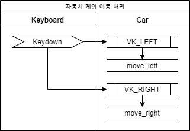
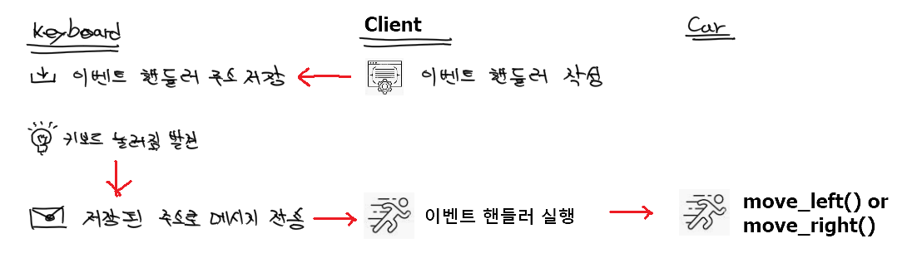

# 이벤트 기반 프로그래밍


## 개념 설명

음식을 주문하고 기다리는 상황을 생각해 봅시다.
이제는 진동벨 없는 상황을 상상하기 어렵지만
진동벨이 없었던 시절에는 주문하고 나서 기다리다 지쳐서 카운터에가서 주문 상황을 묻는 경우가 흔했습니다.

OOP가 유행하기 전 절차지향적 프로그래밍에서는 진동벨이 없었던 상황처럼
주기적으로 외부 상태를 직접 살펴보고 조건문을 통해서 처리하는 경우가 흔했습니다.

게임 프로그램을 작성하는 경우를 비교해보겠습니다.

우선 절차지향적 구조에서는 반복문을 통해서 계속 키보드 상태를 점검하고 케리터를 왼쪽으로 또는 오른쪽으로 이동하는 경우가 많았습니다.

```cpp
while (true) {
    switch (getKeyCode()) {
        case VK_LEFT: move_car_left(); break;
        case VK_RIGHT: move_car_right(); break;
    }
}
```

OOP가 유행하게되면서 가장 중요하게 생각되는 변화 중 하나는 "단일 책임 원칙"에 있습니다.
코드를 객체라는 조각의 집합 형태로 작성하게 되면서 모든 객체는 각자 전문가처럼 자신의 일에만 집중해서 작성하는 것이 효율적이라는 것입니다.

그러한 관점에서 위의 코드를 두 개의 객체로 나눠서 자동차의 위치를 제어하는 객체와 키보드를 감시하는 객체로 나눌 수 있습니다.
실제 코드가 위의 코드처럼 단순하다면 굳이 이렇게 나눠서 작업할 필요가 없겠지만,
시스템의 규모가 점점 커질 수록 그 효과는 극대화 될 것입니다.
여기서 주제는 단일 책임 원칙이 아니기 때문에 다시 이벤트에 집중하도록 하겠습니다.

::: tip
모든 OOP의 장점이 OOP의 독점적인 특징은 아닙니다.
OOP 유행 이전에도 이러한 장점이나 원리는 꾸준히 발전해오고 있었습니다.
:::

아래 그림은 이렇게 두 개의 객체로 나누고 Keyboard 객체가 키가 눌러질 때마다 메시지로 다른 객체에게 알려주는 것을 표현한 것입니다.


* Keyboard의 객체는 키가 눌러졌는지 감시하다가 눌러졌으면 다른 객체에게 이 사실을 알리는 일만 합니다.
* Car 객체는 키보드가 눌러졌다는 메시지를 보내오면 메시지 종류에 따라서 이동 방향을 선택합니다. 메시지를 기다리는 일에 집중하지 않아도 됩니다.

이제 Car 입장에서는 자동차를 화면에 표시하는 등의 다른 일을 하다가도 주기적으로 Keyboard에게 가서 어떤 키가 눌러졌는 지 물어볼 필요가 없어졌습니다.
자신의 일에 집중하다가 외부에서 메시지가 들어오면 그 때 그 메시지에 해당하는 일을 해주면 됩니다.
이러한 방식의 코드는 작은 규모의 시스템에서는 오히려 더 복잡해 보이지만 시스템의 규모가 조금씩 커지게 되면 힘을 발휘하게 됩니다.


## 코드를 통해서 이해하기

위에서 예로 든 게임의 Keyboard와 Car 객체를 구현하기 위해서 필요한 과정을 도식으로 설명한 것입니다.


* 키보드가 눌려졌다는 이벤트를 알려지면 이것을 처리할 함수를 작성합니다. 이 함수를 이벤트 핸들러라고 부릅니다. 이벤트가 발생하고 나서 처리(Handling)할 코드라는 의미입니다.
* Keyboard는 이벤트가 발생했을 때 실행할 핸들러의 주소를 내부에 저장합니다.
* Keyboard는 키보드가 눌러진 것을 발견하면 저장된 주소로 메시지를 보냅니다. OOP에서 메시지를 보낸다는 뜻은 함수(메소드)를 실행하는 행위를 뜻합니다. 즉, 이벤트 핸들러(함수)의 주소를 가지고 있다가 필요할 때 실행해줍니다.
* 이벤트 핸들러는 메시지를 해석해서 필요에 따라 move_left()나 move_right()를 실행합니다.

::: tip
Client는 두 객체를 이용하는 고객이라는 의미입니다. 객체들이 자신의 일만하기 때문에 두 객체가 함께 일하려면 추가적인 코드가 필요합니다. 이부분은 두 객체의 본연의 업무는 아니기 때문에 제 3자가 필요한 것이지요.

이것은 아주 전문적이고 훌륭한 두 선수를 뽑았지만, 작전을 지휘하는 것은 감독이나 코치인 경우와 비슷합니다.
두 선수는 각자가 맡은 포지션에 충실하면 됩니다.
:::


### 함수를 변수처럼 사용하는 마법

이벤트 기반의 프로그래밍은 "너 무슨 일이 있으면 이 함수를 실행해줘!"라고 약속하는 것입니다. 그래서 실행시킬 함수의 참조(포인터)를 넘겨줄 방법이 필요합니다.

예전에는 함수 포인터를 주로 사용했었지만, 요즘은 std::function러첨 손쉬운 대안이 있습니다.

우선 평범한 코드부터 살펴보겠습니다.
콘솔 화면에 Hello?라고 표시하는 간한한 print_hello() 함수를 만들고 이것을 main() 함수에서 실행하는 예제입니다.

```cpp
#include <iostream>

void print_hello()
{
	printf("Hello? \n");
}

int main()
{
	print_hello();
}
```

이번에는 print_hello() 함수를 변수에 넣어서 실행하는 방법을 살펴보겠습니다.

 ```cpp
#include <iostream>
#include <functional>

using namespace std;

void print_hello()
{
	printf("Hello? \n");
}

int main()
{
	function<void()> func = print_hello;
	func();
}
 ```
func라는 변수에 print_hello()의 참조를 저장했다가 func()와 같이 변수를 함수처럼 실행하는 예제입니다.
* 2: function을 사용하기 위해서 헤더가 추가되었습니다.
* 4: std::function처럼 항상 길게 쓰는 것이 번거롭기 때문에 생략할 수 있도록 namespace를 사용하고 있습니다.

typedef를 사용하여 조금 더 간결하게 변경한 예제입니다.
15번 라인을 보시면 이전보다는 좀 더 변수 선언에 가깝게 보이실 것입니다.

```cpp
#include <iostream>
#include <functional>

using namespace std;

typedef function<void()> VoidEvent;

void print_hello()
{
	printf("Hello? \n");
}

int main()
{
	VoidEvent func = print_hello;
	func();
}
```

이러한 방식이 필요한 이유는 다른 객체에게 내 코드의 일부를 실행시켜달라고 부탁하기 위해서입니다.
만약 함수를 변수에 넣을 수 있다면 그 변수를 전달해서 다른 객체게 전달받은 변수를 실행하는 형식을 취하는 것입니다.


### Keyboard 클래스 구현

```cpp
typedef function<void(int key)> KeydwonEvent;

class Keyboard {
public:
    void watch()
    {
        while (true) {
            key = "키보드 상태 알아오기";
            if (on_keybaord_down_ != nullptr) on_keybaord_down_(key);
        }
    }

    void setOnKeydown(KeydwonEvent event)
    {
        on_keybaord_down_ = event;
    }

private:
    KeydwonEvent on_keybaord_down_ = nullptr;
}
```
원리를 설명하기 위해서 만들어진 간략한 예제입니다.
* 11-14: 키가 눌러졌을 때 이벤트로 알려줄 핸들러의 참조를 저장합니다.
  * 키가 눌러지면 해당 이벤트를 외부의 객체에게 알려줘야 합니다. 그런데 이 이벤트를 받을 객체의 참조를 Keyboard가 내부 변수로 가지고 있는 것은 문제가 있습니다. 현재는 Car 객체에게만 알려주면 되지만, 추후 다른 객체에게도 알려줘야할 경우가 새로 발생할 수도 있습니다. 이렇게 변화가 발생할 때마다 그 변화가 사방으로 전파되면 큰 규모의 시스템일수록 더 많은 비용이 발생하게 됩니다.
  * 좋은 설계일수록 모든 객체는 자신의 할 일 이외 다른 객체의 존재 자체를 몰라도 되도록 해야합니다. 그래서 구체적으로 어떤 객체에게 메시지를 전달할 지 정하기 보다, "나는 메시지를 외부에 전달하겠다. 나머지는 알아서 해라!"와 같은 형식이어야 합니다.
* 6: 키보드 상태를 어떻게 가져오는 지가 중요한 부분은 아니기 때문에 생략했습니다.
* 7: on_keybaord_down_가 nullptr이 아니고 다른 값으로 지정되었다면, 키보드가 눌러진 사실을 on_keybaord_down_에 저장된 핸들러에게 알려줍니다. on_keybaord_down_는 함수의 참조를 가지고 있기 때문에 함수처럼 사용하면 됩니다.


### Car 클래스 구현

```cpp
class Car
{
public:
    void move_left()
    {
        ...
    }

    void move_right()
    {
        ...
    }
}
```
Car 객체는 move_left(), move_right() 메시지를 받으면 이동하는 방법에만 신경쓰면 되기 때문에 간단합니다.
별도로 설명할 필요가 없기 때문에 의사코드 수준에서 멈추도록 하겠습니다.


### 이벤트 처리 (Client 구현)

```cpp
Keyboard keyboard;
Car car;

void on_keydown(int key)
{
    switch (key) {
        case VK_LEFT: car.move_left(); break;
        case VK_RIGHT: car.move_right(); break;
    }
}

main()
{
    keyboard.setOnKeydown(on_keydown);
    ...
}
```
4-10: 이벤트 핸들러입니다. 키보드가 눌러지면 어떤 일을 해야 할 지가 구현되어 있습니다.
14: setOnKeydown() 메소드를 통해서 keyboard 객체에게 키보드가 눌러졌을 때 실행해야 할 이벤트 핸들러의 참조를 넘기고 있습니다.


## 마무리

**이벤트는 철저하게 분업을 하고 있는 객체들이 다른 객체의 도움이 필요할 때 연락을 주고 받는 수단입니다.**

Keyboard와 Car 객체만의 분업이라고 생각하기 쉽지만,
실제로는 이벤트를 처리하는 Client까지 포함하여 3개의 객체들의 협동 작업이었습니다.
그리고 각각 자신이 맡은 일들은 다음과 같습니다.

* Keyboard: 키보드 상태를 확인하는 일에 집중한다.
* Car: 자동차 이동 처리에 집중한다.
* Client: 두 객체가 어떻게 협력해야 하는 지에 집중한다.

이렇게 관심사를 분리해서 코드를 작성하면 전반적인 논리는 Client만 살펴보면 알 수 있고,
세부적인 사항은 그것을 맡은 객체들만 살펴보면 됩니다.
코드도 모두 간결해지는 장점이 있습니다.

다만, 클래스를 이용해서 분업화된 코드는 그렇지 않은 코드보다 입체적인 형태를 취하고 있어서,
OOP에 익숙하지 않은 개발자들에게는 이해하는데 좀 더 시간이 걸릴 수도 있습니다.