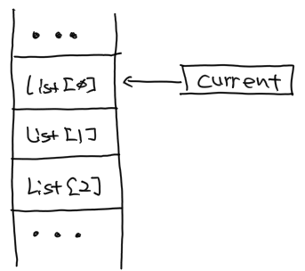

# 포인터 이해하기


## 포인터는 변수입니다.

포인터 자체는 단순한 변수일 뿐입니다.
**변수는 정보를 간직하고, 포인터는 정보가 있는 위치를 간직합니다.**

어찌보면 차이는 단순합니다.
다만 포인터를 응용하는 방식들이 우리에게 직관적이지 않아서 익숙해지기 전까지는 무척 어려운 것입니다.
그래서 저는 입문자들은 포인터에 미리 겁먹지 말고 익숙해지기 전까지는 가벼운 주제들을 중심으로 공부하기를 추천합니다.

```cpp
#include <iostream>

int main()
{
    int a = 1234;
    int* p = &a;

    printf("%d, %d \n", a, p);
}
```
* 5: 정수형 변수 a를 선언하고 변수 안에 1234라는 정수를 저장합니다.
* 6: 정수형 포인터 변수 p를 선언하고 a의 주소를 가져와서 저장합니다.
* 8: printf() 함수를 이용해서 변수 a와 p에 저장된 값을 콘솔 화면에 표시합니다.


* a의 메모리 상의 주소를 알기 위해서 & 연산자를 사용하고 있습니다. &는 뒤에 오는 대상의 메모리 주소 값을 가져오는 연산자입니다.


* 실행 결과 화면입니다.
* 변수 a에 저장한 1234 정보가 그대로 표시되는 것을 확인할 수 있습니다.
* 포인터 변수 p에 저장한 위치 정보는 19921548이라는 숫자가 저장되어 있는데요, 이것은 변수 a가 메모리 공간에서 그만큼 위치에 저장되어 있다는 의미입니다.
* 이 위치는 항상 같은 것은 아닙니다. 잠시 후에 다시 소스를 실행하면 위치 정보가 달라질 수 있는데요, 그 동안 컴퓨터에서는 다른 프로그램들이 메모리를 쓰거나 반납했기 때문에 위의 소스가 실행 되는 메모리 공간이 항상 같을 수는 없기 때문입니다.


## 포인터 변수는 항상 같은 크기의 공간을 차지합니다.

변수는 저장하는 데이터의 타입에 따라 메모리를 차지하는 공간의 크기가 결정됩니다.
저장하고 싶은 정보의 형태에 따라서 그 크기도 당연히 다를 수 밖에 없기 때문입니다.

| 데이터 타입 | 크기    |
| ----------- | ------- |
| char        | 1 byte  |
| short       | 2 bytes |
| int         | 4 bytes |
| double      | 8 bytes |
| ...         | ...     |

하지만, 포인터의 경우에는 항상 같은 크기입니다.
포인터의 크기는 컴파일하는 대상 플랫폼이 32비트냐 또는 64비트냐에 따라서 달라집니다.
포인터가 가리키는 정보의 형태와 무관하게 위치 정보가 메모리를 차지하는 공간의 크기는 항상 일정하기 때문입니다.

| 포인터 타입 | 32비트  | 64비트  |
| ----------- | ------- | ------- |
| void\*      | 4 bytes | 8 bytes |
| char\*      | 4 bytes | 8 bytes |
| short\*     | 4 bytes | 8 bytes |
| int\*       | 4 bytes | 8 bytes |
| double\*    | 4 bytes | 8 bytes |
| ...         | ...     | ...     |


## 포인터 변수의 타입이 필요한 이유

크기도 일정한 포인터가 왜 데이터 타입을 명시하고 있는 것일까요? 어자피 저장하는 공간의 크기도 같고 주소만 간직하기 때문에 의미가 없을 것 같은데요.

```cpp
#include <iostream>

int main()
{
    char buffer[8] = {1, 2, 3, 4, 5, 6, 7, 8};

    char* c = buffer;
    int* i = (int*) buffer;
    printf("%d, %d \n", c, i);

    c++;
    i++;
    printf("%d, %d \n", c, i);
}
```

-   7-9: buffer의 메모리 위치를 c와 i 포인터 변수에 저장하고 printf() 함수로 콘솔 화면에 출력하였습니다. [pic-4]의 첫 번 째 줄을 보시면 두 주소가 12712624로 정확하게 같은 것을 확인할 수가 있습니다.
-   11-13: ++ 연산자를 이용해서 c와 i 포인터 변수 값을 한 칸씩 증가시키고 다시 콘솔 화면에 출력하였습니다. c 변수의 값은 1 byte 크기만큼 증가하였지만, i 변수의 값은 4 bytes 크기만큼 증가한 것을 확인할 수가 있습니다.

::: tip char* c = buffer; 에서는 왜 & 연산자를 안쓰나요?
배열은 일종의 포인터입니다. 따라서 배열은 메모리 주소만을 가지고 있습니다. 이미 데이터의 주소를 저장하고 있어서 & 연산자를 사용하지 않고 바로 사용할 수 있습니다.
:::

::: tip (int*)가 필요한 이유
buffer는 char 배열로 선언되어 있기 때문에 그 타입은 char* 입니다. 그래서 int*로 선언된 i 변수는 타입이 달라서 주소를 바로 가져올 수 없습니다. (int\*)를 이용해서 타입이 호환되도록 하는 작업이 필요합니다.
:::


[pic-4]


눈치가 빠르신 분은 이미 아셨겠지만 포인터 변수에 지정된 데이터 타입의 크기만큼씩 변하는 것입니다.


## 포인터가 가리키는 메모리 공간에서 정보 가져오기

이번에는 포인터 변수가 가리키는 주소에 있는 정보를 가져오는 \* 연산자를 살펴보도록 하겠습니다.

\* 연산자는 포인터의 데이터 타입에 따라서 가져오는 데이터의 형태도 달라집니다.
그래서 \* 연산자를 사용할 때 가져올 데이터의 형태를 지정해야 할 필요가 있는 경우도 포인터의 변수 타입이 필요한 이유가 됩니다.

```cpp
#include <iostream>

int main()
{
    char buffer[8] = {1, 2, 3, 4, 5, 6, 7, 8};

    char* c = buffer;
    int* i = (int*) buffer;

    c++;
    i++;
    printf("%d, %d \n", *c, *i);
}
```

-   7: c는 배열 buffer의 첫 번 째 데이터인 1이 저장된 메모리 위치를 저장합니다.
-   10: c의 값이 한 칸 전진하게 되고, char 타입이기 때문에 1 byte 크기만큼 증가합니다. 그래서 buffer의 두 번 째 데이터인 2가 저장된 메모리 위치를 저장합니다.
-   12: \*연산자를 이용해서 c가 가리키는 메모리 위치에 저장된 char 형태의 정보를 가져오게 됩니다. 그래서 [pic-8]의 첫 번 째 숫자처럼 2가 표시됩니다.
-   8: i는 배열 buffer의 첫 번 째 데이터인 1이 저장된 메모리 위치를 저장합니다.
-   11: i의 값이 한 칸 전진하게 되고, int 타입이기 때문에 4 bytes 크기만큼 증가합니다. 그래서 buffer의 다섯 번 째 데이터인 5가 저장된 메모리 위치를 저장합니다.
-   12: \*연산자를 이용해서 i가 가리키는 메모리 위치에 저장된 int 형태의 정보를 가져오게 됩니다. 그래서 [pic-8]의 두 번 째 숫자가 표시됩니다.


[pic-8]


::: tip *i 값이 왜 5678이 아니고 134678021인가요?
int 타입의 데이터 구조는 char 배열과 전혀 다르기 때문입니다. int 타입의 데이터는 4 bytes 크기라고 앞에서 설명드렸지요? 그래서 각 공간마다 5, 6, 7, 8이 저장됩니다. 1 byte는 256 개의 표현이 가능한 크기이기 때문에 "8\*256\*256\*256 + 7\*256\*256 + 6\*256 + 5"로 인식하게 됩니다.

아래 그림에서 화살표가 가리키는 빨간 네모 안에 보면 8070605로 저장되어 있는데 1 바이트마다 두 칸 씩 차지하고 있어서 실제로는 08, 07, 06, 05 가 됩니다. 메모리에 저장된 것과 반대 순서로 표시되는 것을 확인할 수가 있는데요, 정보를 메모리에 저장하는 방식에 따라서 빅 엔디언과 리틀 엔디언이라는 방식으로 나뉩니다. 빅 엔디언은 사람이 이해하기 쉽게 메모리 순서가 해석되는 순서와 같지만, 리틀 엔디언은 반대 방향으로 처리됩니다. 그리고 미들 엔디언이라고 두 방식이 섞여서 사용되는 경우도 있습니다.

이부분은 지금 다루기에는 주제가 많이 다르기 때문에 자세히 다루지는 않겠습니다. 다만, 저장 방식의 차이와 편의성 때문에 메모리에 저장된 데이터를 처리하는 방식이 우리가 생각하는 방식과 차이가 있을 수 있다는 점만 기억해주세요.


:::


## 포인터를 사용하는 이유


### 정보 교류 방식에 따른 필요성

프로그램을 작성하다보면 서로 다른 객체(또는 모듈 등) 간에 정보를 교류하는 경우가 발생합니다.
이 때 정보 전체를 전달하는 방법과 정보는 한 곳에서 저장하고 위치만 알려주는 방법이 있습니다.


#### 정보를 복사해서 각자 관리하는 경우

선생님이 학생들에게 자료를 복사해주는 경우를 생각해 보겠습니다. 
이렇게 정보를 복사해서 주는 방식은 우선 시간이 걸린다는 단점이 있습니다.
컴퓨터에서도 마찬가지입니다.
크기가 큰 정보를 다른 객체에게 복사해서 전달하는 것은 컴퓨터가 추가로 일을 해야 한다는 의미입니다.

그리고 한 학생이 자료의 문제점을 찾았는데 이것을 자신의 자료에서 변경해도 선생님이나 다른 학생들의 자료는 변함이 없습니다.
그래서 다시 일일히 다른 사람에게 알려서 정보를 수정하도록 해야 합니다.
이 때 어떤 실수로 수정되지 않아서 전혀 다른 자료를 가지고 있는 학생이 있다면, 나중에 문제가 될 수도 있겠지요.


#### 정보를 공유해서 함께 사용하는 경우

이번에는 선생님이 자료를 게시판에 붙여 둔 경우를 생각해보겠습니다.
자료가 어디에 있으니 참고하라고만 알려주면 될 뿐 일일히 복사해줄 필요가 없습니다.
따라서 자료를 공유하는 속도나 방식은 상당히 효율적입니다.

그리고 앞서 복사해서 자료를 가지고 있는 경우와 달리 누군가 문제점을 수정하면 모든 사람들이 참고할 수가 있게 됩니다.

그런데 여기에도 문제가 있습니다.
나는 아직 1페이지를 읽고 있는데 다른 학생이 2페이지로 넘겨 버리면 정보를 올바로 처리할 수가 없게 되겠지요.


#### 포인터를 이용하여 데이터 공유하기

정보를 교류할 때 복사해주는 방식과 공유하는 방식이 모두 장단점이 있습니다.
정확하게는 사용처가 분명한 경우가 있습니다.
여기서는 포인터를 이용해서 데이터를 공유해야하는 경우를 살펴보겠습니다.

다음의 코드가 실행되면 콘솔 화면에 어떤 결과값이 나오게 될까요?

```cpp
#include <iostream>

void make_double(int a)
{
    a = a * 2;
}

int main()
{
    int n = 1;
    make_double(n);
    printf("n = %d \n", n);
}
```

정답은 1입니다.
make_double() 함수에 넣은 인자 n은 함수 내부의 새로운 변수 a에게 1이라는 정보를 그대로 복사해서 넘겨줍니다.
이후 새로운 a는 넘겨 받은 숫자에 2를 곱해서 두 배로 만듭니다.
그렇다고 해서 변수 n의 값이 변경될 리가 없지요. 서로 완전히 다른 메모리 공간에 저장되어 있는 정보들이니까요.


다음 코드가 실행될 때에는 어떻게 될까요?

```cpp
#include <iostream>

void make_double(int* a)
{
    *a = (*a) * 2;
}

int main()
{
    int n = 1;
    make_double(&n);
    printf("n = %d \n", n);
}
```
* 11: &n에서 &는 메모리 주소를 가져오는 연산자이니 make_double() 함수에 n의 메모리 주소를 넘겨줍니다.
* 3: 함수 선언이 make_double(int a)가 아닌 포인터 변수를 받을 수 있도록 make_double(int* a)처럼 변경되었습니다.
* 5: * 연산자를 통해서 포인터가 가지고 있는 원래의 데이터 타입으로 전환한 후에 2를 곱하는 과정입니다.
  * 기존의 코드처럼 "a = a * 2"라고 하면 주소값이 두 배가 될 뿐 주소가 가리키는 정보 자체는 아무런 변화가 없습니다. 그리고 포인터가 가리키는 주소만 엉뚱한 곳이 되어 원하지 않는 결과가 발생하게 됩니다. 이러한 부분들이 포인터 사용을 어렵게 하는 요인들입니다. 
  * (*a)라고 표기한 부분은 *a라고 해도 됩니다. 다만 뒤에 오는 곱하기 연산자와 혼동되지 않도록 괄호를 넣어서 자연스럽게 읽히도록 한 것 뿐입니다.

이번에는 2가 화면에 표시되는 것을 확인할 수가 있습니다.


### 크기가 일정하지 않은 정보를 처리할 때

일반적인 정보의 형태(데이터 타입)는 크기가 항상 일정합니다.
예를 들어 char는 1바이트이며 short는 2바이트이며, 이것은 코드 어느 곳에서도 항상 변하지 않고 일정합니다.
그런데 가끔은 그 크기를 예측할 수 없는 경우가 생깁니다.
이런 경우에도 포인터가 유용하게 쓰입니다.

```cpp
#include <iostream>

int make_sum(int* data, int size)
{
    int result = 0;
    int* current = data;
    for (int i = 0; i < size; i++) {
        result = result + *current;
        current++;
    }
    return result;
}

int main()
{
    int list[3] = {1, 2, 3};
    // int list[10] = {1, 2, 3, 4, 5, 6, 7, 8, 9, 10};
    printf("sum = %d \n", make_sum(list, 3));
}
```
make_sum() 함수 입장에서는 data로 전달 받을 정보의 크기를 미리 알 길이 없습니다.
이렇게 크기가 정해지지 않은 데이터를 처리할 때에 size처럼 처리할 데이터의 크기도 함께 제공 받아야 합니다.



* make_sum() 함수는 전달 받은 메모리 주소를 current 변수에 넣고
* 메모리 주소를 int 크기만큼씩 증가시켜 가면서
* 현재 메모리 주소 위치에서 정수 데이터를 가져온 후 result 변수에 계속 더해줍니다.

이 코드를 실행하면 어떤 결과가 나타날 까요?
16번 라인을 삭제하고 17번 라인의 주석을 풀어서 다시 실행해보고 결과를 확인해보세요.
예상하던 값이 출력되는가요? 아니라면 왜 그런지 확인해서 수정해보세요.


::: tip 크기를 전달하지 않고도 변하는 크기의 데이터를 처리하는 경우
char* text; 처럼 선언된 변수에 문자열을 넣고 printf("....", text) 처럼 사용할 때에는 크기 정보를 넣지 않고 있습니다.
크기를 미리 알 방법이 없는데 왜 크기 정보가 필요하지 않을까요?

char* 타입을 처리할 때에는 마지막 문자열에 0x00 이라는 NULL 문자를 반드시 넣어야 합니다.
컴파일러는 NULL 문자가 나타나면 문자열이 끝났다는 것을 알게 됩니다.
따라서 굳이 정보의 크기를 전달하지 않아도 되는 것입니다.
:::