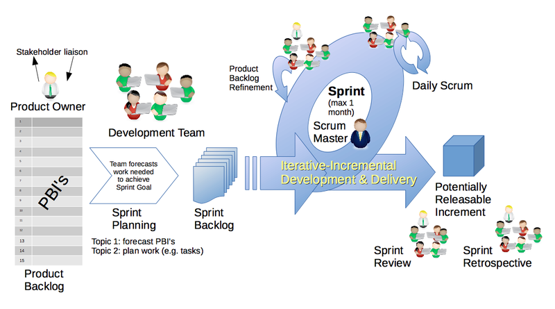

# 프로젝트 운영이 막연할 때

    은총알이 없다는 것은 오래 전에 알게 되었고
    따라 하면 성공이 보장되는 비법은 어디에도 없다.

## 길을 잃지 않기 위해 필요한 것들

### 방향 설정

* 기능 설계 ([PBS](/project-docs/001/))
  * 프로젝트 범위 및 일정 예측
* 동적 설계 ([Job Flow](/project-docs/002/), Navigation Diagram)
  * 사전 검증
* 구조 설계 (Screen Layout, Class Diagram, ERD)
  * 효율적인 시스템 구축

 ### 일정 관리

* 작업 분배 및 현황 파악
* 역량 측정

### 되돌아보기 및 개선

* 코드리뷰
* 리팩토링

## 발표자의 프로젝트 운영의 예

    스크럼을 기본으로 응용하여 운영하고 있습니다.

### 단계별 산출물

#### Product Backlog
* Navigation Diagram
* Screen Layout
* Job Flow
* 기타 기획문서

#### Sprint palnning & Sprint Backlog
* PBS (Process Breakdown Structure)

#### Sprint
* 동적 모델링 문서 (필요시)
* 정적 모델링 문서 (필요시)

### 세부 일정

#### 시작 (1일)
* 기획팀이 작성한 문서를 토대로 토론
* 프로덕트 백로그를 토대로 개발팀이 PBS 작성 및 토론
* 스프린트 범위 및 기간 확정

#### 스프린트 (2-3주)
* 오전 10시10분 체크인
* 오후 5시 50분 체크아웃
* 매주 수요일 스터디 운영
* 매주 금요일 회고 미팅
* QA

#### 배포 및 리뷰 (2일)
* 버전 릴리즈
* 코드 리뷰
* 리팩토링
* 주요 오류 처리

## 기타

### 디테일에 목을 매지 마라

    요구사항은 항상 그리고 끝이 없이 변한다.

### 재사용성에 목을 매지마라

    대체 가능성에 집중해 한다.
    부분적으로 수정 및 교체를 하더라
    다른 영역으로 불이 번지지 않도록 방화벽을 세워야 한다.

### 기술부채에 목을 매지마라

    만기가 돌아오기 전에 회사가 사라질 수 있다.

