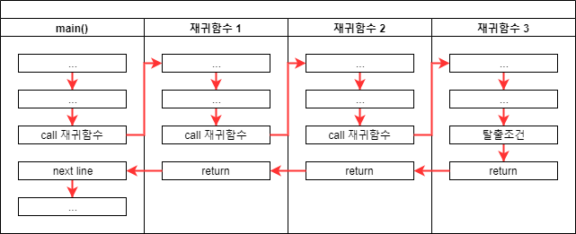

# 함수 호출의 원리 및 재귀호출


## 핵심 강의

<iframe width="800" height="450" src="https://www.youtube.com/embed/zs9UPxjw7lI" frameborder="0" allow="accelerometer; autoplay; encrypted-media; gyroscope; picture-in-picture" allowfullscreen></iframe>


## 강의 개요

이번 주제의 핵심은 재귀호출을 이해하는 것입니다.
재귀호출을 이해하기 위해서는 우선 함수가 호출 되었을 때 컴퓨터 내부에서 어떤 일이 벌어지는 아는 것이 도움이 됩니다. 따라서 간단하게 함수 호출의 원리를 설명하고 이어서 재귀호출에 대한 설명으로 이어가겠습니다.


## 강의 전 준비 사항

* C 컴파일러 및 개발 환경


## 함수 호출의 원리


### 일반적인 함수 호출 및 리턴 과정


C 언어를 이용하여 프로그램을 작성하던 중에 main() 함수에서 "함수 A"를 호출했는데, 다시 "함수 A"에서 "함수 B"를 호출하고, "함수 B"가 다시 "함수 C"를 호출한 경우를 그림으로 표현한 것입니다.

* main() 함수 중간에 "함수 A"를 호출하면서 코드 진행이 "함수 A"의 처음 부분으로 옮겨갑니다.
* "함수 A" 함수 중간에 "함수 B"를 호출하면서 코드 진행이 "함수 B"의 처음 부분으로 옮겨갑니다.
* "함수 B" 함수 중간에 "함수 C"를 호출하면서 코드 진행이 "함수 C"의 처음 부분으로 옮겨갑니다.
* "함수 C"의 모든 실행을 마치면 "함수 B"에서 자신을 호출했던 다음 줄로 리턴(돌아감)합니다.
* "함수 B"의 모든 실행을 마치면 "함수 A"에서 자신을 호출했던 다음 줄로 리턴(돌아감)합니다.
* "함수 A"의 모든 실행을 마치면 main() 함수에서 자신을 호출했던 다음 줄로 리턴(돌아감)합니다.

대부분의 입문자의 경우에도 이렇게 함수가 호출되고 되돌아오는 과정은 무리 없이 직관적으로 받아들이는 것처럼 보입니다.


### 재귀함수의 호출 및 리턴 과정


재귀호출의 경우에 입문자들이 오해하거나 알고는 있어도 머릿속에서 자연스럽게 떠올리는 그림입니다.
재귀함수 내에서 자신을 다시 호출하면 자신의 처음으로 돌아가서 실행된다고 오해하는 경우가 가끔 있습니다.



하지만 재귀함수 내에서 자신을 호출하는 경우에는 위의 그림과 같은 일이 벌어지게 됩니다.
모든 함수는 호출되면 메모리에 새로운 공간을 확보해서 매번 전혀 다른 공간에서 작업이 진행됩니다.
소스 코드에서는 같은 공간처럼 보이지만 실제 실행되는 코드는 전혀 다른 공간에서 이뤄진다고 생각하는 편이 좋습니다.

main() 함수에서 처음 재귀함수를 실행했을 때 "재귀함수 1"이라는 메모리 공간이 생겨서 작업을 진행하다가 다시 재귀함수를 실행한다면 새로 "재귀함수 2"이라는 메모리 공간이 생성되는 방식입니다.

이런 방식을 반복하다보면 같은 코드가 메모리 공간만 옮겨다니면서 무한히 반복되기 때문에 메모리가 부족할 때까지 멈추지 않고 반복하다가 프로그램이 종료되는데요, 이것 때문에 재귀함수를 작성할 때에는 언제 멈춰야 할지 **탈출조건**이 필요합니다.

위의 그림에서 "재귀함수 3"은 탈출조건을 만나서 실행이 멈추게되고 이후 이전 함수로 복귀하여 나머지 코드를 진행하고 다시 이전 함수로 복귀하는 과정이 계속 진행됩니다.

::: tip
함수의 실행코드는 메모리에 한 번만 저장되어 같은 공간인 것이 맞습니다. 다만, 로컬 변수 및 파라메터 등은 전혀 다른 공간에서 새로 생성되어 이전 함수 호출과 전혀 연관없는 진행이 이루어집니다. 따라서 호출 할 때마다 새로운 객체가 생성된다고 생각하시면 됩니다.
:::


## 재귀호출에 대한 간단한 예

``` cpp
int sum(int n)
{
	// 탈출 조건
	if (1 == n) {
		return 1;

	// 자신보다 1만큼 작은 숫자를 분신을 만들어서 계산을 시킨다.
	// 분신이 계산을 마치면 자신의 현재 값을 거기에 더한다.
	} else {
		return sum(n-1) + n;
	}
}
```
sum() 함수는 1부터 n까지의 합을 계산하는 알고리즘이 구현되어 있습니다.
자신을 다시 호출하면서 자신이 호출 되었을 때 n 값보다 1만큼 작은 숫자를 인자로 보내줍니다.

아래는 sum(3)을 실행했을 때 메모리 상에 함수라 호출되는 과정입니다.
호출 될 때마다 새로운 공간이 생겨나는 것에 유의하시기 바랍니다.
이런 의미로 "자신을 다시 호출 한다"는 표현은 오해를 불러일으킵니다.

빨간 선이 실제 실행되는 코드를 표현한 것입니다.
함수 내의 코드가 조건에 따라서 실행되는 부분이 다르기 때문입니다.


* sum(3)이 실행되면 n 값은 1이 아니기 때문에 sum(3-1) 즉 sum(2)를 호출합니다.
* sum(2)이 실행되면 n 값은 1이 아니기 때문에 sum(2-1) 즉 sum(1)를 호출합니다.
* sum(1)이 실행되면 "n == 1" 조건이 만족되어 1을 리턴합니다.
* sum(2)는 sum(1)에서 리턴받은 1에다가 자신의 2를 더해서 3을 리턴합니다.
* sum(3)은 sum(2)에서 리턴받은 3에다가 자신의 3을 더해서 6을 리턴합니다.


## 재귀호출의 장점과 단점

재귀호출은 일반적인 해법으로 코드를 바꿔서 작성할 수 있습니다.
또한 성능과 메모리 효율 면에서도 일반적인 해법이 더 유리합니다.

* 재귀 호출
  * 간결하고 직관적인 코드를 제공 (한 편의 시)
* 일반적인 해법
  * 소설처럼 장황하지만 이해하기 쉬운 코드를 제공 (가독성은 떨어질 수 있음)
  * 메모리 및 프로세스 효율적인 코드


## 좀 더 재귀적인 문제를 연구하고 싶은 분들은

* Composite pattern
* Back tracking
* 파서와 컴파일러
* etc
