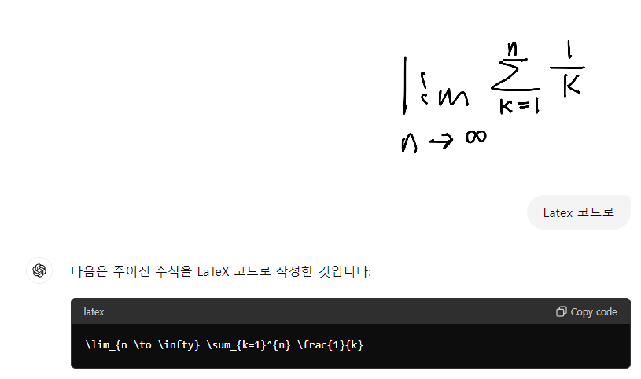

# ChatGPT 활용 가이드

## 언어학습에 활용하기

### 영어학습

```
You ask questions in English, and I'll answer in English.
Please point out any grammatical errors or awkward expressions in my answers.
Based on my answers, proceed with the next question.
If I respond in Korean, translate it into English for me.
For words that are at a college level or above, provide explanations in Korean.
Topic should be randomized. 
Continue this process.

---

When asking questions, please use the following format.

### Question

Content of the question

### Vocabulary Explanation (college level or above)
* Word1 (English phonetic symbols): Explanation in Korean
* Word2 (English phonetic symbols): Explanation in Korean

---

When pointing out any issues in my answers, please use the following format.

### Grammar and Expression Corrections
* Original: ...
* Suggested: ...

### Vocabulary Explanation (college level or above)
* Word1 (English phonetic notation): Explanation in Korean
* Word2 (English phonetic symbols): Explanation in Korean
```

### 일본어학습

```
너는 일본어 선생님이야.
너는 일본어로 질문을 하고 나는 일본어로 답변해.
내 답변에서 문법적으로 문제 있는 부분을 지적해주고.
내 답변을 근거로 다음 질문을 진행해.
내가 한글로 답변한 부분이 있으면 일본어로 번역해서 알려줘.
단어 중에 중학생 이상의 레밸이 있으면 단어 해설도 해줘. 
이것을 계속 반복해.

나는 일본어 답변을 할 때 한글로 발음을 사용할 예정이야.

---

질문할 때는 다음과 같은 형식을 사용해줘.

### 질문
> あなたはどうして日本語を勉強し始めたんですか？
> 일본어를 공부하게 된 계기는 무엇인가요?
> 아나타와 도우시테 니혼고오 벤쿄우시하지메탄데스까?

### 단어해설
* 단어1 (발음 한국어 표기): 한국어 해설
* 단어2 (발음 한국어 표기): 한국어 해설

---

답변할 때는 다음과 같은 형식을 사용해줘.

### 문법 및 표현 수정
### 일본어로 번역 (만약에 필요하면)
* 일본어 번역 부분
* 일본어 발음을 한글로 표기한 부분
### 단어해설
* 단어1 (발음 한국어 표기): 한국어 해설
* 단어2 (발음 한국어 표기): 한국어 해설
```

### 예습을 위한 단어 및 문장 골라내기

```
원문에서 고등학생 수준 이상의 단어와 표현을 모두 찾아서
다음과 같은 형식으로 번역해줘.
원문은 표시하지 마.

### 단어해설
* 단어1 (발음기호): 한국어 해설
* 단어2 (발금기호): 한국어 해설

### 유용한 표현
* 표현1: 한국어 번역
* 표현2: 한국어 번역

--- 원문 시작

원문 내용
```
## 글쓰기에 활용하기

[GPT-4를 활용한 문서 생성 어플리케이션 소스](https://github.com/ryujt/ai-tools/blob/main/gpt-writer/README.md)

1. 소재가 될만한 재료를 GPT에게 "이 내용을 상세하게 정리해줘"
2. 소재를 모두 입력하면, 지금까지 내용을 목차로 만들어줘
3. 목차를 자신이 마음에 드는 형태로 수정
4. 목차의 세부 제목마다 상세하게 작성해달라고 요청

## 프로젝트 전체 코드를 분석하기

[코드 파일 분석을 위한 OpenAI API tool](https://github.com/ryujt/ai-tools/blob/main/code-inspector/README.md)

* 코드 전체를 리팩토링하기
* 코드 전체에서 오류가 예상되는 코드 찾기
* 코드 전체에서 특정 기능하는 코드 찾기
* 코드 전체에서 개선이 필요한 코드 찾기
* etc

### 질문과 예제 등의 영역을 확실하게 구분하기

질문과 코드 그리고 예제 등을 확연하게 구별해주면 좀 더 나은 결과를 얻게 됩니다.

```
code1을 코드를 code2의 포멧에 맞도록 수정해서 code2에 넣어줘.

### code1
소스코드1

### code2
소스코드2
```

## State Diagram을 이용한 코드 생성

```
아래 다이어그램을 만족하는 Vue.js 프로젝트를 생성해줘.

stateDiagram-v2
    direction LR
    [*] --> SigninView : not logined
    [*] --> HomeView : logined
    SigninView --> TermsView : signin
    TermsView --> SignupView : agree
    SignupView --> SignupView : error
    SignupView --> HomeView
    SigninView --> SigninView : error
    SigninView --> HomeView : logined
```

## Event Diagram을 이용한 코드 생성

UI가 아닌 기능 중심의 모듈을 설계할 때에는 이벤트 중심적 설계를 사용합니다.

```
"Event Diagram 샘플"은 "생성된 코드"로 변환되는 규칙을 가지고 있다.
샘플로 제공된 규칙을 참고해서
아래 다이어그램을 만족하는 C# 코드를 생성해줘.

### 코드로 변환할 Event Diagram
master: VideoPlayer
Object: VideoPlayer, FileStream, VideoDecode, AudioDecode
VideoPlayer.Open --> VideoDecode.Init
VideoPlayer.Open --> AudioDecode.Init
VideoPlayer.Open --> FileStream.Open
FileStream.OnVideoData --> VideoDecode.Execute
FileStream.OnAudioData --> AudioDecode.Execute

### Event Diagram 샘플
master: MasterObject
Object: ObjectA, ObjectB, ObjectC
ObjectA.OnEvent1 --> ObjectB.Method1

ObjectA.OnEvent2 --> ObjectB.Method2
ObjectB.data.result --> ObjectA.HandleResponse

ObjectA.OnEvent3 --> ObjectB.MultipleOutcomes1
ObjectB.data.false
ObjectB.data.true --> ObjectA.HandleTrue

ObjectA.OnEvent4 --> ObjectB.MultipleOutcomes2
ObjectB.data.false* --> ObjectA.HandleFalse 
ObjectB.data.true* --> ObjectA.HandleTrue

ObjectA.OnEvent5 --> ObjectB.Method5
ObjectA.OnEvent5 --> ObjectC.Method

### 생성된 코드
class ObjectA
{
    public event EventHandler OnEvent1;
    public event EventHandler OnEvent2;
    public event EventHandler OnEvent3;
    public event EventHandler OnEvent4;
    public event EventHandler OnEvent5;

    public void HandleResponse()
    {
    }

    public void HandleTrue()
    {
    }
    public void HandleFalse()
    {
    }
}

class ObjectB
{
    public void Method1()
    {
    }

    public int Method2()
    {
        return 0;
    }

    public void Method5()
    {
    }

    public void ProcessEvent()
    {
    }

    public bool MultipleOutcomes1()
    {
        return false;
    }

    public bool MultipleOutcomes2()
    {
        return false;
    }
}

class ObjectC
{
    public void Method5()
    {
    }
}

class MasterObject
{
    public MasterObject()
    {
        _objectA.OnEvent1 += (sender, e) =>
        {
            _objectB.Method1();
        };

        _objectA.OnEvent2 += (sender, e) =>
        {
            var result = _objectB.Method2();
            _objectA.HandleResponse();
        };

        _objectA.OnEvent3 += (sender, e) =>
        {
            var result = _objectB.MultipleOutcomes1();
            if (result) _objectA.HandleTrue();
        };

        _objectA.OnEvent4 += (sender, e) =>
        {
            var result = _objectB.MultipleOutcomes2();
            if (result)
            {
                _objectA.HandleTrue();
            }
            else
            {
                _objectA.HandleFalse();
            }
        };

        _objectA.OnEvent5 += (sender, e) =>
        {
            _objectB.Method5();
            _objectC.Method5();
        };

    }

    private ObjectA _objectA;
    private ObjectB _objectB;
    private ObjectC _objectC;
}
```

## 골격만 제시해서 코드 생성하기

### pinia 코드 생성의 예

잘 알려진 코드의 경우에는 샘플없이 막연하게 요구해도 잘 알아듣습니다.

```
다음 요구사항을 pinia 코드로 만들어줘.

- user.js
    - 속성
        - username
        - userlevel
        - token
    - getter
        - isLoggedIn
    - setter
        - 필요하다고 판단되는 것들
```

### API 호출 코드 생성의 예

```
다음 요구사항을 axios 코드로 만들어줘.

- user.js
    - login
    - logout
    - signup
```

## 데이터베이스 설계 활용

### 요구사항 토대로 기초 자료 생성

- 요구사항 입력
    - 녹음 파일을 통해서도 가능
- 기능 트리 생성 요청
    - 원하는 목표로 기능 트리를 수정해서 다시 입력
- ERD 생성 요청
    - 수정 후 다시 입력
- 테이블 정의서 생성 요청
    - 수정 후 다시 입력
- 정규화 및 설계 오류 점검
    - CRUD 분석
    - 정규화 오류
    - 수정 후 다시 입력
- SQL 코드 생성 요청

### 실습 사례

[https://www.developerfastlane.com/docs/backend-database/ecommerce-platform-database-design](https://www.developerfastlane.com/docs/backend-database/ecommerce-platform-database-design)

---

온라인 채팅 사이트를 구축할거야.
회원 가입 및 로그인이 필요해.
로그인 된 사용자는 
  * 언제든지 채팅 방을 개설할 수 있어.
  * 개설한 채팅 방에 대한 공유 링크를 생성할 수 있어.
공유 링크를 받은 사용자는 회원 가입 및 로그인 없이 채팅 방에 참여할 수 있어.
  * 참여하기 전에 대화명을 입력해야 함.
  * 같은 방에 동일한 대화명이 있으면 안됨.

---

백엔드에 대한 기능 트리를 작성해줘.

--- 

현재까지의 요구사항을 바탕으로 ERD를 mermaid로 작성해줘.

---

설계 오류 점검를 점검해서 ERD를 다시 그려줘.
* CRUD 분석
* 정규화 오류

CRUD 분석은 아래의 포멧을 사용해줘.

| Process          | Table      | CRUD |
| ---------------- | ---------- | ---- |
| 주문 생성        | 주문목록   | C    |
| 주문 수정        | 주문목록   | U    |
| 주문 삭제        | 주문목록   | D    |
| 주문 상세 조회   | 주문목록   | R    |
| 주문 상태별 조회 | 주문목록   | R    |
| 상품 등록        | 상품목록   | C    |
| 상품 수정        | 상품목록   | U    |
| 상품 삭제        | 상품목록   | D    |
| 상품 조회        | 상품목록   | R    |
| 재고 관리        | 상품목록   | U    |
| 고객 정보 등록   | 고객목록   | C    |
| 고객 정보 수정   | 고객목록   | U    |
| 고객 정보 삭제   | 고객목록   | D    |
| 고객 정보 조회   | 고객목록   | R    |
| 배송 업체 관리   | 배송목록   | CU   |
| 배송 상태 추적   | 배송목록   | R    |
| 결제 방법 설정   | 결제목록   | CU   |
| 결제 내역 조회   | 결제목록   | R    |
| 문의사항 처리    | 문의목록   | CRU  |
| 환불 요청 처리   | 환불목록   | CRU  |
| 사용자 등록      | 사용자목록 | C    |
| 사용자 수정      | 사용자목록 | U    |
| 사용자 삭제      | 사용자목록 | D    |
| 권한 설정        | 권한목록   | CU   |

---

지금까지 정리된 내용을 토대로 SQL 코드를 작성해줘.

---

AWS Lambda를 이용해서 node.js 16.x 버전으로
REST API를 구현해줘.

## Embeddings

부족한 지식을 추가하는 용도로는 파인 튜닝보다는 Embeddings를 고려하는 것이 좋습니다.

> 입력하는 데이터에 있는 모든 한글을 영문으로 변경했을 때 정확도가 높습니다.
> text-embedding-ada-002 모델의 한글 정확도가 낮으니 유의하세요.

### Embeddings를 활용한 FAQ 검색

``` python
import openai
import numpy as np

# OpenAI API 키 설정
openai.api_key = 'API-KEY'

MODEL = 'text-embedding-ada-002'

# FAQ 데이터 준비
faq_data = [
    {"question": "회원 가입은 어떻게 하나요?", "answer": "홈페이지 상단의 '회원가입' 버튼을 클릭하여 가입할 수 있습니다."},
    {"question": "비밀번호를 잊어버렸어요. 어떻게 해야 하나요?", "answer": "비밀번호 찾기 기능을 이용해 주세요."},
]

# 질문에 대한 Embeddings 생성
question_embeddings = [
    openai.Embedding.create(input=faq["question"], engine=MODEL).get("data")[0]["embedding"]
    for faq in faq_data
]

# 사용자 질문
user_question = "장바구니 물건은 어떻게 넣어요?"
# user_question = "로그인을 어떻게 하죠?"
# user_question = "비번은 어떻게 찾죠?"

# 사용자 질문에 대한 Embedding 생성
user_embedding = openai.Embedding.create(input=user_question, engine=MODEL).get("data")[0]["embedding"]

# 질문 간 유사성 계산
def cosine_similarity(a, b):
    return np.dot(a, b) / (np.linalg.norm(a) * np.linalg.norm(b))

similarities = [cosine_similarity(user_embedding, q_emb) for q_emb in question_embeddings]

# 가장 높은 유사성을 가진 FAQ 찾기
max_index = np.argmax(similarities)
max_similarity = similarities[max_index]
print("max_similarity:", max_similarity)

response = faq_data[max_index]['answer']
print(response)
```

### Embeddings를 활용한 코드 검색

``` python
MODEL = 'text-embedding-ada-002'

# 코드 예제 데이터 준비
code_examples = [
    {"code": "print('Hello, world!')", "description": "Python에서 'Hello, world!'를 출력합니다."},
    {"code": "for i in range(5): print(i)", "description": "0부터 4까지의 숫자를 순서대로 출력합니다."},
    {"code": "if x > 0: print('x is positive')", "description": "x가 양수일 경우 'x is positive'를 출력합니다."},
    {"code": "x = [i for i in range(10) if i % 2 == 0]", "description": "0부터 9까지 짝수만 리스트에 저장합니다."},
    {"code": "def greet(name): return 'Hello ' + name", "description": "주어진 이름에 인사를 반환하는 함수를 정의합니다."},
    {"code": "class Dog:\n    def bark(self):\n        print('Woof!')", "description": "Dog 클래스를 정의하고 짖는 메소드를 추가합니다."},
    {"code": "import math\nprint(math.sqrt(16))", "description": "math 모듈을 사용하여 16의 제곱근을 출력합니다."},
    {"code": "try:\n    x = 1 / 0\nexcept ZeroDivisionError:\n    print('Cannot divide by zero')", "description": "0으로 나누기 시도 시 예외 처리를 하는 코드입니다."},
    {"code": "with open('file.txt', 'r') as file:\n    data = file.read()", "description": "file.txt 파일을 읽고 내용을 data 변수에 저장합니다."},
    {"code": "colors = ['red', 'green', 'blue']\nfor color in colors:\n    print(color)", "description": "색상 리스트를 순회하며 각 색상을 출력합니다."}
]

# 각 코드 예제의 설명에 대한 Embeddings 생성
description_embeddings = [
    openai.Embedding.create(input=example["description"], engine=MODEL).get("data")[0]["embedding"]
    for example in code_examples
]

# 사용자 질문
user_question = "양수를 확인하는 코드를 어떻게 작성하나요?"

# 사용자 질문에 대한 Embedding 생성
question_embedding = openai.Embedding.create(input=user_question, engine=MODEL).get("data")[0]["embedding"]

# 질문 간 유사성 계산
def cosine_similarity(a, b):
    return np.dot(a, b) / (np.linalg.norm(a) * np.linalg.norm(b))

similarities = [cosine_similarity(question_embedding, desc_emb) for desc_emb in description_embeddings]

# 유사성이 높은 순서대로 인덱스 정렬 후 상위 3개 선택
top_indexes = np.argsort(similarities)[::-1][:3]

print("가장 유사한 코드 예제 3개:")
for idx in top_indexes:
    example = code_examples[idx]
    print("설명:", example["description"])
    print("코드:", example["code"])
    print()
```

### 프로그래밍 관련 챗봇을 만들 때 아이디어

* 질문 내용과 관련 있는 예제를 검색
* 질문 내용과 검색된 예제를 모두 AI에게 전달하여 예제를 참고해서 답변하도록 유도

```
참고자료를 참고해서 사용자질문에 답변해줘.

### 사용자질문
사용자가 입력한 질문 내용

### 참고자료1
사용자가 입력한 질문 내용을 바탕으로 DB에서 찾아낸 코드들

### 참고자료n
...
```

## 질문 답변 자료를 한 번에 정리하기

질문이나 문제에 대한 참고 자료를 찾았지만 내가 원하는 것이 바로 보이지 않는 경우
GPT에게 요약하거나 정리하도록 요청하면 좋은 결과를 얻을 수 있습니다.

```
아래 글에서 "Could not load file or assembly System.Diagnostics.DiagnosticSource" 오류에 대한 해결방법이 아래 글에 있는가?

- 링크 또는 자료 원문 1
- 링크 또는 자료 원문 2
```

## 유사 반복 처리

아래의 코드를 보면 DebugLogs.Instance.Log를 통해서 메소드 시작 위치에서 로그를 남기도록 되어 있습니다.
로그는 상당히 유사한 형태로 반복되지만, 메소드의 파라메터에 따라 변경되어 단순한 붙여 넣기는 되지 않습니다.
이러한 작업도 미리 예를 하나 던져주고 GPT에게 부탁하면 상당히 잘 만들어주는 편입니다.

``` csharp
public void Method1(string handlerName, string eventName, Exception ex)
{
    DebugLogs.Instance.Log($"Method1: {handlerName}, {eventName} - {ex}");
    ...
}

public void Method2(string handlerName, string eventName, string operationName)
{
    DebugLogs.Instance.Log($"Method2: {handlerName}, {eventName}, {operationName}");
    ...
}
```

## LaTeX 코드 작성



## 기타 프로그래밍 활용의 예

- 페어 프로그래밍
  - 프로젝트 시작하기 전 막연한 상태에서 시작할 때
  - 토이 프로젝트를 시작할 때
  - 프로토타입을 만들 때
- 에러 메시지 해석
  - 에러 메시지와 해당 메시지에 표시된 위치의 코드만 복사해서 붙여 넣으면 됩니다.
- 코드에 대한 문서/주석 자동 생성
- 리팩토링
  - 오류 및 위험 요소를 찾아내고 수정
  - 효율적인 코드로 변경
- 코드 해석
  - 코드에 대한 다이어그램 요청
  - 코드에 대한 개요 요청
  - 코드를 초보자 수준으로 해설 (익숙하지 않은 용어 등을 한 번에 처리할 수 있습니다)
- 로그 해석
  - 실패 로그 + 성공 로그 + 소스 코드 --> 의심되는 소스 코드의 위치 및 해설
- 테스트 케이스 자동 생성
  - xUnit, E2E
- 복잡한 콘솔 스크립트 작성
- C++, node.js 프로젝트에 대한 .gitignore를 작성해줘.
- 작명 요청
- 매직넘버 제거하기
- 프로토타입의 CSS 등 디자인 자동화
- 언어 변환
- 단순작업 자동화
- 구체적이며 잘 알려진 알고리즘 문제는 꽤 잘 처리합니다.
- [닷넷 에이전트 지원 범위 분석](https://whatap-dotnet.s3.ap-northeast-2.amazonaws.com/analysis.html)
