# RAG를 활용한 프로젝트 분석 및 설계

이 발표에서는 RAG를 이용하여 기존의 프로젝트를 분석하거나 프로젝트를 수행하는 과정에 대해서 설명할 예정입니다.
CodeSage라는 오픈 소스를 사용하여 발표를 진행할건데요.
마무리 과정에서 오픈소스 인공지능을 활용하여 개선된 부분에 대해서도 살펴볼 예정입니다.

## CodeSage에 대한 소개

CodeSage는 사용자가 참고자료가 있는 폴더를 지정하고 질문을 하면, 인공지능이 폴더의 모든 자료 중에서 필요한 것만을 참고해서 답변을 해주는 프로그램입니다.
주로 사용되는 형태는 다음과 같습니다.

* 프로젝트 소스 코드가 있는 폴더 지정
* 노션의 자료를 다운받아서 사용
* 기존 답변을 참고자료로 활용
* PDF 문서 참고 기능

## 설치 방법 

CodeSage의 소스코드는 아래의 링크에서 다운받을 수 있습니다.
자세한 설치 및 사용법은 아래 링크의 문서를 참고하시기 바랍니다.

* [https://github.com/ryujt/CodeSage](https://github.com/ryujt/CodeSage)

### pip 사용

파이썬이 설치되어 있다면 아래의 스크립트로 간단하게 설치하여 사용하실 수 있습니다.

```
pip install -r requirements.txt
```

### docker 사용

Docker를 사용하면 배포하고 실행할 수도 있습니다.

```
docker build -t codesage:latest .
docker run -d -p 8080:8080 --name codesage_container codesage:latest
```

<div style="page-break-after: always;"></div>

## 동작확인

CodeSage가 프로젝트 수행에 어떠한 도움을 주는 지에 대해서 다음과 같이 알아보겠습니다.
이 사전자료 문서에서는 스크린 샷만을 보여드리고 발표장에서 자세한 설명을 드릴 예정입니다.
스크린샷의 길이가 긴 것은 하단 부분을 잘라서 사용했습니다.

### 기존 프로젝트의 내용을 분석

#### 질문의 내용이 전체 코드에 의해서 영향을 받을 때

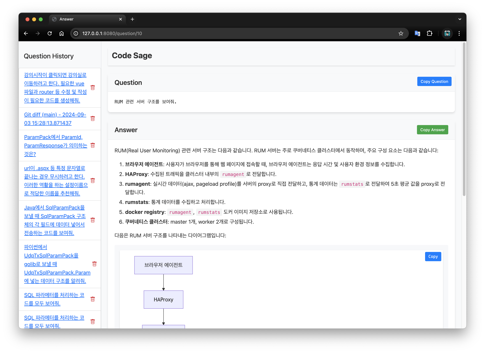

<div style="page-break-after: always;"></div>

#### 문서를 모두 검색해서 원하는 답변을 얻고 싶을 때

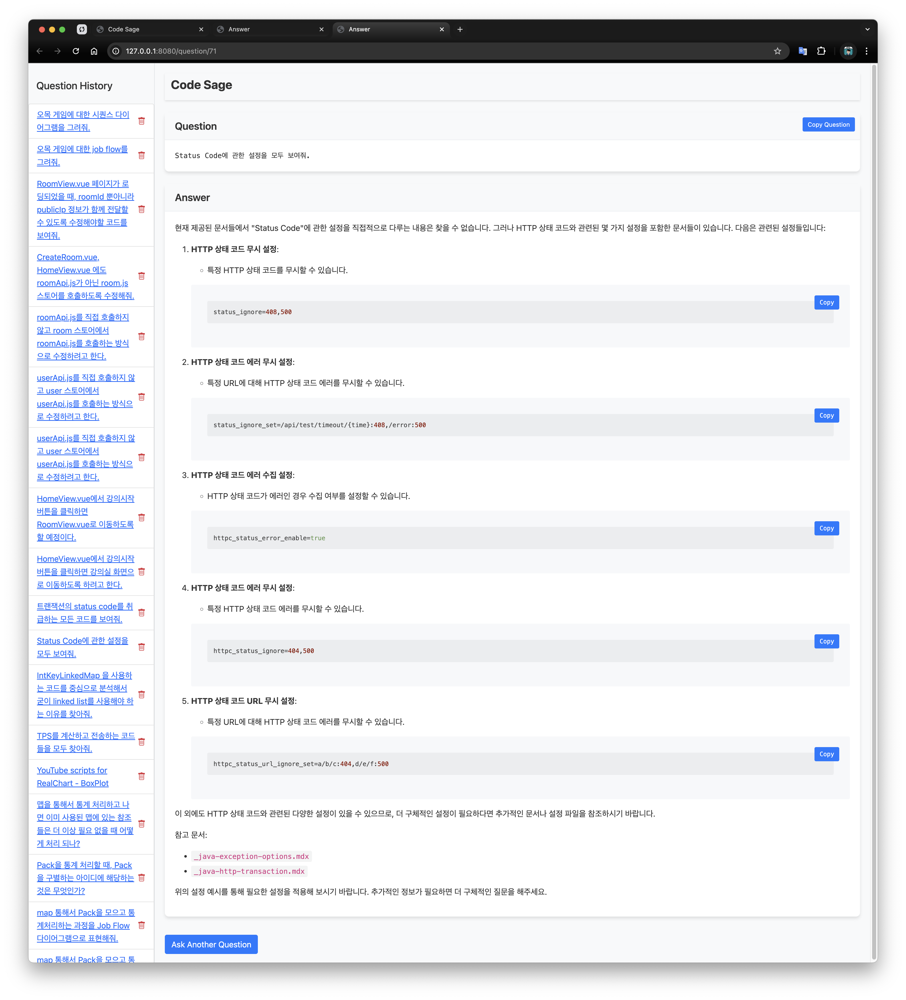

<div style="page-break-after: always;"></div>

#### 프로젝트 분석을 위하여 다이어그램 요청

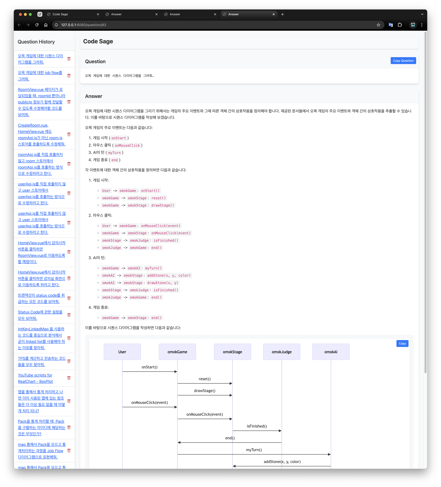

<div style="page-break-after: always;"></div>

#### 기존에 없는 자신만의 다이어그램 형식 요청

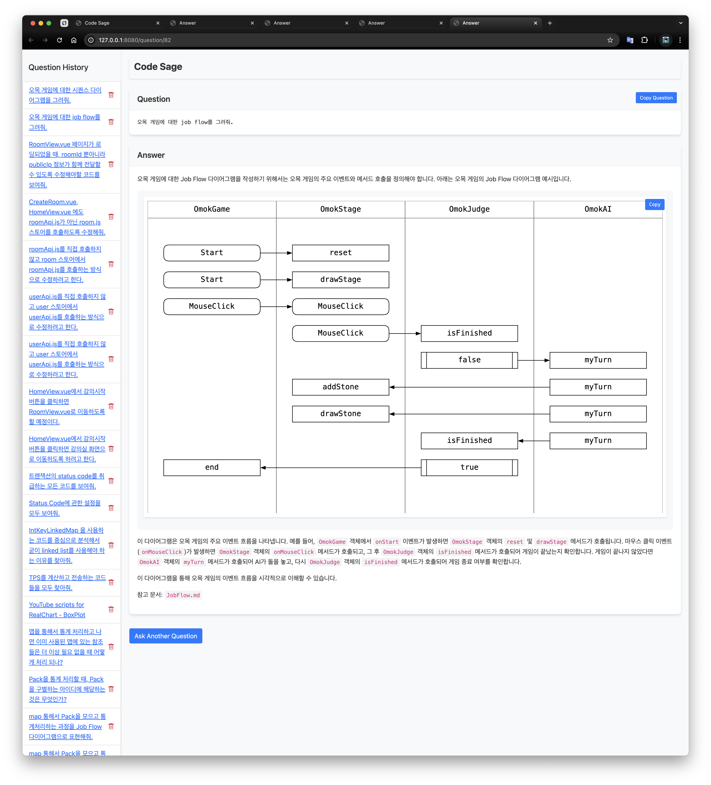

<div style="page-break-after: always;"></div>

### 프로젝트 전체 코드를 고려하여 기능 추가하기

인공지능과 페어 프로그래밍 하듯이 프로젝트를 진행하는 예제입니다.

#### 변경된 설계를 프로젝트 전체에 적용하기

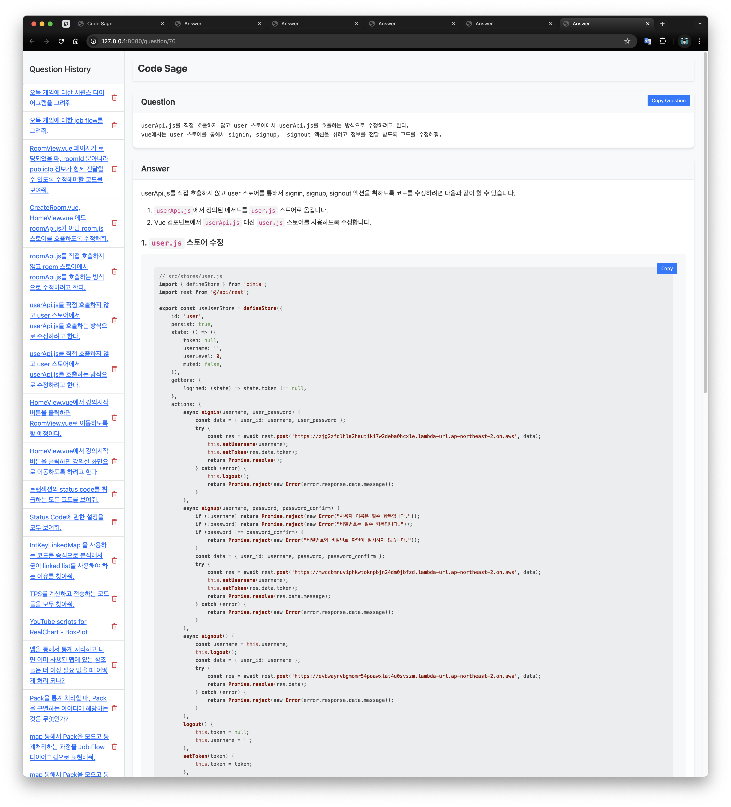

<div style="page-break-after: always;"></div>

#### 프로젝트에 추가 기능 개발하기

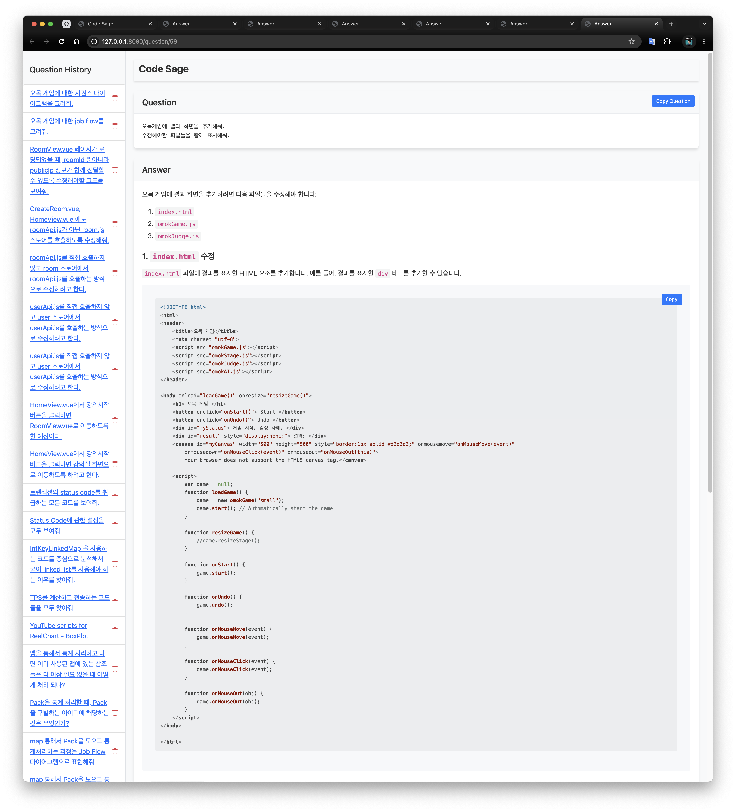

<div style="page-break-after: always;"></div>

### PR 전에 코드 분석 자동화

버튼 하나로 저장소에서 변경부부만 골라내서 코드를 분석합니다.
리팩토링 대상이나 개선 사항들을 찾아서 보고서 형식으로 만들어 줍니다.

#### 현재와 이전 커밋 코드의 변경 내용을 분석하기

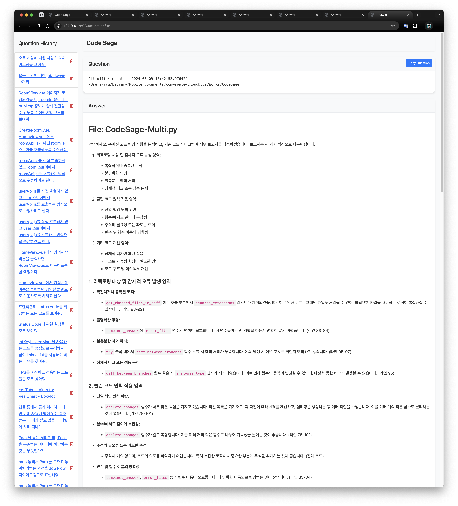

<div style="page-break-after: always;"></div>

#### 메인 브랜치부터 현재까지 변경 내용을 분석하기

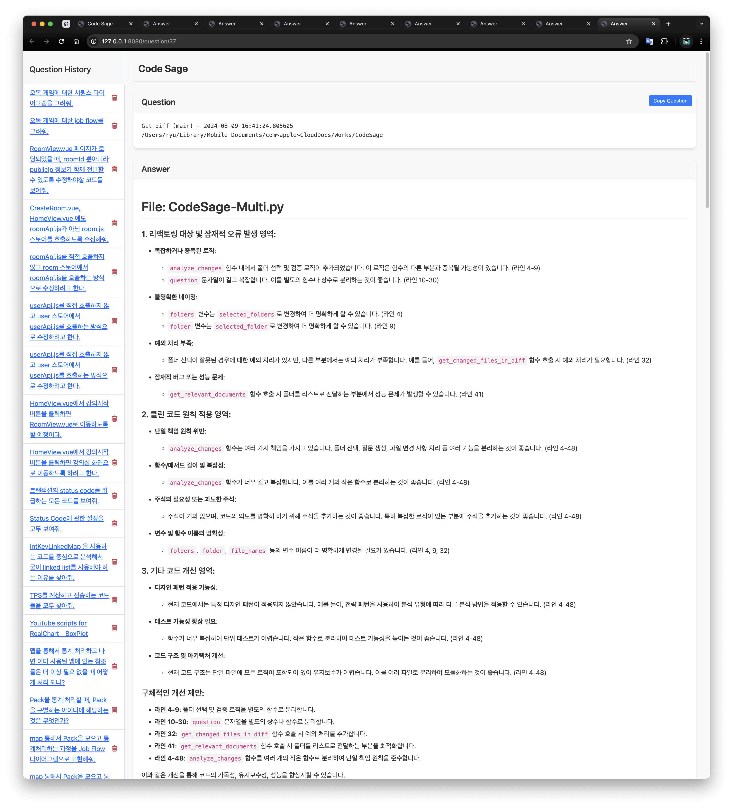

<div style="page-break-after: always;"></div>

### 기술문서 작성

회사 제품에 대한 동영상 대본이나 문서를 만들 때 활용합니다.
회사 내에 있는 기존 소스와 문서를 스스로 참고해서 결과물을 작성합니다.

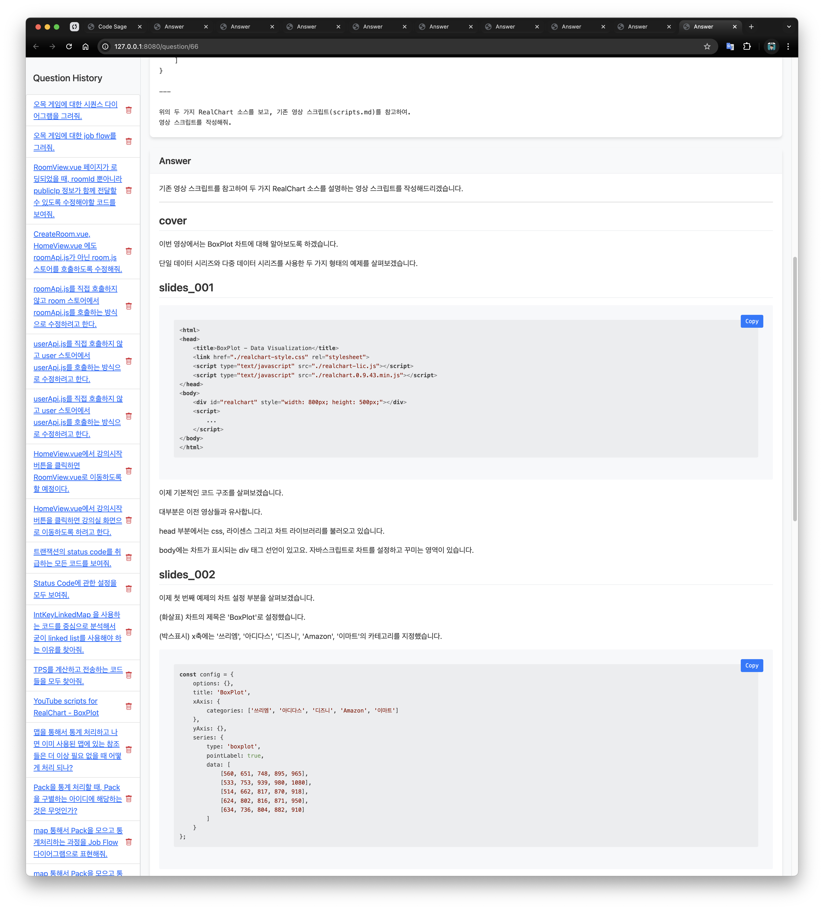

<div style="page-break-after: always;"></div>

## 오픈소스 인공지능 활용

오픈소스로 공개된 인공지능을 활용하는 몇 가지 방법에 대해서 알아봅니다.

Llama 3.1 405B와 같은 모델을 사용하다면 좋겠지만 일반적인 개발자가 운영할 수 있는 환경은 아니기 때문에
개발자 PC에서 충분히 사용할 수 있는 Gemma 2 9B를 활용하고 있습니다.
Gemma 2를 선택한 이유는 다른 모델에 비해서 한국어 지원 및 균형이 잘 맞아서입니다.

하지만 9B 모델을 메인으로 사용하기에는 답변 품질이 떨어지기 때문에 메인은 유료인 Open AI나 Claude를 이용하고,
부수적인 작업을 Gemma 2에서 진행하도록 구성하였습니다.

반복적으로 발생하는 부수적인 작업을 처리하는 과정에서 비용을 절감할 수 있었습니다.

### 임베딩 모델의 한글 지원 이슈

```
OOP에 관한 강의를 작성해줘.
```

강의 제작을 위해서 소재나 메모를 모아둔 폴더에서 위와 같은 질문을 했을 때, 한글과 영문으로 진행한 결과에 대한 스크린 샷입니다.
한글된 자료를 사용했을 때는 전혀 상관없는 참고 자료들이 더 많이 사용되는 것을 알 수 있습니다.

#### 자료를 영어로 번역하고 영어로 질문 했을 때

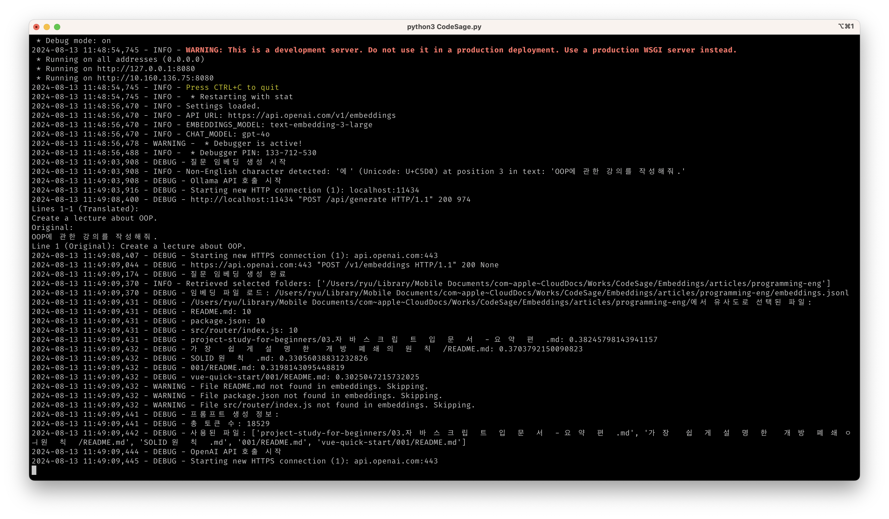

<div style="page-break-after: always;"></div>

#### 한글 자료 원본과 한글로 질문 했을 때

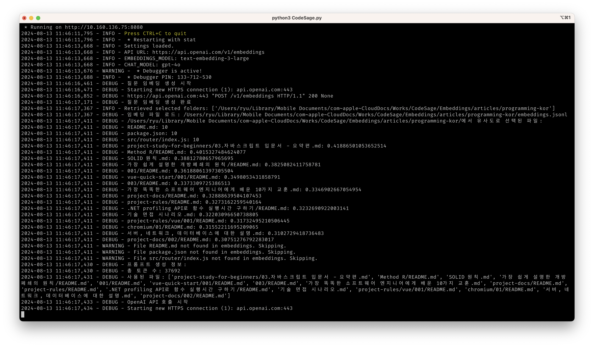

### 입력 토큰 부족 이슈

오픈소스 인공지능을 이용하여 참고자료를 1차 요약하여 전달하는 방식으로 참고자료가 방대한 경우에 대한 지원이 가능해집니다.
