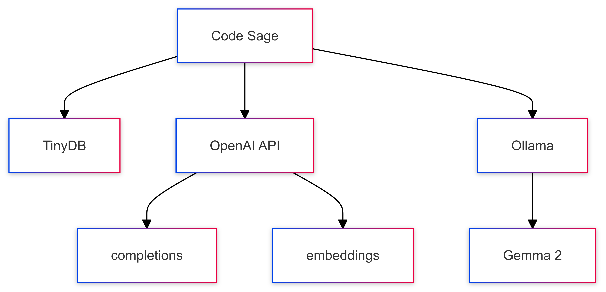
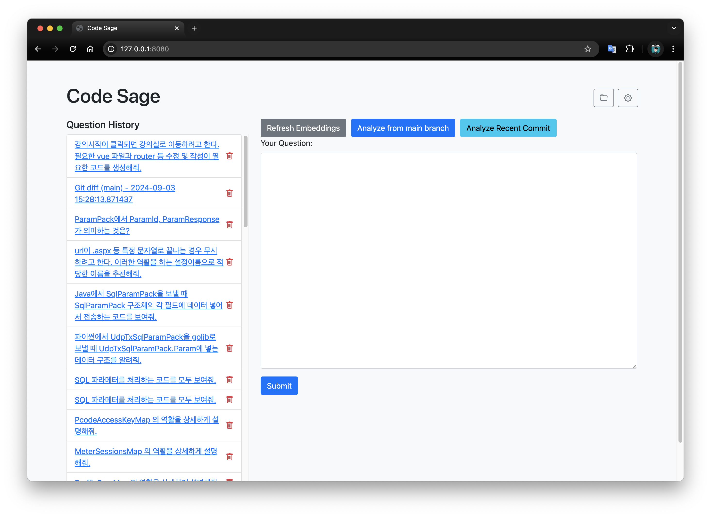
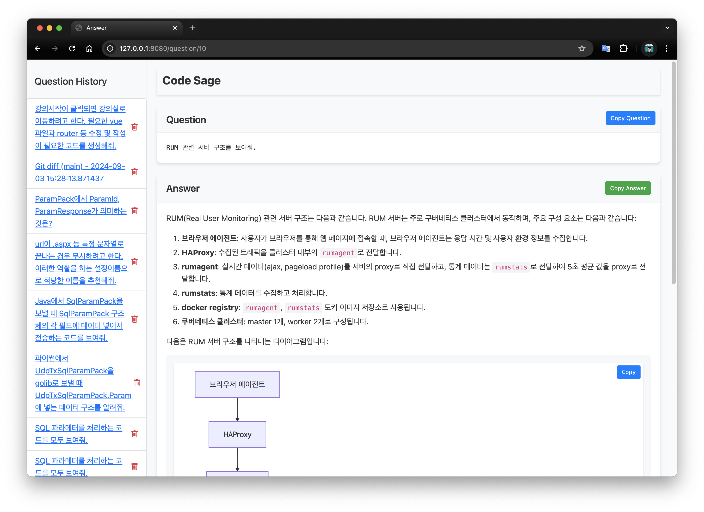
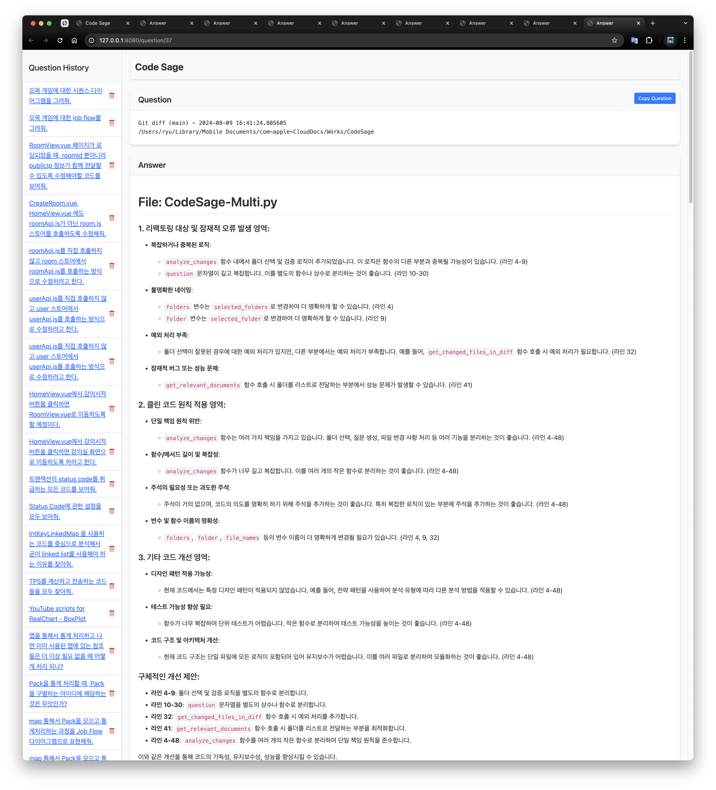
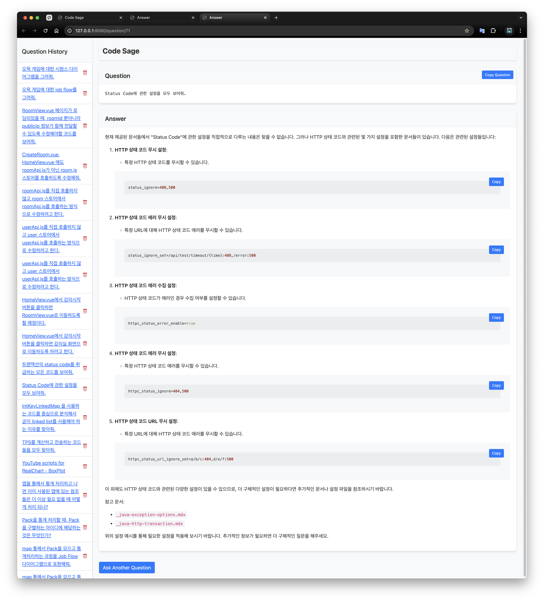
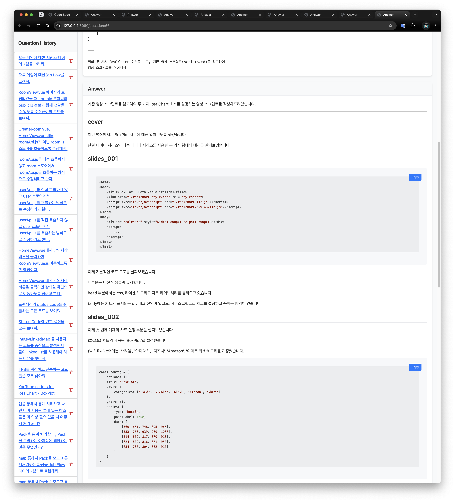
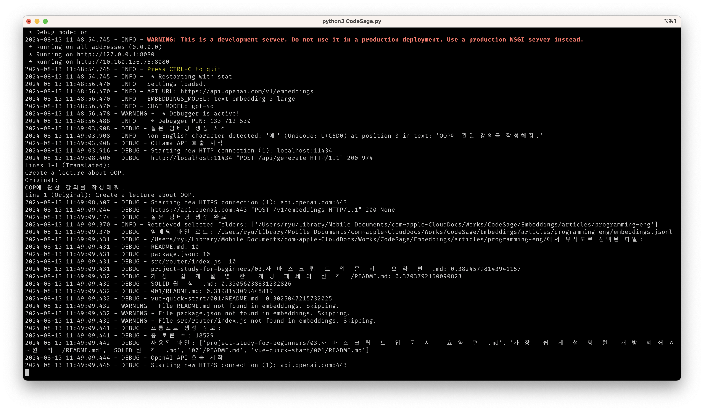
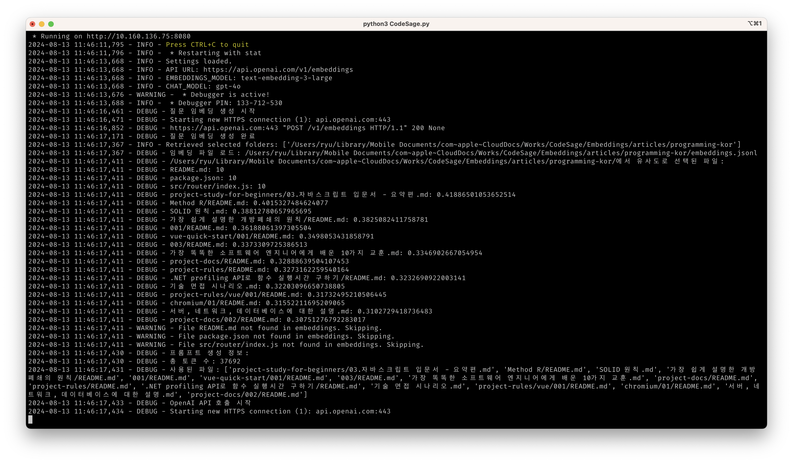

# 가장 단순한 RAG 시스템을 활용하여 프로젝트 진행하기

* 가볍게 로컬에서 모든 작업을 수행
* 원하는 기능을 마음대로 추가 / 수정
* 간단한 설치 방법: [https://github.com/ryujt/CodeSage](https://github.com/ryujt/CodeSage)

---

# 시스템 구성

---

# 실행화면

---

# 답변화면

---

# 메인 브랜치부터 현재까지 변경 내용을 분석하기

* [답변화면 보기](http://15.165.45.59:8080/question/109)
* [상세 답변 내용](http://job-flow.s3-website.ap-northeast-2.amazonaws.com/markdown.html?script=eJzNW1tTG0cWfudXdNkPARcI20m8VWzlIevc%2FODdVJJNap%2BQIsa2NiCxo8FxaitVAoRLAXmBNQLhCFZshAGXUiWDwKKC%2F5C69R9yzunumR7N6AK2d%2B2yjTWa7j59Lt85X5%2F2ZfZJYtIaYxOpeHp0KvadNZJITlgPItM%2FDAxcvnyZiZdr%2FHGJ8aNM8%2FAl4ydZkd2CT%2FXmUVlkS%2FTOZXYtwvjTait%2F0HpY5nuzjOczYh5%2B1JaZ2C6L7aoozzJRrPDdIjwsifkt%2BDQrNn4dGGFXrvCjY7G90yoUm89rfK7IRGUVHvEVWHWnJPZmr1wZYwOMjbDoXStp2THHGnes%2BL1kIh6bHAe5Z6aspBNlrcK%2ByMH8c3WxsQKyMd5YgwmaLxqslauCvExkT8VCUWxlmThZa9YysCRfXFOriK06iybusDupyQnLZh98wC5ZTvzSWJSJnVrzeZ1XG0wUcjA3ay1XYTG%2BUhTrddhgTiwe86UcX6pEGM7CTzKop60Mg0d8F5ZfrvNHazgSFNMqlJg4LIK%2BxGYGhW7%2BBkI%2FAjGeLbQ2C6iGwzwqGt7gKyA07Mm%2FBuniyhVRLoE8qJwuG%2BVHWb4MshSVeuA9NTcsJDaqDNTAlxdE9jm9%2FfDfsAGagWxAqqrA8LOgGAPSdic5LXcJdwC%2FPXNJVY6nbPg7irtt1jZJLUcZFOXZAn3Q2xZ7Gb6XH2ZRJ%2BFMWunxWHJifDrm3EtH0Ui4O%2F7sAByJVGwMAqsskqC9FRUy9e4Zi2ofGg9%2BvaNdX6krYKhWIcRErm7EyQFom0xezInNhrK8q6JWMQvRoYJMui1utpXPo85hWbRrDba4U4f3vP3qSNl62WzUVGThezK4UCYYK57UTJ8zBaA5Nx4aEgdUlUpHUAcR60Ei7aQHlS3x0ZAREirUpMBomXZJ0TJSFoa2K%2BcCsqAJdDzWReEMVHrg06MHIfwwS35QXEEtgdPyxV2GUpRLnte1GzGSTtnOIAjdKjbESYncZxXUcphz1YUwwB%2FVhjF8jZlFmSAC5avn%2BHYx3NbtmhPlAi9XXVTJstbDY9iSciCKk8MceLqSB1dYzvKdLYiOksiWOzgU4ez1CGvN1vnTmoZl8fOKON0kzT458GHq0j5F7fMFsZ11Xytlea14LjglfAQFg41BU6CX5tFZJ7xRVkR98Wf7qGNpYIwUfKm71sAsakkcD4NRHX7cmivyXBYxt1mbhd%2F4rdwgYZeMyu1ct5CUk43ygzWMNFBgs9Egh4BMJdMQbPHcCgK78v8QlJLTb6%2BKjQWFSK31nzTQNhqoBZ3sDjopAjZmTNETvxV0wAudkLxURmQ9qivVgqPAN73RS%2FxyBqlerpwVT0Bhz3XggQ%2BAUBTI9JKrMD0m48Y6rSLmqrAq5EvtBqUzsOVwDz%2FSedSAMDV9HROreJh3K4WOytQjAINq2eZhTQtEOpF%2BOWyoEP5gLJIDa28S2Qp%2BUKVC7aC1vovygx26xqssbDJUkYBzqeIE8eUpmVMu4PO2bydTd8djtpOIA36dI19KaO48AFJW87gqDutoFCm6zNT94Zmen1JlfMa2MVPqZ%2B35USc0Cny0j9jS9Y9frd1g7t0IREutNZ%2FRMCc1beKbkRPW1sT2Ci2T329l6woMXbX60MtEZQDS7aJYrOBaAItaM0Yd65ZIW6A8hh4Dtnd1KMqrzRdnferwIwUbn0pESdlRTwCKShJPFxntgNusZ3h5nypiANbHZXMbVIt6SaQb%2BC3kYbXWYoOgYnEX9YE7gkpdhnh7WWIg3GYDohHjA%2FM7QgzE4N6%2FRAEE0LNSTbFe5%2BXjrjDvzpCl6Nxe0J4TlM4Fso7lp%2FYPcO%2BdmuQbhWxrrtJaeAQuqPwmvNpSgyiqZbJURQzijV%2FL9WDFj0kIjKIqqV67RkxHL1vcRTzfUWbMtTbXNIrLDCIl8HIdwZNnfDkFodmLBv%2Fl1BjvZQG5K3CprvBEBtQsDnUQDRLAqFvWFTX%2FAyRvFX4lCcygwXwFJROoZ8OsvymVkRIoJQQz1bAvO1F8ogmp%2BiLnJu8USyUwKRW6Jco6zcN58BsPMxSFTcempgE5RyN%2F%2Fvgr9okdm7K%2BT9nfjd6%2BH%2F%2FImkqNTt2Pv%2Ff%2BVf3jZirp2KnJSctOj36WmrK8z5F4%2Bi2kvo79w0g85sTvRWXapDSo3AZL2bAce4AVrVlqGx6tVwrjsMUcYfXjCnw3zD78%2FJYqVf1Q1GnmqF9MxcVrRblcoBKknIjLuZWOW50Fi53erJSx3rw0Np34qz0Zpe30lWFtKz0z6fgy7PImJR85DjHEl2UhG6lUr7KKzpFUPoH7ogX%2Bu9RZ6SjjF1Z6OpVMW%2Ba6uoCo04KwFDGLV6GgoeaSr5JAgI25EmZsNMtSCXWCEZ%2BtAM%2FxNoQZAsYOM1nQ0ci5fYhZ7djknpioN1bofAOlh9h%2FckCSAWU6Ii8AuGgeHXvVFj8sENoclXm58nr44Uw6kbwbpceanNUxhqGgVMlYIrtBW7QffOY4099Y3%2FoME%2F3Ssa3YVFSVCZQPyiWAAVQTSgwfVkLYMKgTswCGDpCaXBt9Dx5mhMsNGkVXlF7mrubWAh397c0QyluYOaJGAMPqHnwEwAhJ1wtM28XWpjyt6kUb5fla%2BPTETP3T9QEpYfuSAIOR3cHjzkkjw9TSkzPqvWOlEU4dNXK6U0kOA1MhQPl2bDDni5DE8LC7CEHUB10mlzvJiJ3nxrZai6eIN55lQ5ggkTJ5ZoBrm0pxKZ97yOuvkMJIXoctnpPAvb400YPZb1Tbpe2XN3VgS17N7e6mU9r3qIcXXuhpp1nkUh6pCeRuXfmrst8AMRdvO2dH6eka9DxbAu7LzCKJkkcipAf3RSL650WmS4aoIRxl%2BAHkcxCbL50ab6jUWjIIlIH7pAgw5ZO8mRS9CCEi45X7xslxVzZ2Ac50%2B%2BubylVMVJQW%2FW0fFuI7FUAf%2F1kcVWd1ebjiugYv59Ai67LaA4251A9feAoS5ug1T7GuBs%2FtFn5WQZ4Bsbrdm1RiGOmoIeYyEIbfZLyK2Mq7JWS97eAgmMHHBgai0Wg8fS9mTw9Mz3w7mYizD%2BNOIpX8gmCD0SqDQwP%2FBL0z9nXC%2Bv5PsbuR21Y6HbtrsQ%2FYpb%2BlZmwWm56GkTEcxyasdNxOTNO%2Fp%2BGlyKU%2F%2BsZ%2B6NWQMP5TyzEeDA7Jd23LmbGTNAQf%2FTgwMG0n7scci038kIxNgZDt45SAaceGeoTJWhrFuwfF0djo6Hs3rkYmgG9F4qmpUfh29DZsLvGVlXZG31XyAZehn3Ii%2FDU6Gowt%2BvJH%2BptKVDYIpdfHD%2BKW3LD1YCg4SRgnCc5z8Ul%2BRBsSe3ZBvt7mF0bYh0N4ndwPgGUvI%2Fk9sGR3CqoCzZJEnl1ikUBl88pBv7QXDOYQ73X%2F4aO8YCy0ydtOe8H5vkk49wJFd%2FD5tbYCC1Pv1hnRPxdRlCIDVWXodJi%2Fw9YnxHFbN4i5xUJrnjBf89O611nqyHdx8FwxkDbcZlFH0BvkeCTTYDdujFy7%2Fu5QX4w3fH91mIlU5daxurzJUL%2FVO28KOQ7XjMYT7FUpsN7YtevvDfVPX3t4CDr6zckEdWzcfQZYLnhjG9dTq2nfXSoFmK1uxQYN3HNon7YdRlWMXLtxY%2BhCRNdlq%2F%2BYgUiXWjHUQfum4knTbeyKtqnI6LRBhX9IR38uPVMcXSzpngx%2FuuB5%2BRmWdRjS8g11Uhg%2BS09lkA7eBGUNcZ9uBFNsrfKlYyW8PO04XbgIdT03b2tLEh58yP1hQ1nCmyL%2FbY2MvuHkIgS3pxLlcJT7zXLZ8%2B3yVVqcHm%2FtSC%2BJQROJxqPrtlrcb1EqEVy09bUcQ%2Fhs%2FxFzARLbAU81oX27UoVrztffN%2BwS92Rc2YoQ5SzfPjYZEs3iHi5VxPoqvmdWtwox4d2fXlI3WtnVY39hERx2Jhhq78501jwvKSmt9MttOxP7dhpL2pE7C%2B5JN6XO6cPn46z9ma778QXm6r28PI4%2Fb3stNHPBbmt8pzwAq1PkUV1NOq6tteYL0vWHwygDbcLPaI3TO90W8zPQ0KMxdbDWXm1Lty1BLa5vRASwKfyaTTGsw4QZws2KzVpBNilNc1dWfWK9IpO5lXQsOxmbBI7aRmb8REa1Lr0zRM8CsihBd17YNxN2AWKbJH%2Fno8SdO2Pv6LKRjmOoBRayAlrrHZTEeuCEDMHCcaduHITqE00Iz2zD41m%2BBuf%2FlnDhXbn2OpBvl%2Fijiu4zLFcVwqhsyfOPm40MqVLfY%2FBfrO3WbTRuzPZ3ZN%2B7C8gGwSnH2PWrI%2B9flaHYN03ybZ7yLyTu9QpkrBrm86yK%2FYwoN1Dbi2uY3ALXUf3U8otYciI19Xkq7fzFvpmawnsgsIyRVV8hFfZPlHD9MNMG6UpUx9SXln3fsj%2B27ZS8%2FiNbK6HVbTCjq2ndrqHZ3VNu6AGF76xeEhl1L5R6nJ3SSCj4ku1vXB35w%2Fva9hdhT9Jouq0n80GFOu3zOWIypqeTZTL65gK2N4qzmHOlj4Z184LTexeSEOMrGX211rsw6i4p1V%2F1sbfwZEq6uOYp4s0wqEDQuAiBTt4JHeiOp2x%2FtR91BdyLrpJ4SegtaeyFbV17nb4k2IHveFeC%2Bt3Q%2F7t15xKfvu52GvsLa9sFmn6BkkNe9qfaRy5xWAi5CtoHK3pdrTw5gUd7ut2rlHkqJHPwpbpSlD91hPUgVfRG%2F57WPYKoiuDXSnRUTfG0arIYjSx0My8YzCqSyROXsLOlj0KD9XMI%2BPXbzetU9L6GTp66ChgawbLWoarwYZ7OWkJu%2F3VttHVrdurZ2%2B%2Bjyhd57Wffpcpzpb6LcKVoaP0cbSv6%2FTjkQy7T%2FF2JlGwHGj3DLiN85%2Bvg0rBd%2Bh8T7jXXntyYmjSwCN0XVNHhXl4MeN5FbiRWQw0wMiLPfYpoYTwagCe%2FAxG7%2FrQ%3D)

---

# 현재와 이전 커밋 코드의  변경 내용을 분석하기

* [답변화면 보기](http://15.165.45.59:8080/question/109)
* [상세 답변 내용](http://job-flow.s3-website.ap-northeast-2.amazonaws.com/markdown.html?script=eJytWV9PG9kVf%2FenuAoP%2FBFmQ7LZkEh5qNJs%2B9BWK%2B1DH9oVNjAmozpjZA%2FN0igSJOPIBdKQYoNJbNe0JOCISAYMsVX2C%2Fne%2BQ57zrn3zozN2Bh2rSjY43vv%2Bf8753c9xL41k8Z99jA1Z3wfnzeif1xM2ubEwlIkIgo5ni24haJwmuJdfoKJ%2F52LrYbYd5j4Kc83S4yfLLePf2LixaFb%2BCzKDuNnjnDKsKV9Uh1n7WZd7DbUYrGzzHjLaZ9u4InbhwxO5Wfw7KQBi4VT4h%2FOmai8Fc4R7j%2BuitVTvpbja3sTgTWredzH2vVlsb8Mb1siWxSlc74Lyrwo8pxDCr5VGyORSdj88dBdr7mvqnx%2FhfH1ZfES%2FtTfgKyqqByK6goTxT3%2BoQgPS%2BJlGT6tiO3P9yOMsShIPhWVXVToqA4CmNh7C4%2F4BojbLYn9FbXqLMc%2FZd0dcBZ88SkL%2F7wvxFkNvIJfiGJO7DSZOC6CSvJ7Xwd%2B7LS%2FNBkvbkgbj%2FjqB8YPm6JaikRuTTB3pcE%2F1rXjxfsN0dphsFG8q3VpvHYgyuDJo6yoON7CksPrRbnALRyIXPErXsujQ%2BGwdrMpyg2KD1kLwpV2EG%2BnLMpF2ONABsAXWsH2yTl%2FI62iRdpby3A0eVdKYXAw%2F%2BjgEdJBeHbk9gSmhvtyWZvTBs871U47Aq7J50VlQ5SbzF0%2FcJ2GMltZk10Xq3vuKuUE%2BAx1dLc%2BQJBBtNJbOh%2FPVkcrqaeHYrcuc6HguC%2F23OxrCI7SJhIZGhpi186fSCTKxsYuS5%2BxMbQ2ymLzhj09%2BzhuzRtz0wkoyMy0aU3PmYlETHvSLTbFGew7W8Yi296A4LGYOW%2Bl0rDF%2BNE2rIyZsjIx1Fd6BBwCriqh6A2ouFygoDAsUDLgU7fQwLJ08w48gAzklSKvvwZPr0MWQYhVuvINCA%2FGs5KDChvHxPZ9Kxdj%2FcvFYC%2FmiDQRw6DdAKWZ847xtRnhuLvJpqai926NgkOk7y4Wleeu2dSTGdMCw%2BNW5qmRjmHyxox0OpWW3oupVFSJJ1qfSY1PB%2BBFt1ALuEEt5Jt7%2BAFs41t7DOLnFqpokDQFsUbpUgEDCuuQvrS2ehpmxu3o1NejEW1EDwDwbLHTS6BuM893y4BhDR1aDP70jGE%2FNQxreiYdt2Yfo12d2SDWuk7FmEOKiN2joJlyhc5P3KPs3K2LVpGA98sBWuzbCRiNAFtYDTHw3p3ovbvKwIEQzLN1YKNicSueXMqYmWl7acGIYaYCBgyc0fJAiv6bHWwqMtDQrIKJDH2jVh8n9wBctDBV%2Fk%2FJRpaQK8ll4Jk%2BWXvvzqjEioFQWqVFb5D2fEUe%2BIehYMHzEqnl5PghWLT%2FL1FeVqdgtsq2CK2yS1VZoGBeDZJML6w2Abdkn66v6Bre3kCIQxdiqDAz2ieOeFHXLR0E8eMqz9eo2l%2BWZbemat88gro55P85pC6%2BnaUVuaK79c%2FOiqN0kwsRactFWg92SPuolZ85Poy0j19Saf53LcT5d6eikzcnVS4O0tkGcS9sQx9q1Lqq8noOoY70JgtCaTR69W%2FcfyWDrtCAtV16C0g%2FqpN%2B26%2B8RJeDGD4sF2E3GoNxL2QxvGGQ5q62EPG0J0o%2BpqtupjqA15U8%2BRD7szw4oG8QRdURx3pA1Ig5yAzRsxGMd7eBzSPaKA%2FVJ4W0Av46z%2Fx2oxaqwZKAY5Bs1MiPaNB%2FyLkAnuEzjrbTLTqwUAeQOgTVXNcu0ow2Ij4q%2FAYkD8BkMYdRx3aHbTz2vZ2O28Y8dCB9goPjPJygpvQuICaAyNc5oskaTD1NNfKDWIdXTmk7KRCKmapMrzSy%2FXp4SHMLAG%2FJ8adG6ijdWa%2FrvCcsoWNCrLh2mQ8yj3oFHlxM6pfP241lEt8IVruqnnbdURUPXEytQiUvmCvFaCQoOTQZfjrgmzl3J%2B9ROmwVXnP1Pe1PR5ditywP1P%2B4gblSbnqlUS0B51QwEBgJwfRLRl3KaQCp95pc9hxpSdnDBswYqCJgIExdPgx0iMZiJtFXmTY1xGDyraC3YvH5%2BbQxD1U2N502MguguCFPSMRhsxr3Y0GgCdOGZi7S5hfOUOSqtT2aAjVCy9Z%2BYUpE97WyMiEhUNXchSGWykSdEqa1THNSu0f5XmUaoMCGTE6EOnsYgYAWEez8ACkSw0MvLPSwU1IgRrmxnxMtv%2BOTbSpLgbzgOIv5TMMjuIjXkDPgiMs35fSMC4pYOtQI6d4EEl5dsuAFyx%2FMmcxXi7aZNG3TyNBFC9ZDp4IKVL17D1rzS9joYGR0QC6qKIqaKrEjVz5AZiF0u06dFPOp31tw8jHAQr1IwmrdSDj5ze1xNnmXeB%2BKHxvrQAPMnX4SnF6JIq2TDQkZQyA1QgmmgwQQcEJ7IZ5MdnpBFa2ZtA3Eoc7vwiaMS3nU5Dc30fSv%2B5geogZWTKzr0W5pvKdqtP7v8aR54YswyFG%2B6ahyxSi1ZzKLMwvp1KyRyUwA9Mz%2BbTq1aC8s2rGrkVLPCVPghFs37%2FZxQjgyfZGo%2F%2BIA%2BpUEMJpbcCDa3mgfrwfHOVUSQAzWIG2WCXQgK05O%2FSag21%2BtY1YZkN4qxxi2bVrzkA3tehm6mx4u8shHSImOq4S%2BqdG3IC5IItw8K6G70SdeM9bYHmjZsgkgJMLEtnbI6%2B%2BVA3BBtRB0wNDgrPZSUjsgtFyH3Xo%2Bu3MnOjl1ux%2BQKMQKQRF%2B4oAfJNXqxpPu4ujBMwmHA0Tz6ia3WyvXMMqLrVSDknsPMSg4yPmG9jDqSlyzi2rq4pbAe2WWObitKPKdd7Po9%2B8Q1tlLlWBxXOgIg3FPj3o%2BiVtz14T%2BO1OIen2LfN6EzFFCOngozUFaHU06KtnOur2Ef5K54aTTJzTK1G72eS3q2SeoRB17EVCcVbfe%2BkMaZHTVLRaCwfdGUZ3bYdRT125P8qnyXtvs1Sa0HvydyiNQI4EGGBtFPdr1Av1ktQ58h%2BYM8MBWoydKXRp5TxTldYVu0txXp3Sx2Zt1%2BgmgK3owWtll7qBc%2BiIRvXBfNnhdI1GCbEWDiEz6rNMvYyUpSFVrg1LKACXR8%2BbVB0tQPxaLLSzZj1MWvJ8zEgy4lZysPFY6ghg%2FbcWfGOPMp6qj9KMWvNKGvZi2WNxa8hdOGNZc5qlpPx6BDaMskUrjTmZawQOk8EinJXJ8REs6MEghRZe%2BHU2IPWB%2FwTckjd6AODnHMTNBT36APSFjI%2B78IUwbldeaMYdgY7heAZjDs4fh8%2FA4G44%2BhP8TqeSckYZP2DDx8%2FCzmXjGULT3%2BcTE7x%2F95re0OoqejKas5NJwuHaUgn6%2FVDGVZUHdQ7WOkCj3bOEjWr8Opu0Fe4j9zrTpp6tqiyqG7svVl51mz6aNuG1MBx72OFvtVn%2Fs9JIWhi8VwAesx4g%2BEjgf0tOaTc3BFPlgeNFORKeGRycydtpcGIG%2FC8BOR4b%2Fag2PBk6%2FTgLpV3giScaiSogejnQsCUoPvIXzrZQddmbQGfhaSJuWPZK48ed42gJL77M%2FpbQZTCqRSC1CAED3Z9Lfz8mgZx1Of%2B7FYOJGUCUjmTF6SfyWzn2WNKyRED1Hn3epcT0FAm8VsITIUouMH2eNBTuYGQ%2BBWxpz38lPj%2FA6i8UzrMOidNzMGOwRbSVwu6G1VHcAXXpiN4Q2xdda6gIQq0T9hATEbQ96PFjAEunUE2boMlU%2F0bTrO9hxJHAHWp4%2FxHm%2Fp4zjEIA87qSBoy8%2B6Hcde35xHPgZ7LW0FA%3D%3D)

---

# 기존 프로젝트 내용 분석

* [답변화면 보기](http://15.165.45.59:8080/question/10)
* [상세 답변 내용](http://job-flow.s3-website.ap-northeast-2.amazonaws.com/markdown.html?script=eJx9VF1PE0EUfd9fcR%2BhKWi%2FVHgw0fDgC4kh8mRMutClVinbbGvAhIcFV4JtkWKobLFbl1AEkiaudCslQvw%2FO3f%2FgzPTbruF1qYPOzN3zr3n3HNnbn52bE4Sl2E%2BKykwK6%2BkcrKSWkmOg2OrxDwD1KrkQgOn1cAji%2BT3gRTqaBSd5jU4VgXzLVLYpluTMDc%2F2w1mUXh8TY6qgH9NtqHV3YKF%2BTq4Gzb53qBfrmbhQYnGA9mtYG3PLevk3Aqye3i4z9Npv4B%2B4lZxdNZpQQhNQiBA2kVi0IsWmiowXMNGU3Pz7UBgGnCzgYfnWCs5lgr%2BSHJyDe5Wyy3bgN%2BuwP2ss3unKgUANPdwa8ctm0DKxSCMTMC5Gnuk0AIsVB1LA2Lt9lOCW9GdixsKVyZNmyXEbR1PKd3zrm5CmBF49uS5Iq%2B95%2BXyAFKqAoOv6e7%2BDRragHJANm3yW0VDh7jyLi0mpZVcnMttaqTQ8IFHGLgXwtGpjt06dyzKgqKNiW%2FEtSBkaMyyLCYgo8hLqWVpnFfLG8oSZVh9PMfpBhWnl0p3mmaQyeg0fZhMFlZaNifmsgOl6XjQgBja2%2BDufnIuTdrPL4xfH%2F82h2iXA8diHO4k88nKygG80MkPP0SMQSTkxbfU44qUTGVzCte6r17QVy61pIZ%2F6rSvNvnZpoagNalYO2FWZAXy5pJSD%2F0BQ%2F%2Bf01mqtJjN0ewhx6oGYVVWWClhumCIHbf7EIWO3dFQfWPlzSBlSzZ194PKXOCNho1fbeeS%2BuUMax97wxGPx9OSkhZTCSGpiJnX8GJGAPp7qsirdN5fjrT1K5iYeAxdV%2FIr3W%2B%2B76nGD7wFO1kfYq916IMMxN5u4zp4HfBi%2BYJn7EP0qhhyf0bMiQtiVmK8BYHu3tHGUEePMnsePBtVB93VJe97MIbPXWcY%2Bmcc8q4kWFGHmtixNui%2FZ1%2BddZc%2BefTxYBNCHxA6O1jf6bkErTazO2m0qUOmhQmID5BjnI%2Bv7nUcVMcr3dXLY7d8Og7RWEyK3A8%2FDCciS9GYGHkUkkKLkanYlBSNxCLRhcl0Iv4PH3pmGA%3D%3D)
  

---

# 문서를 모두 검색해서  원하는 답변을 얻고 싶을 때

* [답변화면 보기](http://15.165.45.59:8080/question/71)
* [상세 답변 내용](http://job-flow.s3-website.ap-northeast-2.amazonaws.com/markdown.html?script=eJy9VF1P02AUvu%2BvOOFyYSsqJGYJV9544YVRvN7KqDoD29J1hsSYFKi48BFYWGUs3SwBs2GW2LAOazL8QX1P%2F4Pnbbsv%2BdCo8aZ92%2FP1POec9%2FFrOjY7gJbpdXts3wTWcVE32cEpHu7TAaaeqpJaKsKD%2FJI8Rf%2FAczTfMAH1U7QMbOiArTW0Kmitodlnx5Rh%2B5SdtNlWFdi6g%2FUzbGiA9vfAtVwDPNzErR7bLpNfAryvLvvYYes1eLiw8BhwY83foOSXVXZg4pHGqzGrHQD7%2FB48W8OWNlbb3%2Bv4RpvjGeFuOIDN8lgNemBjh8MYZQtTcPfmu9AvKQh3EhCLXcVBuR3cHsTEYkkBAOLgb32jz2tws0%2F9KMQ3rJDzOB4enU6ns7ksPxWD9qayL3J5RZ6fnbk%2FPTczE7kIwt0bENEgqG23A3v25BGfF9uheTnXwIyS%2FDnaVFFW50WpkBVVuaiKanZFzpdU8Q0%2FvE1yKqKsKHklOc7o3u2MqD62Kj8zuupPmxCFYMMF7%2FwS6%2FYw%2BLDDLjTOK0zzG7xeqmohk4rYBaBTck5aXJbnVaUkD8HP%2FsU4%2Fs0AJoAOl2Z2YmnmbkBJC%2FH%2FN2YCcElZHt8dSVwUM0kOf0mUxecTexJc4yOXV9zTfy0OdMU%2FVMZ1KRSBgebQkcTpi0b6NA1stwper4PnDhctWp9RjG%2FoWK%2F6Ro2L2BnluKhyzQndIokhrQoDwN8hVekHRWwXj22Ko6Z4rg3MrrLm7qAhApm9rhUlSApxSKdeSa%2BluLyakQtqNp%2BL54NXMbGytJoe2Xnz4qoi5YpShttDs4Cmjo0hCqyVqSofir%2FZ44MbkJgQaaJQP%2BNW1nWuAzlJlWtj1%2BGXbNQRasfVzrXKnBRXYsPBkz7qLnknfgBZOlo7)
  

---

# 다이어그램으로 프로젝트 분석

* [답변화면 보기](http://15.165.45.59:8080/question/83)
* [상세 답변 내용](http://job-flow.s3-website.ap-northeast-2.amazonaws.com/markdown.html?script=eJy9Vl1v0mAUvu%2BvOJcs2Uj8uOrFEqLRYOLV9L4NNNpslFlA3V0JXUIA4xbpZLMQdGwTM5PKukkiv6jv2%2F%2Fged%2FS8g2LUa9oz3nOeZ5zek4OtNEh37rg9Wq0ZdKPB0Bqhm%2FZQKu2bxi00gFS7dCmS49c72eftL7Spgns6fzS6ztAbdO3XGrapFIPkzQbQE8H9KQOGEd6Hb%2FSp8cGC%2BL56w4564PnNGnPxZ8AXyr6jT5tHdKTLiOgbQvNLLM1AN%2FqkmoZZcTRbntX1%2BTABnLZZ6wfOpgTH4BO1LFIwnLSmzq9sX2rDbSM3laZVq4jYkxzNgDi1P2SRe0B%2BbyiRSyt%2BQMrAHLler32KJcgrNTKmslz1ryrAco9jqJF4U58GMj4kQViUlbbyst6XloT7saBXJTpicNU%2BUWXnH%2Fn%2FqfZQk55sKOmthF0Lw6JJKP1TRe9mb1nBV1D%2B%2F1R5i%2F75LSGPkVLo0PwnOJYI0dDcruP2CBdd2E5M%2FWIAgBsgPQ8p%2BgSbGyClM1ktx%2FLGUUSISw1tiYNYZEzgiLgBcfqSk65HTKty2%2F4C0PPa%2BIqUaP%2BxpTXipa%2FDemKqAAXhT0ppIMwNfdI1dTcSyU9WVoAmNGGX5AXNf7RxYXiEkkWE0zEZHr0zJYgp9Nb%2BaymxN6uw946pLI7WX11VNDtMOxfFj090YsLj8SFoX%2B88MunXZKkjKJnZDUt5JRXBUVLKQ9V%2BYUuZ5g02MXZVlPqrqzlgc3ajDFUPtfBi5jr4X2a60kkBW5nbNiNzYhBhGjXOCC0RyDOJsJwy5ZixvZrCdvMOizNuQzPIVEAL16E8RmKkNw3pYSPgDCfPJEUIVyPCJFIToubuxhL8FMr8R8KGRIHEJxKPvGzc238lcNatfGC0HZxuEf%2Boe03TH5AeiXa2g%2BP7MSZ8RwDt8%2BmpSa7yMSqDUnYyUelqJEc%2FUJVE2xs%2FSp1emGwPHh8g3cg7xwg7036yeBFHoT%2FJ34DGycU2w%3D%3D)
  

---

# 변경된 설계를  프로젝트 전체에 적용하기

* [답변화면 보기](http://15.165.45.59:8080/question/76)
* [상세 답변 내용](http://job-flow.s3-website.ap-northeast-2.amazonaws.com/markdown.html?script=eJzVWFtvE0cUfvevGEjFrlVnnUZUlRwSUbX0qRWI20tT8Nge2xv2pt1ZOwmyFKpAoxCJVCXFVDEyEi0NohWC0IJI%2F1B2%2FR96ZmZv3qwxERFq%2FeC9nHO%2Bc%2Bbc5sy6DrE%2Ft1RlwfF%2B3UP%2B4xt%2B%2F0c06L7y%2F9oebHX9xyvI31rff9FHLjAif%2F3R4Fbf%2F3mXMQ9uvRxs7fqr28hRG4ZqFPjVtcTVdCmIPvRvdv3eKvL%2F%2Fh3gvDur3sMe8v%2B56%2F20zfWtdf3%2BFqP0H3k7u8i7%2Fcjvbey%2F2EP7z%2B77vV002OozJuQ%2FWPPXX3q314BDyeU%2BUVDZjSwv%2B%2Fc2mRkA5fe63uY28nbuwotACedkbAnzHwJ398%2F91zdCyGkFXXYJ8t%2FsDu489VY3BuuvAtSkIuRtrPi3%2B5mQbDnfP%2FV%2F2UksNFjeTmT4xMQECo0flg%2BYc7lyubyAW9ip2qpFc8Uicuxq0aGmTZxiIJZTdcu0KbqOaqSuGuQCo6IOqtumjiRLNVQszYRMIEcDyukittQiewHkHFnk9KppAAMgXwJwgTSbxJWv5xD81FoJSUy%2FVODPFrEd1aElRG2XiFcOxZSUkJxHs3MoEGM%2Fal4jRgkZrqYVopcMysA68EvS8NuvSYtoJTQVv9VdSkB9HWtOoKqTF9cGoRQMKaFYm2Y2wHRgl7k93Bh%2Bp3A70LHZ2YQpHXHBVaqCH5I42FkyqkFqy6G1BW7hVQs7Ttu0a%2FkEP%2FsJX9YwxeDD64KXOW6EOOrMDIlTeykFGINC1AATt7EqQqpYpkNlqUmp5ZSKxeWFxvRy3dSaGp5uYpeq19TP2tM1UsFTzeqiRhQN65UannRtTcHWpAGRbxLs0MlpxTQU3HakArc7P3NAP22qjuIQeilYROSMt%2FBeZK6WwU6FgQrPZ7DbhLq2gc5BdqoOUYDf1FpETnF2UBXTahPJxLZNO%2B3zSC0EHppOWjhTzQKpUtkgbXSGIQpcpt0CVxNhsk4cBzdIPm1L9NQpZKSKayVSJQxzfHcVYllXbT29BrWO5GORW8fae1w0Gv%2FBJoIm6f226vdWoFWusk452PrDewKkm0HPOZ5eAdcVJ%2FBYXd7rVe%2FZivd8DXYFb%2F3uofREic6KbpwT3iVSQ9b491dQ8hkN7sMG8IrtG35vz3%2FdjXewePM4YGfnkBU8OqpHWM56u1qt6IbbUq3mtTaUj2FVFozpkzV9aqFSX679r8o5kgtr6rDl%2FeHqlzeQzKYeegmixr0SPqdCProRjcusI8we0qq08ZLRqjR0U7c%2FPWmZuL2oYXrSnXJazrL%2BHtkzJsT%2FudCGsUip5nES84CYBjLCmIi4JM1kgUeVIQribTr4dRTIwVLMgkrYczD5DgLyMUrW2P9IOM4DeJwrE4yNXtne40MZWxnMf5mirjFemI90B6Th0oHgwiQsJuaM4TwalycYwwU%2BpV1WSVtpuWTEDN0CslNMsZ4SPMxprjUXD9Y2qReg2HSLGxqO1iAhxTzgwfOQXHAuStAnbf5qmC0erTvRKJ4Y6aVcLqhrATcbQ8v5XNx%2Fwuk8iTjEEKQHGC9LUkiINuE0gdfWN6KYEsSAqjqXsabWzuhYZSkS%2BkIW472IaVC9cQqAqy%2Be%2FfJsKXwIFDGM86RBFgGoeOXbK%2FPzzunvPj4d3szPK%2BHtR8V5I5ANwGNhhUKri2pEaWHNJXnIlJTF5%2BL1powOPSFEFY0YDdpEc2gqAfGVaesc5qB40iMCAp04kdYamhUA8tMI69V8i0n6Lun9AI01Gk4b7v2iz0cJoKTOJEK4kFpdPhIXSaVYrtOUpWLT1IkkiKO7M7PdhEMDiXtwjJdtOBtE4dTd20Ned5PNicnJbP8ZTGEPut6TN95m17%2BXOMuL9XZyndypoijFuajuRV271jvXdYL1LXX9war58BUZEr4IBsp3rNj3aR6hMGnAaZ6LH3WqJs5E2alaSK%2F7CDI402QxTATjw6jEY4nc%2F2H%2F%2BUbi69TO7tBnoDGfykZ8HYq%2Fl5VFBZcL4s61wjtYZzn91SzjA9i%2F%2F9PVRg%3D%3D)
  

---

# 프로젝트에 기능 추가하기

* [답변화면 보기](http://15.165.45.59:8080/question/59)
* [상세 답변 내용](http://job-flow.s3-website.ap-northeast-2.amazonaws.com/markdown.html?script=eJy9V1tr3EYUftevOJZf1jTVxg2G4r1A6qZtStwU4j7kbbXSeFe2NLNII9vbYnBa0xp7oQnxtpviNRtwS13yYFr3BvlF1vg%2F9IzuK68vgVAtSJqZb74596MVg6Pgt2M4%2B70nDrfFj0%2Fx7eTsj9dw%2FmI%2FOD4Vw20Qf%2B2fnWyd9wfB6AinINg7EsMenPd6Yvg6eH4UYnYGYtQ%2F75%2BKPm7tHwd7OwibV5RZDRoWNcmG1uaO3VDewzFz2OrHukO0Fa%2Bh3IknPvXNVjSjTE9PQ2FffIAyNhdJkMkc%2FIxnPzsQewfn%2FRF8srT4AMRP%2B%2BLbnlxItIhF00AMduS8VOCH01sTKRqmtYbHfHNw9vc%2FeY6RFAfE4Y7Y%2FTOmU5RGoyHFUqpTHz5cWHr8%2BT2Qw7pSTR5EN4lbVwCvKre4Teoib%2FtqOZqMAA7hOhht3fUIr6k%2BX373fTVe8gzX6nDwXKOm5kyp1qvlaOkS3COut24ETFxxLfDu%2FQKqWk60VKpNZnaBUZvpZk2VdylnaUbFOZd41pekpkbPeD4%2Boz1bhzG7AJLOxotNn3NGkcGwLWMVhaColMvlbgjfEBxhLt3wBTVZiJcvRTj6GywU1%2BkiG%2FdRt0QIjAhx%2BEzD4RbGIYiTX4OXWxruxy2FzaiVb3MVPN61UUnT8jq23p2njJJKSCgDbX5sq6HTNd2Lj14IByqsWyZv19S527dVaBOr1ebxICZuMhdNPT%2Fb2QCP2ZYJ0%2BYd%2BatIEzvM94jD1ojUeVEOFnFQImuE8hk1PFVeMdBk6zQFLkhTJcgEwXyeAh76vMTblpf4TF6Pme9C02XrHnHBZMQDyjBS%2FE6HoVd4m4T5OAexphiKWrUcDTBYctGVUa7pLrQwNqAG1LftSrqw7FODW%2BjWLKrgq3RVXsk2sg5JhpRUz9FtW52pXEBqXhREFSiX4a7PmaNzy0BwF8KVUHwJTHduKheFyQdzQZxyOTwmQoRpWMqJMYksDewJiqXiXsMQRfokAj9cuW5%2FMWomMV1E3Yg1H2JX0OZhN%2BKVkcmaK1dxJpA8n7zni5gsXbKElaPSjZU9akrF5pV0pbh5DrE3PhkGX7%2BSHTHo9yb0lEHw%2FXbwcpjRYHt5chocDsQu9tEBzuc0b0BwvC%2B2D4LnB2H3iXvscb7lrOiYQaHgSipZx2Wc8W5n3I6YD6m5xk1vLUOYz5qsUxZt5c0Xznth57jSKSnHStg8LO8ji1pem5ilmaI3QhihZqmQiiYzfAdZtRbh92wiXz%2Fo3jdLSUGd0cLCp8UFFfVRmzYzVtU3pbEoJe4S2eCSIinHKryTV9bwXXeB2czFaRXE7r%2FBL6%2BmcidtArE9MkkzL%2BwcY4dczhu1kYIGIRx7q9Nd8l1aNNMbWPoqa79Fi%2F9%2FVr%2FU8m%2FR%2BpuFwrCpbGYV4MLX6s1LgOj3UJtgdx8auk1cjtnd2xJ7oxwkOBmcvxhkVeImGR9JkqV8Fg9jCZ%2BEhmyqtu7xR%2FjRQ8aNg557kKwk0SKDLYNP1QBbB1m2KDHzsSZJDUa5RX3yme8ktEi4qG8sZAsZlbZxKxND6xYKSZ6rXoO5Yly7hGNiAHd9Uizj0T0GLOsYKZXEf%2BicYPQdOiq160D%2BnRn72LzMgenfodO4lAdPE6f8B%2B%2Bnyo8%3D)
  

---

# 기술문서 작성

* [답변화면 보기](http://15.165.45.59:8080/question/66)
* [상세 답변 내용](http://job-flow.s3-website.ap-northeast-2.amazonaws.com/markdown.html?script=eJzNWF9PG0cQf%2FenWDkPJJIxxx8bmwBS2j62UpSHvkRR49gHXGpsZB8pSRTJhEvkYKcBYYNBZ2pUJ0BK1Ysx9CJBP5B37zt0Zvd8dzZ2AkkfeopM9m52dvY3M7%2Bd2ZZpsL0mYZVltrJM2GrdWj6i786tVZO%2BPSPMMFvHNatcYVtHhK6vkZaRY%2Fs5ckeOJb%2Bdi2VUwl4WYRKX1er0%2FQuQpaulvvp215n2wSo36YZO3x21GjW2ekILeVqoB32%2BwcFBn%2B%2FaNRJPP5IzPh%2BrNmkjb6tiW2tM01H1N%2Bml28k0rGwcgFZ4T2gxByoJKxdZWaPHTfpGo3tVAqZ0LUALB6x6RuhrA3RbmkFYAc1g7%2FJsO0dAhtXXe33lpj8%2FYjuHVln34mBVytaKzqoVsDLParoQbFq%2FNsGMrsVhY9mkkpCzP0nSsM93%2F%2F79OXU%2B6ZvE32n4I8cS0z4Cz6SqqEl5ur3PQfJdTI2RH5XsYiypPImpSjo1OSRkhHxSSf1M5jLyzJQ%2FOJQB18TRNYNZ9XFSDsazWT%2FJyMkpPx9n52RZ9dsTs%2FGMsqAS9fGCPOVX5SV16GHsUUy89ZNsJt6pMKnEgw%2Bz%2FunJISHyRVqCUjAaHBsNziupLmWTQwKDyQfpxGNbd0J5RJTElN%2BZDgpxG1P%2BX5SEOjdBIpK0sHSTzMnK7Jw6QUJ8iFphZod9YoBPMBgUHzwriyXBAu4M8A0PP%2FAoaZkGPTZZbZlVTcLOSxC5pHVyxPaMTzkbQpKewj%2BNVXOEa9LsQKYb9dYxTNRrEFFW%2BdCZgpsn9iQn2MF7AUKrZ6hCO4N0Iq2%2FTcyc45qdAPZXahbpb5BpR2gVPc3DgFXqXGw377UMdwr6eZJyBRDKxFrXMdjXeO4i5hDVsBDkdI1tmqAetYAytlMKwn%2FXqFHqSO093VZmEwGrlTH7YPXWPyb9y2xTwtaftq5%2BiTHi4M4afxBIf7Zv2rnFs0xsWazQBquq9XXDdWu7hN%2FW9RttvkAtkKjvD9EzA3aSDfAdCLs3O4y7To0ybpUDdIMssdOyjd4A2zCQHrZqAwEYAPOUSkghq3UcwwCJo5DHwa352JN0iouBp%2FbzYMcAN%2BRj03pRBJhsvwGlXLQAgtHNJ188ncqqwJCpGWWWTJGnPJLTC0gK2Qny9FmAv%2BDsMOFuT7xdurWkoJCTCfGYKs%2BmM4oMb%2B9%2B5X7uca32%2Bo%2FtlexhVhZruCsjWYB9D9JLC659%2BCyklZT6feyBnJwgamZRdr8kgAXBTGeMz91QWAqQcGg4QMbHIgESiYYCJBoO3Qt0iY2OgkQIfqKjUfiJwKxhKSJdkBseA3XhEdA0PA4%2F4yAXHY50i4VHQCwicbEwisH60dAFbeFREBsfRQkJJ0RGUJt0z5GyMfM9uykox5sJo5AJPVOgfSjZ8Yrhf9nAt1ZybPcFD%2Fw28m7gQ%2FazzQvJ6VXk%2BgYXRe940kbUCC1jmVhvjoAr22dzLc%2FZqYSJ79KMfUJv9iWCMYcI8Lj9NBF8FQP8sJhUlYWkTLxUQI9zrcY5IrKFtBfo0lPTWKPZtqENqtYL1K4dIn04Rud6cByWIW%2B2oUjxngyXYICe%2BdSXFi7s%2BX%2FCD3efdiRQfy7oxwc87caikLWhyGc44Sq8cAVuuAI%2FXI4jXJ7w4IdPJ1bxdDKdAddek6SZGUkaCPwXSHrYdeQzSIY5ktHLIRm6NJLjl0dyXJKuhKRPjHtxbwgKuJ6scznuFQ2C7lQ8IMSLCLtz0JEegCg5V3JGhBKvwmsKL8nw7seuNeyJaEOf9kQ0JBfqPU7IruA%2BvrwMj38pbYf7IOdabdfOWBD2Yr%2BWsQ37oPvFgHfTLvCOIixbu84qtBigsF6eYDvoadPgM31reqHTTLtYxfWQidvNJNTdhH7UWidrVhmwzFd45dsoErp22HPH47Dj%2FTy3%2BRXTzwBJYbnYEqHvD3DkNMzBOLQyqiyaZ6t8ACtwmysmO9Vt8NuegNnPm9B0YjPRWWGvVHkb3e%2BI6Lna9UQ6vjgvp1SgZaedAo4WJ8kNNw0kKQpYQjCZ%2BdbHIu4MnMXjSGxJNEHcLfV16AjcpsXuxBFDcRuAbX7NtBsHt7SHU8PRw%2FdTqFubrzCsMFfK4PtWw8AuCfKBHjbxrbVdxqKi3OOIF6ZiImKYoK2Nld6nK5gsFNOjMzizOwKH59pFJT2iuUkPjc8EpxNZTSeYKkLpOdsxvEsD3nIq0feyw76x6HVP0ed2ovN6hHeD%2B0XEGbUZh7RR7nVlwiDyOjOprWCjjjBw93u7lWON10ntDfMcb5SYrgl%2F6jABe2aeEEggVkWzMYA5vPtFcysAZYBAzEO72jM9O9ADAWAgYu0cgAtRu9eFHAC6pjtRyi%2BmCN34wH0EPevvRaGkhCFkggt3c7xydO64wGp8bZTo7mtXcS0nHAE4FDv8w98V4M%2FJdldEtoy1ruaeX21xVL1tM%2Bj138ableEw%2BSaWIXdiqVnZvpXIBucTfnR3%2B6ZAx9smVqjamIqrNFGiumv%2FC5PVftw%3D)
  

---

# 기존에 없는  자신만의 다이어그램 요청

* [답변화면 보기](http://15.165.45.59:8080/question/82)
* [상세 답변 내용](http://job-flow.s3-website.ap-northeast-2.amazonaws.com/markdown.html?script=eJytVMFu2kAQvfsr5thKxB%2BQQyVUKRWRqhzSD1iInZYEsARGUW8QTIQAKVSJGyexEW1oUioqudRJfeCLvON%2F6NiADRSSHHpbr9%2B8eTPzZtHo8x8D8EZt7Gp40QHervi6CdtKBrZyyhHwVh8tBz873h%2BXd7%2BjpQF2P6H2y9cNz7UBTc3XHdRM3jwHXGCzDMCbMV7RveXwUd9vunhZAT44D%2BBnJviGiw9mSNnTCR4Q6WPw9QFvNSixCKhrvGuspF6nkJANbJnYrU9JBIExdqBk9gks5NMlVS5uwk5eOXyTzsvCTuZA3lPji0R42lXT76fH7bI0OyZTgjDDiUqBQEUVNjZexSFiUS7J6lMgqZg%2BCk8LdG%2BVckl%2BncvuHS7B538Jq6%2BjiFCtmC1tZQvZ0gdZElZdivvpXEmOYpIpMf%2FxXblYEBa%2BllSkJWlXVQryo6BJZetRz5OnFsuxurA7ckEKpigINOl%2FLVl52njgWx1%2BqwVe48eGX6vwWj0ymdHg38bAz%2FrEmQA2y8rAsy0cObQWZFhg02GymNWzyc62iTWLtoEPnEls2IoomMSw0BWMoKfAouGzeBMCnsky8E7kfX7XwCsbm33wqw6%2F%2FRmnfcHmZ89ePlfGQtTq7Ib3u5cAaiz419qEJxzPAk88qnUs1MhoGDSwqsWPh7TFeEeYS1p1d27Hl3BGAEK9iVRKqx9Vk0wtSJj46rH0yVTYltN2OPOTs7CwwDot83%2FUBfi1zm%2FagBdD%2FlAJ%2FLNc2BqzauCf3NNLt8KzK8xKaj27ir0qmmP%2BxQwwFOvrPcAGRXQb2LyP89kuVQl86JL0TWD0RAYvpJiX2F%2FYxxRF)
  

---

# 오픈소스 인공지능 활용

* 임베딩 모델의 한글 지원 이슈
* 입력 토큰 부족 이슈
  * 참고자료를 1차 요약하여 전달
  * 필요없는 자료 첨부로 인한 노이즈 제거 효과
  
---

# 자료를 영어로 번역하고 영어로 질문 했을 때

---

# 한글 자료 원본과 한글로 질문 했을 때

---

# 자주 사용하는 참고 자료 활용하기

